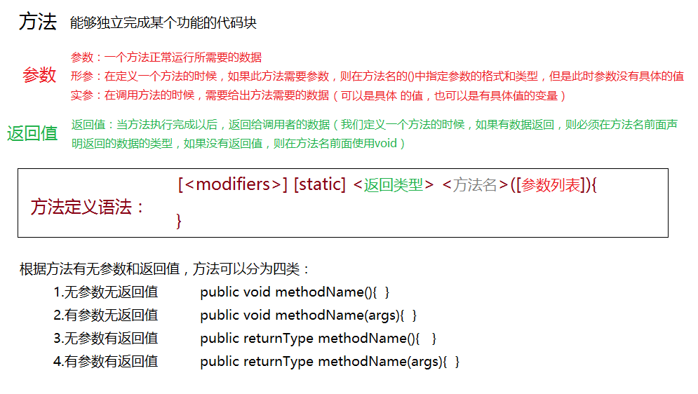
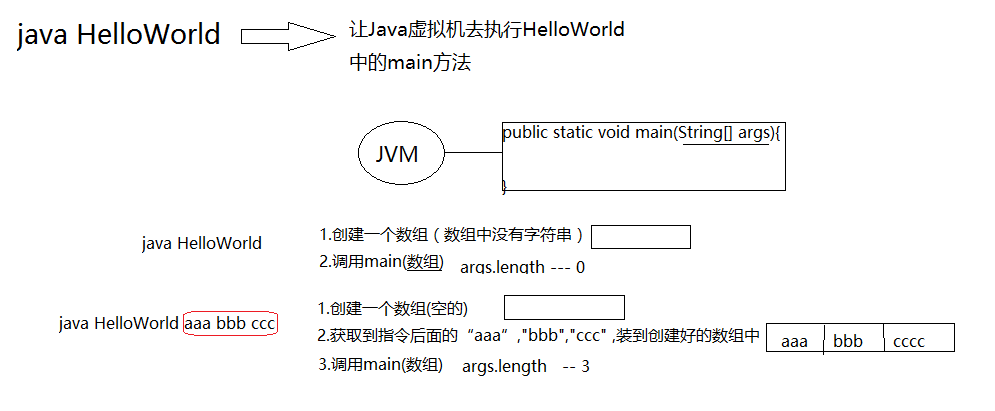

#          HelloWorld程序  

##          Java程序的书写规则  

### 文档规则 

- Java源程序要写在后缀名为”.java”的源文件中  

- 在一个Java源文件中可以创建多个类，但是只能有一个public类（通常我们在一个Java源文件中只创建一个类）
- Java源文件的名字必须和public类名保持一致
- Java代码对大小写敏感（区分大小写）
- Java代码以”;”结尾（Java代码中所有的标点符号都是英文半角符号）
- ​         Java源程序规则：代码必须写在方法中，方法必须创建在类中  

> 创建类 创建方法 写代码  
>
> ​         创建类的语法规则：[]中的内容表示可有可无，<>中的内容必须要有，但是可以改变  
>
> ```java
> [public] class <ClassName>{
> 
> }
> -------------------------------------------------------------------------------------
> public class HelloWorld{
> }
> class Test{
> }
> ```
>
> ​		创建方法的语法规则：[<>]中的内容表示可有可无，如果有还可以改变
>
> ```java
> [<访问权限修饰符>] [static] <返回类型> <方法名>([参数列表]){
>      //方法体
> }
> -------------------------------------------------------------------------------------
> 返回类型 方法名(){
> }
> 
> 访问权限 static 返回类型 方法名(参数列表){
> }
> 
> 主方法：名为main的公有的静态的没有返回值带有String[]参数的方法
> public static void main(String[] args){
> }
> ```

### 编程规范

- 命名规范：

> 类的命名规范：
>
> > ·类名要选取能够表达类的作用的英文单词组成
> >
> > ·类名首字母要大写，如果由多个单词构成，每个单词首字母都大写
> >
> > ·类名可以由字母(a~z,A~Z)、数字(0~9)、“$”和“_”，但是不能以数字开头
> >
> > ·类名可以使用中文，但是不提倡使用   
>
> 代码的排版规范（增强代码的可读性）：
>
> > ·{}位置： ”{”直接在定义行的后面，“}”单独占用一行，纵向上要与”{”所在行的首字符对齐
> >
> > 缩进规则：{}中的内容不能顶格写，需要在{}的位置缩进4个空格
>
> 注释规范：
>
> > •Java代码的注释写在被注释的代码的上面

## Java源程序的编译和运行

编译：Java源程序经过编译生成字节码文件（借助于JDK中的编译工具 javac）

​          javac HelloWorld.java

运行：将编译后的字节码文件通过虚拟机解释执行

​          java HelloWorld

# 关于方法的概念



## 命令行参数



# IDE工具

为什么使用IDE开发工具？à对项目进行管理，对代码进行检查

​     IDEA（2013）

​     Eclipse：需要依赖JDK（先安装JDK，才能使用Eclipse），当进行不同项目开发时需要安装插件支持

​     MyEclipse=Eclpise+各种插件

​     NetBeans（C/S）

## 常用的界面模式设置

显示常用窗口：Windowàshow view

切换开发模式

## 使用MyEclipse进行项目开发

代码要写在方法中，方法要创建在类中，类要创建在包中，包要创建在项目中

- 创建项目（Project）

- 创建包（package）

包的命名规范：要采用域后缀名倒置的形势来命名，包名中不要包含大写字母

- 创建类（class）

- 创建方法（method）

# Java学习：

Java语言是一门面向对象的语言

方法：每个方法都可以完成一个具体的功能，在一个类中又可以定义多个方法

了解JDK中提供的常用类中的常用方法（功能，参数和返回值的含义）


