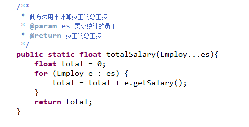

# Java中的注释规范：

## Java中注释的三种形势：

### 单行注释（用在方法内部，用来标注一行或者多行代码功能）

```java
public static void borrowBook(int m){
		//这是注释内容
		System.out.println("借了"+m+"本书");
}
```

### 多行注释（用在方法内部，用来标注某个代码块的代码功能，当注释内容比较多时使用）

```java
/*
* 这是多行注释的第一行
* 这是多行注释的第二行
*/
if(){
	
}else{
			
}
```

### 代码块注释（用在类或者方法的前面，用来标注一个类/一个方法的功能）

> 方法注释：
>
> 
>
> 类注释：
>
> 

### 生成JavaDOC文档：

1.完成项目中代码的注释（语句注释，方法注释和类注释）

2.点击MyEclipse中的“Project”   “Generate Javadoc”

3.选择项目和文档的保存路径


4.打开指定目录中的index.html

# 标识符

类名、方法名和变量名统称为标识符

1.标识符可以包含字母、数字、$和_，但是不能以数字开头

2.不能使用Java中的关键字和保留字做为标识符

3.尽量避免使用Java中已经存在的名字做为标识符

4.尽量避免使用中文标识符

5.尽量让标识符具备一定的含义（增强代码的可读性）

# 关键字和保留字：

关键字：在java代码中具备特殊的含义

保留字：在java中没有特殊含义，但是不允许使用的单词（goto,const）

<table>
    <tr>
        <td colspan="2">关键字</td>
    </tr>
    <tr>
        <td>数据类型</td>
        <td>byte,short,int,long,float,double,char,boolean</td>
    </tr>
    <tr>
        <td>访问权限</td>
        <td>public,protected,private</td>
    </tr>
    <tr>
        <td>流程控制</td>
        <td>分支：if,else,switch,case,default,break  循环：while,do,for,continue</td>
    </tr>
    <tr>
        <td>面向对象</td>
        <td>package,import,class,abstract,interface,extends,implements,final,void,null  static,this,super,new,return,native,instance, transient, synchronized</td>
    </tr>
    <tr>
        <td>异常处理</td>
        <td>try,catch,throw,throws,finally</td>
    </tr>    
</table>

# 数据类型

Java是一种强类型语言，不同类型的数据要存放在不同类型的变量中

| 强类型(Java)                                                | 弱类型(JavaScript)                                      |
| ----------------------------------------------------------- | ------------------------------------------------------- |
| int i  = 5;  <br/>String  str = “abc”;<br/>float  f = 3.3f; | var i  = 5;  <br/>var  str = “abc”;  <br/>var f  = 3.3; |

**变量：就是在系统中分配的一个内存空间，用于存放数据**


**Java中的变量分为简单类型和引用类型**

​     简单类型：在栈区中开辟变量的存储内存空间，并且值就存放在变量空间中

​     引用类型：在栈区中开辟变量的引用内存空间，值并没有存放在变量中，而是存放在堆区的内存空间中，变量中存储的是堆区的内存地址


> 1)整数类型：byte、short、int、long都是表示整数的，只不过他们的取值范围不一样。
>
> byte(字节类型) 一个byte 8位，取值范围为-128~127，占用1个字节（-2的7次方到2的7次方-1）默认是0
>
> short(短整型) 一个short 16位，取值范围为-32768~32767，占用2个字节（-2的15次方到2的15次方-1）默认是0
>
> int(整型)    一个int 32位，取值范围为（-2147483648~2147483647），占用4个字节（-2的31次方到2的31次方-1）默认是0
>
> long(长整型)  一个long 64位,取值范围为（-9223372036854774808~9223372036854774807）,占用8个字节（-2的63次方到2的63次方-1）默认是0L或0l推荐用大写；

## 八种基本数据类型：

​     ①布尔类型：通常用来表示一个判断结果(true|false) boolean b = 5>3;

​     ②字符型：用来存储一个字符 char c = ‘a’; String s = “a”;

​     ③整型：byte,short,int,long

​     ④浮点数：float,double


## 类型转换：（boolean不支持转换）


# 局部变量和成员变量：

|        | 成员变量                                                     | 局部变量                                         |
| ------ | ------------------------------------------------------------ | ------------------------------------------------ |
| 定义   | 定义在类中变量/属性                                          | 定义在代码块（方法,if,else,for…）中的变量        |
| 修饰符 | 可以被修饰符修饰                                             | 不能被修饰符修饰                                 |
| 作用域 | 可以被当前类中的所有方法调用  也可以被当前类的对象调用       | 只能作用于当前代码块  (包括当前代码块中的代码块) |
| 初始值 | 可以不赋初始值而直接使用  （会有默认值，引用类型为null，数值类型为0/0.0，布尔类型为false） | 必须赋初始值才能使用                             |

