#          Java中运算符  

运算符有哪些？

每个运算符的作用及使用

## 分割运算符

**,**  一般用在方法的参数列表中，用来分割多个参数

**;** 每句Java代码结束，都以;结尾，用来分割多句代码

**()**  用在方法名的后面，用来将参数列表分割开来

用在数学运算中，表示较高的优先级

**[]** 用来声明数组

**{}** 用来隔离定义和代码块，用来类、方法等之后

## 算术运算符

数学运算（数字之间的加减乘除运算）

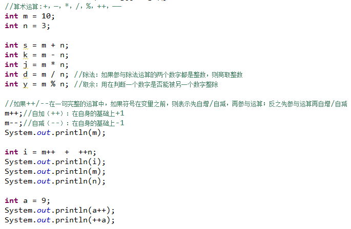

## 关系运算

大小关系（两个数值之间的大小关系）

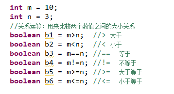

## 布尔逻辑运算

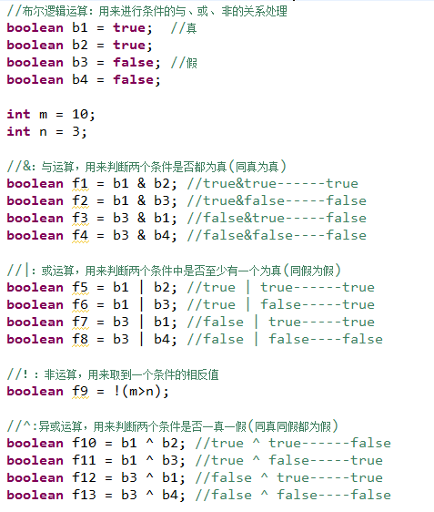

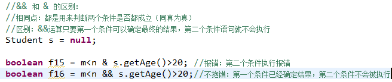

## 位运算

就是将数据转换成二进制之后的运算

二进制中的关系运算：

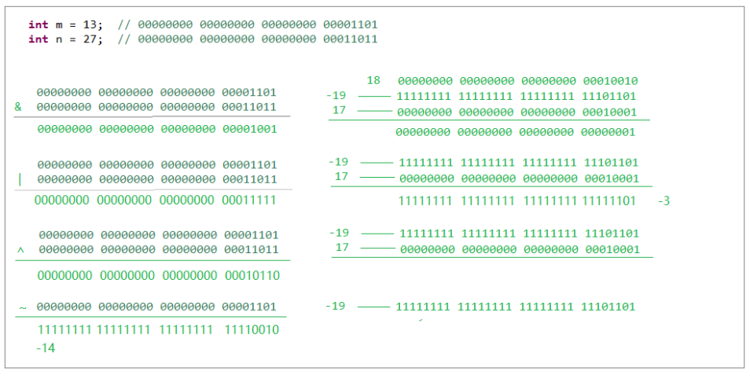

二进制中的移位运算：

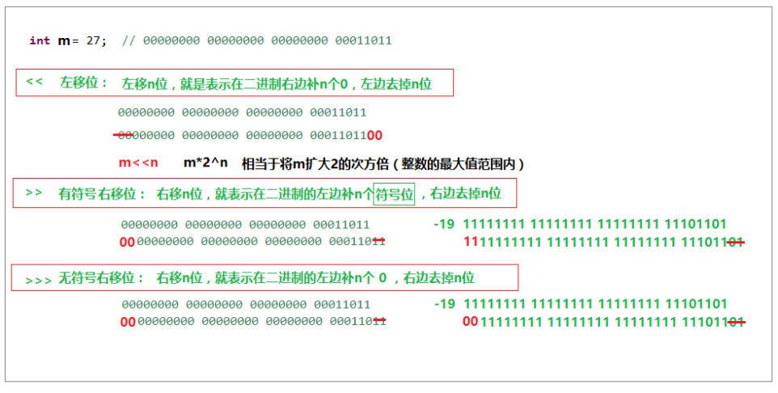

## 赋值运算符

**赋值运算符:** =   int i = 5;

**扩展赋值运算符：** +=，―=，=，=

i**+=**5;	i = i+5;

i-=5;	i = i-5;

## 字符串连接

+

如果+两端都是整数，则表示数学加法

只有有一个不是整数，则表示字符串拼接

## 强制转换

()

## 三目运算符

?:

> &和&&都可以用作逻辑与的运算符，表示逻辑与（and），当运算符两边的表达式的结果都为true时，整个运算结果才为true，否则，只要有一方为false，则结果为false。
>  &&还具有短路的功能，即如果第一个表达式为false，则不再计算第二个表达式&还可以用作位运算符，当&操作符两边的表达式不是boolean类型时，&表示按位与操作，我们通常使用0x0f来与一个整数进行&运算，来获取该整数的最低4个bit位，例如，0x31 & 0x0f的结果为0x01。
>
> ||和|都是表示“或”，区别是||只要满足第一个条件，后面的条件就不再判断，而|要对所有的条件进行判断。

（1）在Java程序中，使用与操作，要求所有表达式的判断结果都是TRUE，才为真，若有一个为FALSE，那么最终判断结果则为FALSE

（2）使用或操作，只要其中有一个表达式为TRUE，那么最终的结果就为TRUE，只有当所有的表达式为FALSE时最终结果才为FALSE

实际含义不同：

“||”:  如果左边计算后的操作数为true,右边则不再执行，返回true；

“|”：前后两个操作数都会进行计算。也就是说：“|”不存在短路。

```java
System.out.println(1&1);1
System.out.println(1&0);0
System.out.println(0&1);0
System.out.println(0&0);0
System.out.println(1|1);1
System.out.println(1|0);1
System.out.println(0|1);1
System.out.println(0|0);0
```

# 进制转换

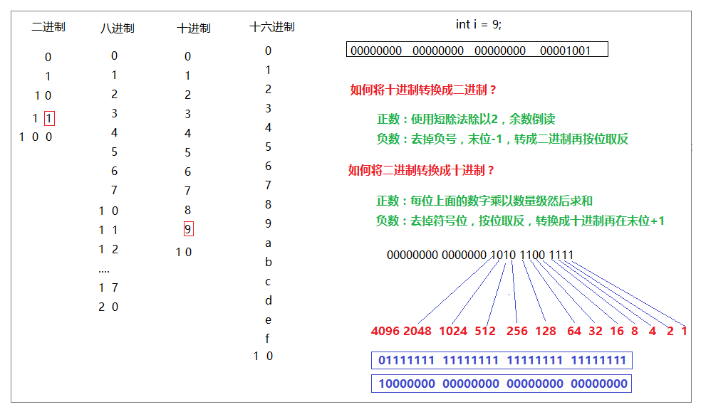

# 流程控制

## 分支语句

在不同的情况下，执行不同的代码

###  if语句

> 语法：
>
> ```java
> if(条件语句){
> 
> //代码
> 
> }
> ```
>
> 
>
> 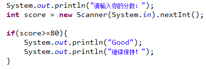
>
> ```java
> if(条件语句){
>     //if代码块
> }else{
>     //else代码块
> }
> ```
>
> 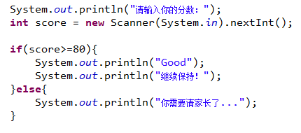
>
> ```java
> if(条件1){
>     //代码1
> }else if(条件2){
>     //代码2
> }…{
> }else if(条件n){
>    //代码n
> }else{
>    //代码m
> }
> ```
>
> 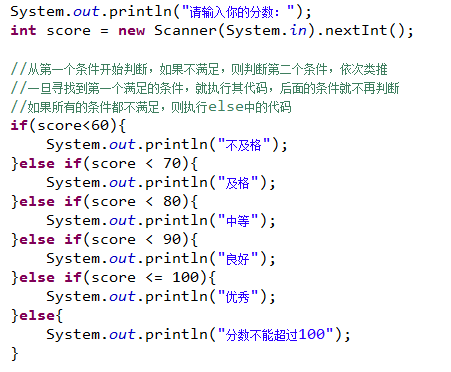

### switch语句

```java
switch(变量){
   case value1 :代码1;
   case value2:代码2;
   …
   case valuen:d代码n;
   default: 代码m;
}
```

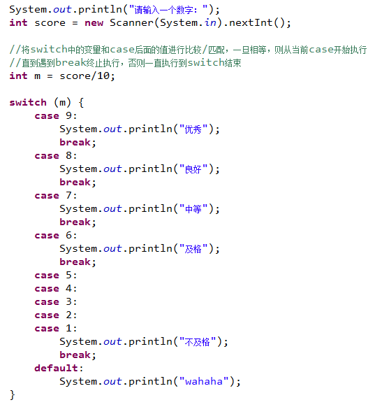

###          循环语句  

在满足某个条件的情况下，重复执行相同的代码

-  for语句

> 语法：
>
> for( 初始化语句;条件语句;语句3 ){
>    //循环体
> }
>
> ```java
> for( int i=0; i<5; i++){
> 	System.out.println(i);
> }
> ```

- while语句

> 语法：
>
> while(条件){
>    //循环体
> }
>
> ```java
> int i=0; 
> while( i<5 ){
> 	System.out.println(i);
> 	i++;
> }
> ```

- 3.3.4 break和continue的区别

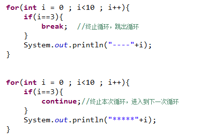

