# 单例模式

static：静态的属性和方法可以通过“类名.属性/方法”直接调用

private：私有的属性和方法只能被本类访问

单例模式：一个类只允许产生一个对象

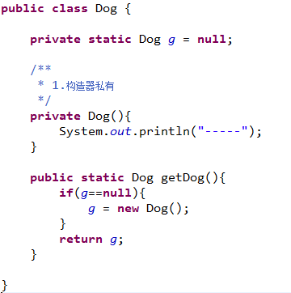

----

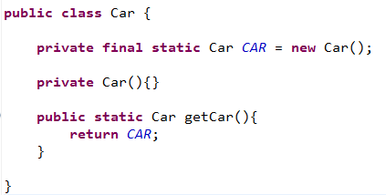

---

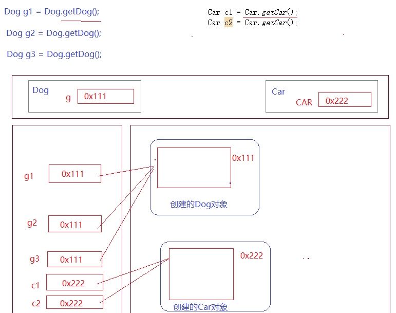

# 抽象类

类的继承：子类继承父类，可以获取父类中的属性和方法

- abstract:

可以使用abstract关键字来修饰类和方法，被abstract修饰的类称之为抽象类，被abstract修饰的方法称之为抽象方法。 

- 抽象方法：

只完成了方法的定义，而没有方法的实现过程（没有方法体）

> [<modifiers>] **abstract** <returnType> <methodName>([args]);
>
> 和普通方法的区别：
>
> 1.被abstract修饰
>
> 2.没有方法体
>
> 3.不能定义静态的抽象方法

方法的实现：如果子类继承了父类中的抽象方法，并且对抽象方法进行改写

- 一个非抽象类继承一个抽象类之后，必须实现抽象类中所有的抽象方法。

**什么情况下必须将一个类定义成抽象类？**

- 此类中存在抽象方法

- 此类继承了一个抽象类，但是并没有完全实现抽象类中的抽象方法

**创建抽象类的对象**：

---

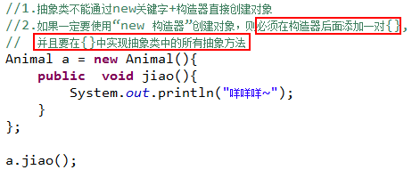

**模板设计模式**：在父类中只定义了算法的框架，而没有方法的实现（抽象方法）；在不同的子类中进行不同的实现。

# 接口

接口：就是一种特殊的抽象类

|                          | 抽象类                                                       | 接口                                                         |
| ------------------------ | ------------------------------------------------------------ | ------------------------------------------------------------ |
| 定义语法                 | public **abstract class** ClassName{     }                   | public **interface** InfName{     }                          |
| 包含的元素               | 变量、常量  抽象方法、非抽象方法                             | 常量  抽象方法  在JDK8版本可以定义默认方法（default）        |
| 抽象方法定义             | 抽象类的抽象方法必须使用abstract关键字修饰                   | 接口中的抽象方法可以使用abstract修饰，也可以省略             |
| 继承/实现关系            | 子类继承抽象类（extends）    一个子类只能继承一个抽象类 | 子类实现接口（implements）    一个子类可以实现多个接口 |
| 类与接口的继承实现关系图 | 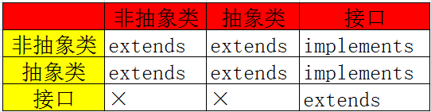                                          |                                                              |

# 内部类

定义在类中或者方法中的类称之为内部类

- 定义在类中的内部类
  定义在类中的内部类，和这个类的属性、方法一样，都属于类的成员
  定义语法：

> [<private|protected|public>] [**static**] **class** <ClassName>{
>
> }

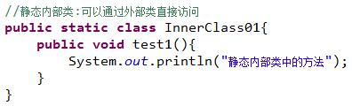

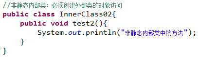

- 创建内部类的对象：

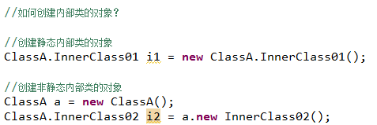

定义在方法中的内部类

定义在方法中的内部类，相当于这个方法的局部变量，只能在这个方法的内部使用

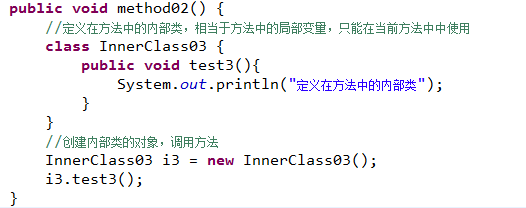

**内部类的特性：**

​     内部类可以定义成抽象类

​     内部类之间可以相互继承

​     内部类可以声明为private或者protected

​     内部类可以声明为静态的

 # 常见修饰符的使用范围

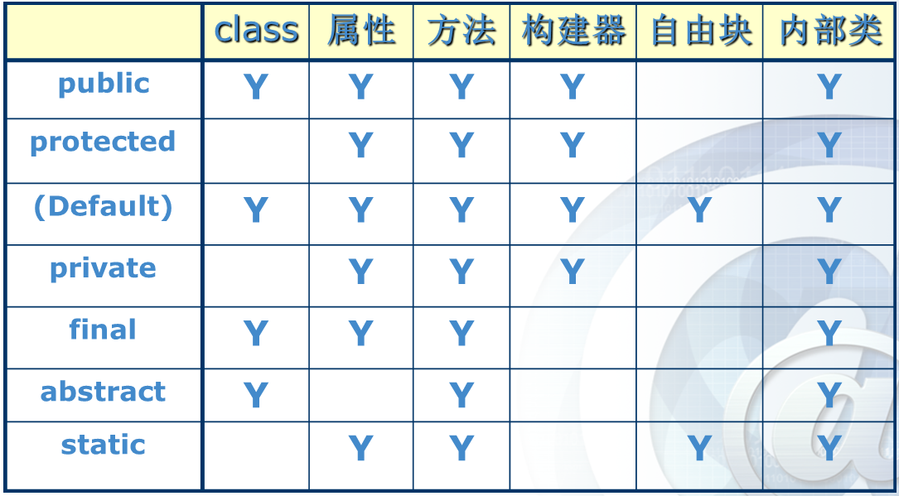

# 封装类

简单类型：byte,short,int,long,float,double,boolean,char

**String** str = “abc”;

JDK为8种简单数据类型分别提供了一个类，在类中定义了对此数据类型操作的常用方法，我们就把这些类称之为简单类型的封装类。

| 简单类型 | 封装类      | 简单类型 | 封装类        |
| -------- | ----------- | -------- | ------------- |
| byte     | **Byte**    | float    | **Float**     |
| short    | **Short**   | double   | **Double**    |
| int      | **Integer** | boolean  | **Boolean**   |
| long     | **Long**    | char     | **Character** |

**Integer**：int类型的封装类

| ·简单类型变量和封装类对象的转换（int   Integer,Integer  int）   int i = 5;   Integer a = new Integer(i);   int j = a.intValue(); |
| ------------------------------------------------------------ |
| 了解封装类中对此类型数据的常用操作方法 **static  int parseInt(String str)**： 将字符串转换成整数  String str = “45”;    int i = Integer.parseInt(str);   **static  String toBinaryString(int i):** 获取当前整数的二进制字符串  String str = Integer. toBinaryString(9);     **static  String toOctalString (int i):** 获取当前整数的8进制字符串      **static  String toHexString (int i):** 获取当前整数的16进制字符串 |

# String类

String类中提供了对字符串的常用操作

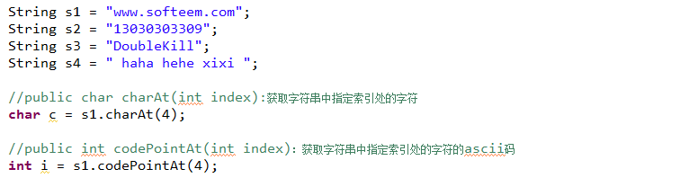

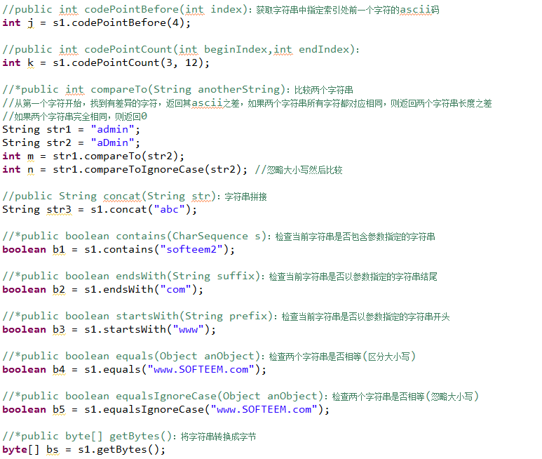

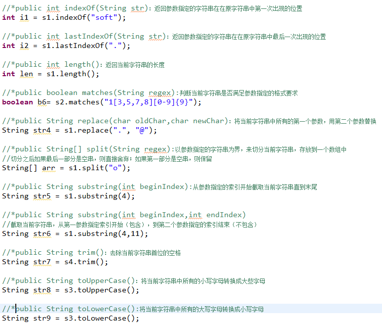