# 命令行参数

​     main方法执行需要的参数

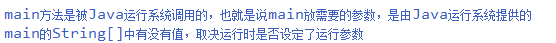

# 标准输入输出（IO）

标准输入：用户可以通过控制台输入数据到程序中

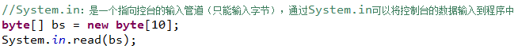

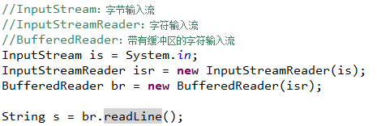

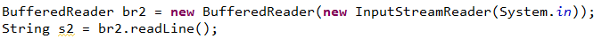

通过java.util.Scanner完成控制台数据的输入：

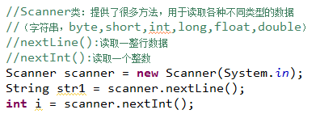

标准输出：将程序中的数据显示到控制台中，提供给用户看

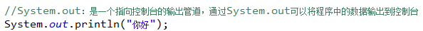

System.*err*也是一个指向控制台的输出流，但是它专门用来输出错误提示信息，会专门启动一个线程来输出  

# Math类

- 作用:Math类中定义很多有关数序运算的方法，并且这些方法都是static的
- 构造器:没有对外提供构造器

- 字段

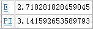

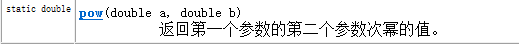

- 方法

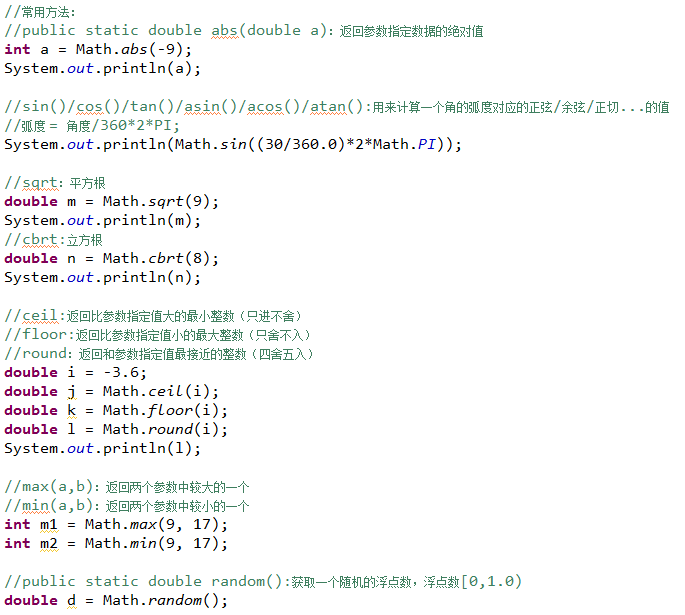

# File类

- 定义

File类位于java.io包，一个File类的对象，表示一个文件或者一个目录

File类中包含很多对文件文件夹的操作方法

- 构造器

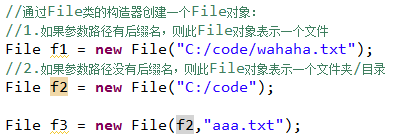

- 方法

①获取文件的状态

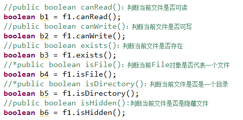

②获取文件的信息

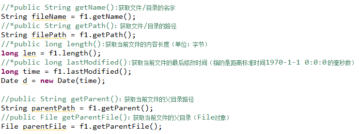

③获取目录下的子文件

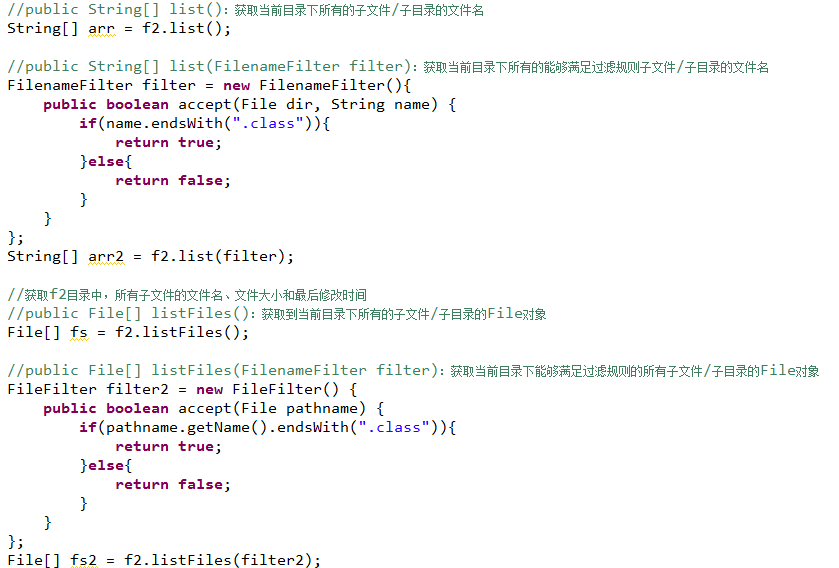

- 遍历文件夹

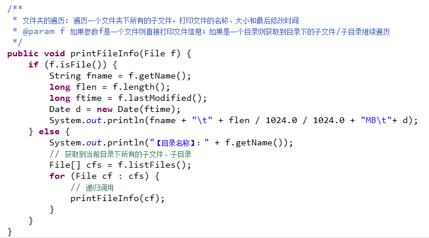

# Properties类

- 一个数组中可以存放多个元素，多个元素必须是同一种类型，且数组长度一旦确定就不能改变。

- **集合**和数组一样也可以存放多个元素，并且允许元素是不同的类型，且集合的长度可以改变。

​     int[] arr = new int[10];

​     Java中提供类一些集合类，一个集合类的对象就是一个集合。

| **定义**   | 一个Properties对象就是一个键值对集合                  |
| ---------- | ----------------------------------------------------- |
| **构造器** | 提供了无参构造器：  Properties p =  new Properties(); |
| **方法**   | 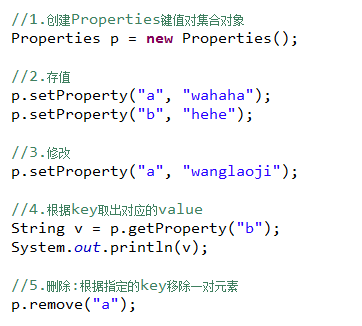                                    |

