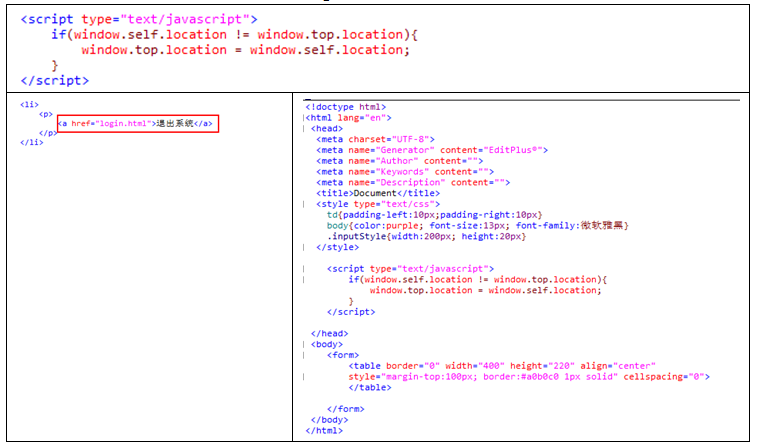
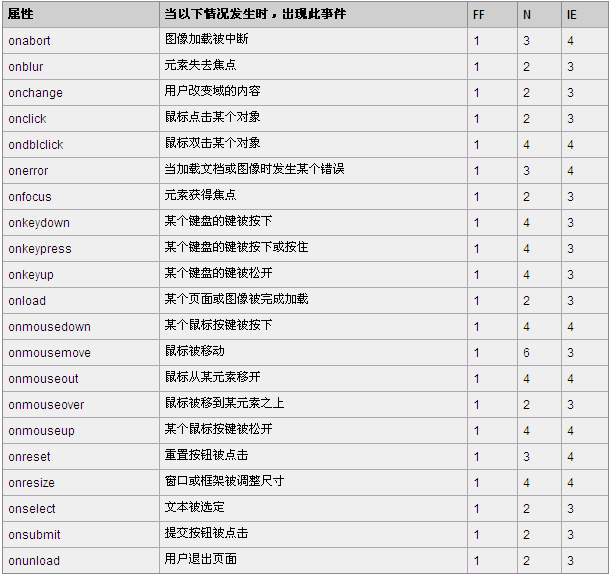

# 知识回顾

HTML(3天):
	显示标签
	输入标签
	功能标签：<a></a>   <form action="" method=""></from>
	布局标签：<table></table>   <div style=""></div>   <ol></ol>   <ul></ul>
	其他标签：
CSS(1天)：
	文本
	字体
	背景
	边框
	间距
JavaScript(3天)：
	JS介绍，JS基本语法，JavaScript内置对象（Array，String，RegExp，Math，Date，Global）
	浏览器内置对象（window,navigator,screen,history,location）
	Document对象，DOM节点操作（添加节点，删除节点，插入节点，替换节点）
•通过JS修改页面中某个/某些元素的属性
•通过JS修改页面中某个/某些元素的样式
•通过JS完成页面中节点的操作
•通过JS完成用户输入的数据的校验（表单元素校验）

```java
document：
	var arr = document.links;
	var arr = document.images;
	var arr = document.forms;    var formTag = document.formName;
	var bodyNode = document.body;
	
	document.getElementsByTagName(tagName);
	document.getElementsByName(name);
	document.getElementById(id);
	
	var node = document.createElement(tagName);
	var textNode = document.createTextNode(“aaaa”);
	appendChild(node);
	removeChild(node);
	replaceChild(newNode,oldNode);
	insertBefore(node);
```

# JS实现图片翻转


# JS在frameset框架中的简单应用

避免登录页面的“后退”操作，在login页面添加如下代码：



# JS事件

事件：对页面中的某个元素的某种动作



