# Servlet介绍

Servlet类：就是一个可以接收页面HTTP请求的类。

# Servlet类的创建

1.创建一个类，类名以Servlet结尾

2.继承HttpServlet类

3.重写HttpServlet类中继承的doGet和doPost方法

4.删除重写的方法中的注释和代码，并且在doGet中调用doPost

# Servlet类的配置

当一个Servlet类创建完成以后，需要在webRoot/WEB-INF/web.xml文件中进行路径配置，如下：

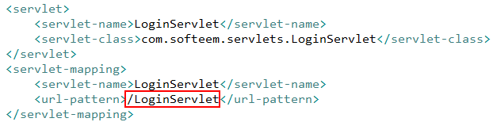

# JSP提交数据到Servlet类

只需在jsp页面将form标签的action属性值修改为Servlet类对应的路径

# 在Servlet类中接收页面提交的数据

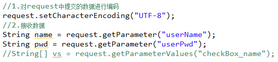

# 从Servlet类传值到JSP页面

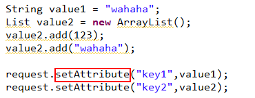

# 从Servlet类跳转到JSP页面

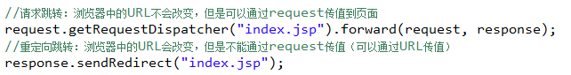

# 如何在JSP页面接收数据

## 1.通过Java代码接收

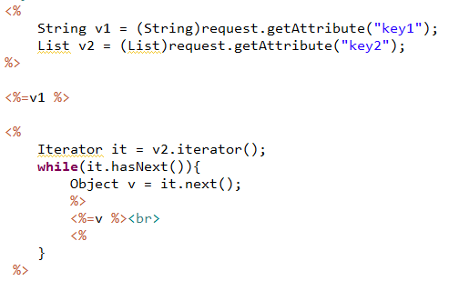

## 2.通过JSTL+EL接收数据

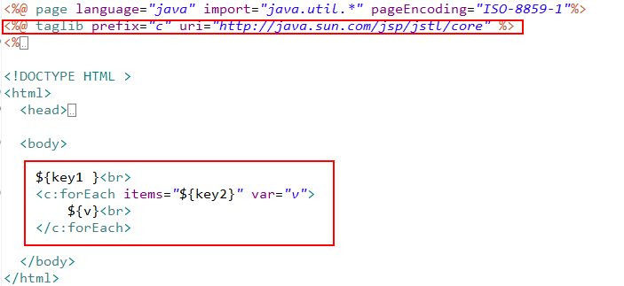

# request对象

在页面和Servlet类之间传值

# session对象   

session对象也可以用来传值，作用于一次会话的所有页面

通过session对象完成登录验证（未登录用户不允许访问项目主页面）

# response对象

在服务器端响应客户端的请求

# config和application对象

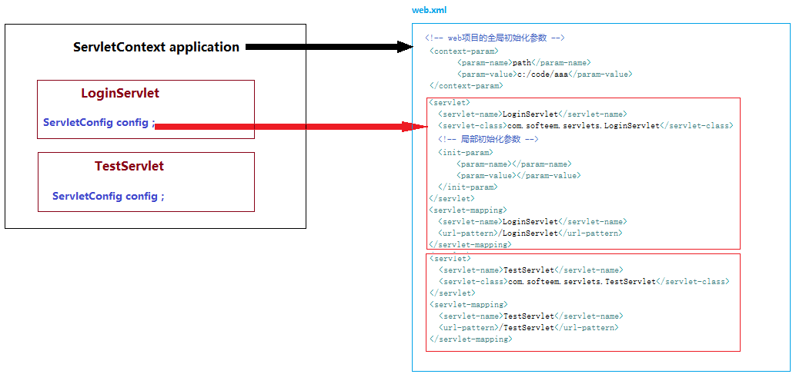

ServletConfig对象，与当前Servlet类相关，通过config对象我们可以：

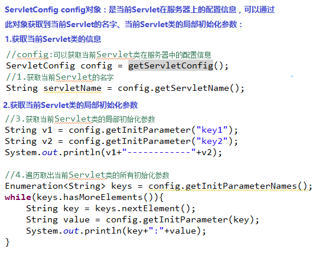

ServletContext(application)对象，与整个项目相关，一个项目只会创建一个application对象，通过application对象我们可以：

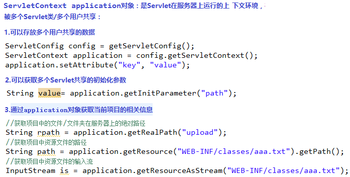

# Servlet的初始化参数

我们可以在web.xml中配置一些Servlet中需要使用的参数，这些参数会被Servlet类加载，根据参数使用范围的不同分为：全局初始化参数和局部初始化参数

​     全局初始化参数：配置在web.xml文件中，可以被当前项目中任何一个Servlet类加载

​     局部初始化参数：配置在web.xml的某个servlet标签中，只能被当前Servlet类加载

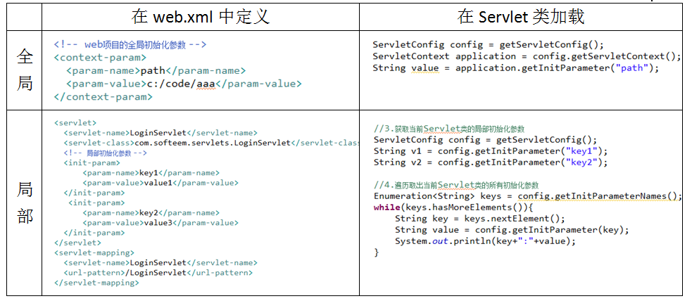

# cookie

在web项目中，某些情况下由于项目功能的需要，服务器需要将某些用户信息保存在客户端。所以我们需要使用Cookie对象：

​     ·Cookie是存储在客户端的一个文件

​     ·Cookie是通过服务器保存在客户端的

​     ·Cookie文件谁保存谁才能访问，

如下案例：（记住登录密码）

 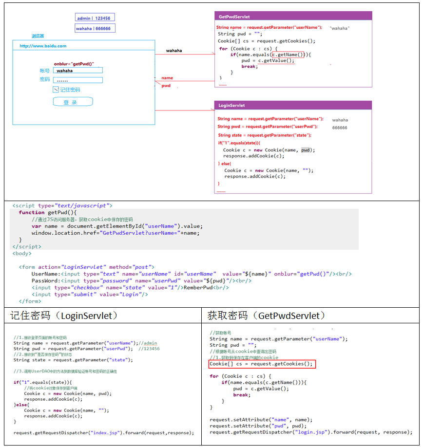

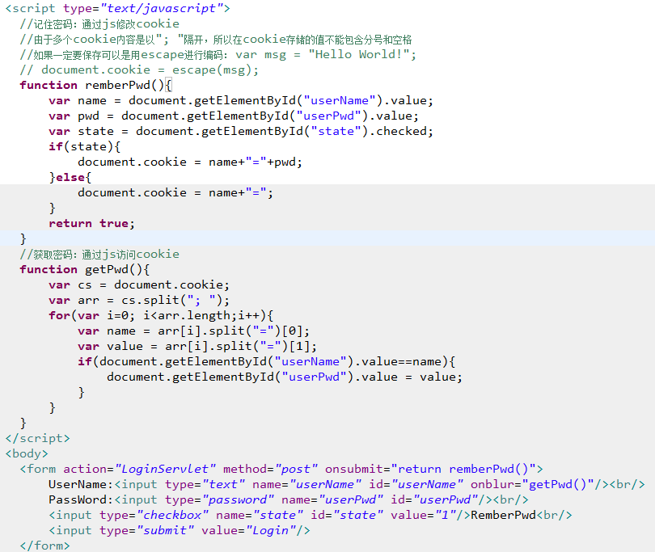

# Servlet的生命周期

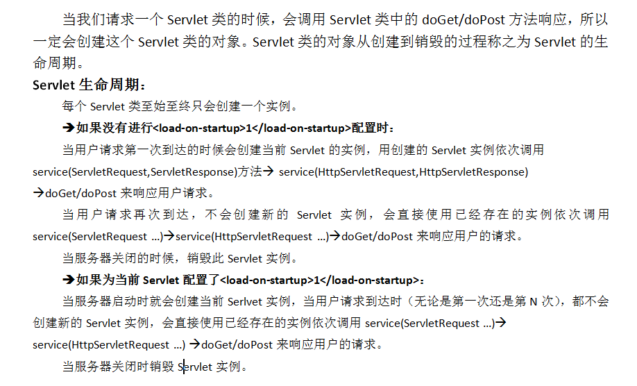

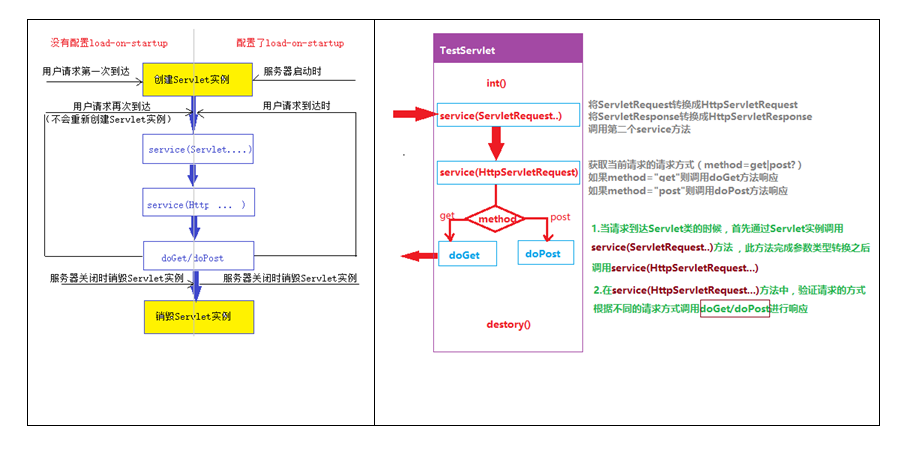