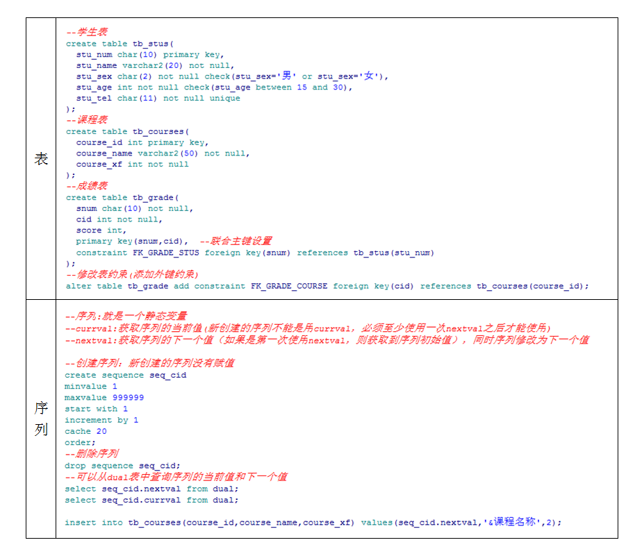
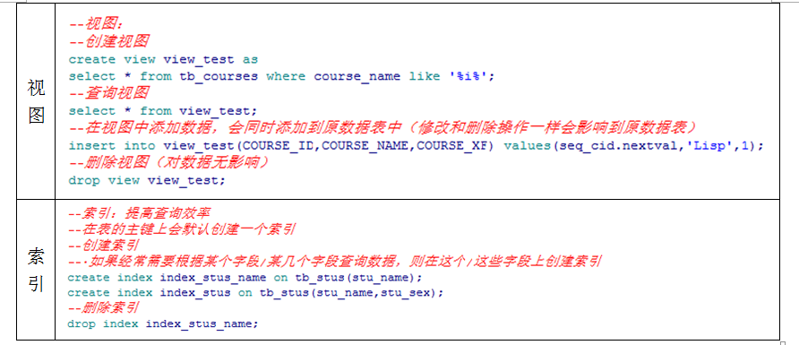

# 数据字典

数据字典：在Oracle系统表空间中提供了一些数据表，这些表记录了Oracle中的各种系统信息，用户可以通过查

询这些表来了解Oracle数据库实例中的对象、用户等信息。

了解不同的系统表中存放的不同的系统信息。

- 用户

```sql
--【与用户信息相关的数据表】
--user_users：查询当前用户的信息（用户名，状态，表空间，临时表空间）
select * from user_users;
--dba_users:提供给管理员，查询所有/指定用户的信息（用户名，状态，表空间，临时表空间）
select * from dba_users;
select * from dba_users where username='SCOTT';

--user_role_privs：查询当前用户所具有的角色
select * from user_role_privs;

--user_sys_privs：查询当前用户所具有的“系统权限”
select * from user_sys_privs;
--dba_sys_privs:提供给管理员，用户查询所有/指定用户的系统权限
select * from dba_sys_privs;
select * from dba_sys_privs where grantee='SCOTT';

--user_tab_privs: 1.可以查询到其他用户授予给当前用户的表级权限
--                2.可以查询到当前用户授予给其他用户的表级权限
select * from user_tab_privs;

--v$pwfile_users:提供给管理员用户查看当前系统中特权用户的视图
select * from v$pwfile_users;
```

- 表

```sql
--user_tables：查询当前用户的所有的表
select * from user_tables;
--user_tab_columns:查询当前用户的表中的字段信息
select * from user_tab_columns;
select * from user_tab_columns where table_name='EMP';
```

- 索引

```sql
--user_indexes：查询到当前用户的所有索引信息
select * from user_indexes;
--user_ind_columns：查询索引所在的字段
select * from user_ind_columns;
select * from user_ind_columns where index_name='IND_EMP';
```

- 视图

```sql
--user_views:查询到当前用户所有的视图
select * from user_views;
```

- 其他

```sql
--【与约束相关的数据表】
--user_constraints:查看当前用户所有表中的约束信息
select * from user_constraints;
--根据表名查看某张表的约束信息
select * from user_constraints where table_name='EMP';

--【与存储过程相关的数据表】
--user_procedures：查询当前用户所有的存储过程
select * from user_procedures;

--[可以根据object_type不同查询出所有的数据库对象]
--user_objects:查询当当前用户所有的数据库对象（表，视图，索引，存储过程，触发器，函数....）
select * from user_objects;
select * from user_objects where object_type=upper('&请输入对象类型：');
```

# SQL语句

## DDL





## DML

```sql
--tb_stus
--学生表
create table tb_stus(
  stu_num char(10) primary key,
  stu_name varchar2(20) not null,
  stu_sex char(2) not null check(stu_sex='男' or stu_sex='女'),
  stu_age int not null check(stu_age between 15 and 30),
  stu_tel char(11) not null unique
);
--tb_courses
--tb_grade

--增：请在表名后面的(),指定添加数据的列名
insert into tb_stus values('2016010101','张三','男',21,'13030303300');
insert into tb_stus(stu_num,stu_name,stu_sex,stu_age,stu_tel) values('2016010102','李四','男',21,'13030303301');

--改（update）：就是对数据表中的数据进行修改（通常就是根据主键修改其他字段）
--主键：关键字段
--非主键：非关键字段
update tb_stus set stu_name='二狗子',stu_sex='女',stu_age=20,stu_tel='13131313311' where stu_num='2016010102';

--删（delete）：
delete from tb_stus where stu_num='2016010102';

--查询：
select * from tb_stus;
delete from tb_stus;

--查询当前客户端编码
select userenv('language') from dual;


--dept(部门表)
--emp(员工表)
select * from user_tables;
--分别查询dept表和emp表中的所有信息
select * from dept;
select * from emp;

--查询：select  */字段名 from 表名 [where 条件]
select * from emp where deptno=20;

select ename,sal,deptno from emp where deptno=20;

select ename from emp;

--1.给列取别名:as不要省略，别名不能用单引号
select ename as hehe,job as haha,sal from emp;

--2.计算列
select ename,sal,sal*1.15 as newsal from emp;

--3.排序:order by 字段名  [升序asc，降序desc]
select ename,sal,deptno from emp;
select ename,sal,deptno from emp order by deptno desc;
--根据多个字段排序
select ename,sal,deptno from emp order by deptno desc,sal asc;

--4.消除重复行[distinct]
select distinct deptno from emp;

--5.rownum:oracle为每张数据表提供的伪列，就是对查询到的数据进行编号（1.2...）  
select rownum,ename,deptno from emp;
select rownum,ename,deptno from emp where deptno=30;
select rownum,emp.* from emp where rownum<=5;

--6.通过伪列实现分页 （pageSize,pageNum）
select * from emp where empno not in(select empno from emp where rownum<=(pageNum-1)*pageSize ) and rownum<=pageSize;

--7.分组：对查询出的数据进行分组统计
--通过group by进行分组查询，select后面只能是聚合函数和被分组字段
--count(*)
--sum(sal)
--max(sal)
--min(sal)
--avg(sal)

--按部门编号分组，统计每个部门的人数,,
select count(*) from emp group by deptno;

--按部门编号分组，显示部门的平均工资
select avg(sal),deptno from emp group by deptno order by deptno;
select deptno,max(sal) from emp group by deptno;
select deptno,min(sal) from emp group by deptno;

--having:对分组的数据进行筛选
select deptno,min(sal) from emp group by deptno having min(sal)>800;

select * from V$nls_Parameters
```

# [oracle中清空表数据的两种方法]

1、delete from t

2 、truncate table t

 区别： 

1、delete是dml操作；truncate是ddl操作，ddl隐式提交不能回滚

2、delete from t可以回滚，truncate table t 不可以回滚

3、 truncate table t 执行效率更高，会回收表空间，delete from t执行效率慢，不会回收表空间

4、 truncate table t高水线下降，delete from t高水线不降（这个不太明白...）自增ID，TRUNCATE后从1开始，DELETE后还是接着自增