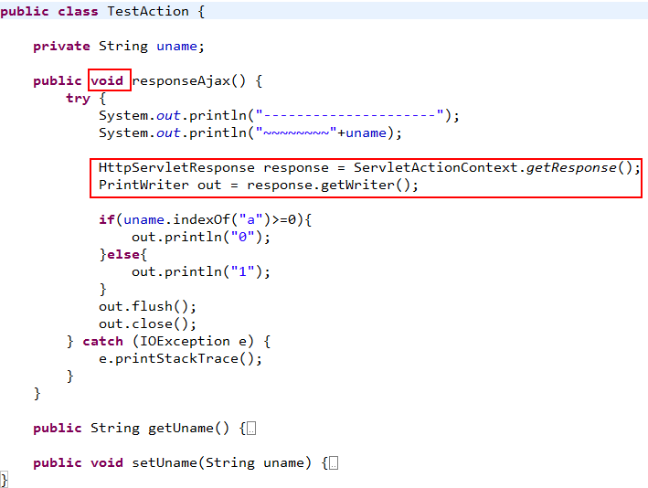
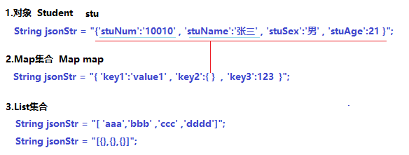
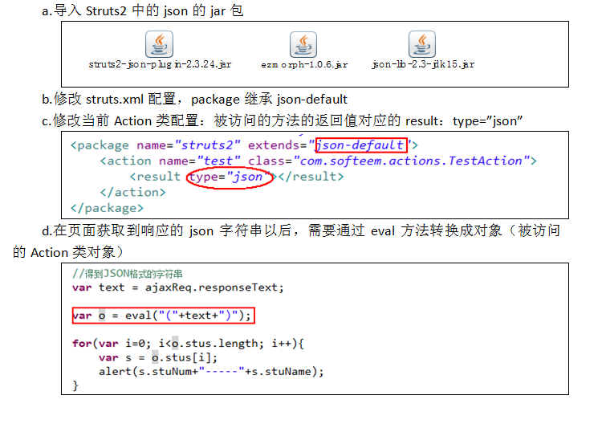

# ajax请求Action

Action响应Ajax请求有两种方式：通过response对象中的输出流响应，以JSON格式响应

通过response对象中的输出流响应：
	1.ajax请求的Action类中的方法不能有返回值，返回类型为void
	2.在Action类中被请求的方法中获取response对象，从response对象中再获取输入流，返回数据

以JSON格式响应
	1.什么是JSON?
		JSON就是有结构的字符串

2.为什么使用JSON?

​          使用JSON格式的字符串将数据传递到页面，可以通过JS代码完成对象和集合操作

3.如何使用JSON传值

