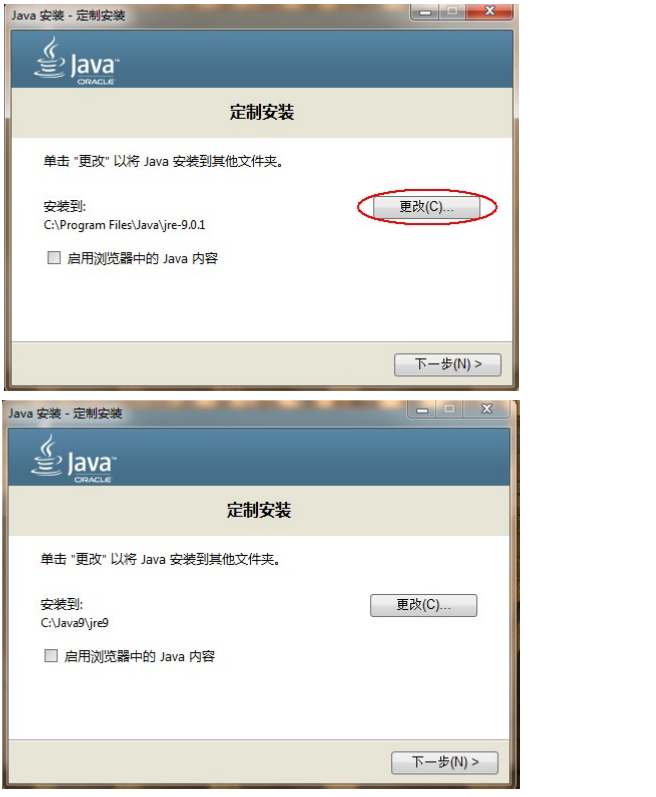
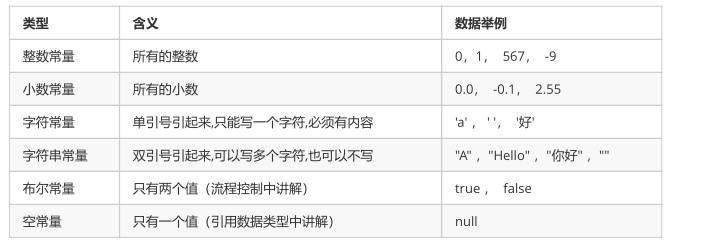
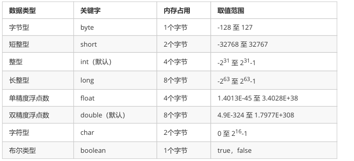

#  第一章 开发前言

## 1.1 Java 语言概述

### 1.1.1 什么是Java语言

Java语言是美国Sun公司（Stanford University Network），在1995年推出的高级的编程语言。所谓编程语言，

是计算机的语言，人们可以使用编程语言对计算机下达命令，让计算机完成人们需要的功能。

### 1.1.2  Java语言发展历史

- 1995 年Sun公司发布Java1.0版本
- 1997 年发布Java 1.1版本
- 1998 年发布Java 1.2版本
- 2000 年发布Java 1.3版本
- 2002 年发布Java 1.4版本
- 2004 年发布Java 1.5版本
- 2006 年发布Java 1.6版本
- 2009 年Oracle甲骨文公司收购Sun公司，并于2011发布Java 1.7版本
- 2014 年发布Java 1.8版本
- 2017 年发布Java 9.0版本

### 1.1.3 Java语言能做什么

Java语言主要应用在互联网程序的开发领域。常见的互联网程序比如天猫、京东、物流系统、网银系统等，以及服务器后台处理大数据的存储、查询、数据挖掘等也有很多应用。

## 1.2 计算机基础知识

### 1.2.1 二进制

计算机中的数据不同于人们生活中的数据，人们生活采用十进制数，而计算机中全部采用二进制数表示，它只包含0、1两个数，逢二进一，1+1=10。每一个0或者每一个1，叫做一个bit（比特）。

下面了解一下十进制和二进制数据之间的转换计算。

- 十进制数据转成二进制数据： 使用除以2获取余数的方式

  

- 二进制数据转成十进制数据： 使用8421编码的方式

  

> 小贴士： 二进制数系统中，每个0或1就是一个位，叫做bit（比特）。
>
> [8421快速转换法 2、10、16进制快速转换.md](https://github.com/wantao365/JavaGuide/blob/main/06.技术杂谈/8421快速转换法 2、10、16进制快速转换.md)

### 1.2.2 字节

字节是我们常见的计算机中最小存储单元。计算机存储任何的数据，都是以字节的形式存储，右键点击文件属性，

我们可以查看文件的字节大小。

8个bit（二进制位） 0000-0000表示为1个字节，写成1 byte或者1 B。

- 8 bit = 1 B
- 1024 B =1 KB
- 1024 KB =1 MB
- 1024 MB =1 GB
- 1024 GB = 1 TB

###  1.2.3 常用DOS命令

Java语言的初学者，学习一些DOS命令，会非常有帮助。DOS是一个早期的操作系统，现在已经被Windows系统

取代，对于我们开发人员，目前需要在DOS中完成一些事情，因此就需要掌握一些必要的命令。

- 进入 DOS操作窗口

  - 按下 Windows+R键盘，打开运行窗口，输入cmd回车，进入到DOS的操作窗口。

    

  - 打开 DOS命令行后，看到一个路径 c:\user 就表示我们现在操作的磁盘是c盘。

    

- 常用命令

  

#  第二章 Java语言开发环境搭建

## 2.1 Java 虚拟机——JVM


如图所示，Java的虚拟机本身不具备跨平台功能的，每个操作系统下都有不同版本的虚拟机。

##  2.2 JRE 和 JDK

- JRE (Java Runtime Environment) ：是Java程序的运行时环境，包含 JVM 和运行时所需要的 核心类库 。
- JDK (Java Development Kit)：是Java程序开发工具包，包含 JRE 和开发人员使用的工具。

我们想要运行一个已有的Java程序，那么只需安装 JRE 即可。

我们想要开发一个全新的Java程序，那么必须安装 JDK 。


> 小贴士： 三者关系： JDK > JRE > JVM

##  2.3 JDK9 安装图解




> 小贴士： 安装路径中，不要包含中文和空格。

##  2.4 JAVA_HOME 环境变量的配置

**配置环境变量作用**：开发Java程序，需要使用JDK中提供的工具，工具在JDK9安装目录的 bin 目录下。在DOS命令行下使用这些工具，就要先进入到JDK的bin目录下，这个过程就会非常的麻烦。不进入JDK的 bin 目录，这些工具就不能使用，会报错。为了开发方便，我们想在任意的目录下都可以使用JDK的开发工具，则必须要配置环境变量，配置环境变量的意义在于告诉操作系统，我们使用的JDK开发工具在哪个目录下。

JAVA_HOME：```c:\Java9\jdk -9.0.1```

Path：```%JAVA_HOME%\bin;%JAVA_HOME%\jre\bin;```(注意分号)

CLASSPATH：```.;%JAVA_HOME%\lib;%JAVA_HOME%\lib\tools.jar```（注意前面的“.”）

#  第三章 HelloWorld入门程序

##  3.1 程序开发步骤说明

开发环境已经搭建完毕，可以开发我们第一个Java程序了。

Java程序开发三步骤：编写、编译、运行。

## 3.2 编写Java源程序

1. 在 任意 目录下新建文本文件，完整的文件名修改为 HelloWorld.java ，其中文件名为 HelloWorld ，后 缀名必须为 .java 。
2. 用记事本打开

3. 在文件中键入文本并保存，代码如下：

```java
public class HelloWorld {
	public static void main(String[] args) {
    	System.out.println("Hello World!");
	}
}
```

> 文件名必须是 HelloWorld ，保证文件名和类的名字是一致的，注意大小写。 每个字母和符号必须与示例代码一模一样。

​	第一个 HelloWord 源程序就编写完成了，但是这个文件是程序员编写的，JVM是看不懂的，也就不能运行，因此我们必须将编写好的 Java 源文件 编译成JVM可以看懂的 字节码文件 。

##  3.3 编译Java源文件

在DOS命令行中，进入Java源文件的目录，使用 javac 命令进行编译。 命令：```javac Java源文件名.后缀名```

举例：```javac HelloWorld.java```

编译成功后，命令行没有任何提示。打开 d:\day01 目录，发现产生了一个新的文件 HelloWorld.class ，该文件就是编译后的文件，是Java的可运行文件，称为字节码文件，有了字节码文件，就可以运行程序了。

> Java源文件的编译工具 javac.exe ，在JDK安装目录的bin目录下。但是由于配置了环境变量，可以再任意目 录下使用。

##  3.4 运行Java程序

在DOS命令行中，进入Java源文件的目录，使用 java 命令进行运行。 命令：```java 类名字```

举例：```java HelloWorld```

> java HelloWord 不要写 不要写 不要写 .class。Java程序 .class 文件 的运行工具 java.exe ，在JDK安装目录的bin目录下。但是由于配置了环境变量，可 以再任意目录下使用。

##  3.5 入门程序说明

###  编译和运行是两回事

- 编译 ：是指将我们编写的Java源文件翻译成JVM认识的class文件，在这个过程中， javac 编译器会检查我们所写的程序是否有错误，有错误就会提示出来，如果没有错误就会编译成功。
- 运行 ：是指将 class 文件 交给JVM去运行，此时JVM就会去执行我们编写的程序了。

###  关于main方法

- main 方法：称为主方法。写法是固定格式不可以更改。main方法是程序的入口点或起始点，无论我们编写多少程序，JVM在运行的时候，都会从main方法这里开始执行。

##  3.6 添加注释comment

- 注释 ：就是对代码的解释和说明。其目的是让人们能够更加轻松地了解代码。为代码添加注释，是十分必须 要的，它不影响程序的编译和运行。
- Java 中有单行注释和多行注释
  - 单行注释以 // 开头 换行结束
  - 多行注释以 /* 开头 以*/结束

##  3.7 关键字keywords

- 关键字 ：是指在程序中，Java已经定义好的单词，具有特殊含义。

  - HelloWorld 案例中，出现的关键字有 public 、 class 、 static 、 void 等，这些单词已经被

    Java定义好，全部都是小写字母，notepad++中颜色特殊。

  - 关键字比较多，不能死记硬背，学到哪里记到哪里即可。

##  3.8 标识符

- 标识符 ：是指在程序中，我们自己定义内容。比如类的名字、方法的名字和变量的名字等等，都是标识符。
  - HelloWorld 案例中，出现的标识符有类名字 HelloWorld 。
- 命名规则： 硬性要求
  - 标识符可以包含 英文字母 26个(区分大小写) 、 0 -9数字 、 $ （美元符号） 和 _ （下划线） 。
  - 标识符不能以数字开头。
  - 标识符不能是关键字。
- 命名规范： 软性建议
  - 类名规范：首字母大写，后面每个单词首字母大写（大驼峰式）。
  - 方法名规范： 首字母小写，后面每个单词首字母大写（小驼峰式）。
  - 变量名规范：首字母小写，后面每个单词首字母大写（小驼峰式）。

#  第四章 常量

## 4.1 概述

常量：是指在Java程序中固定不变的数据。

##  4.2 分类



##  4.3 练习

需求：输出各种类型的常量。

```java
public class ConstantDemo {
	public static void main(String[] args){    
        //输出整数常量
        System.out.println(123);
        //输出小数常量
        System.out.println(0.125);
        //输出字符常量
        System.out.println('A');
        //输出布尔常量
        System.out.println(true);
        //输出字符串常量
        System.out.println("你好Java");
   }
}
```

#  第五章 变量和数据类型

## 5.1 变量概述

变量：常量是固定不变的数据，那么在程序中可以变化的量称为变量。

> 数学中，可以使用字母代替数字运算,例如 x=1+5 或者 6=x+5。 程序中，可以使用字母保存数字的方式进行运算，提高计算能力，可以解决更多的问题。比如x保存5，x也可 以保存6，这样x保存的数据是可以改变的，也就是我们所讲解的变量。

Java中要求一个变量每次只能保存一个数据，必须要明确保存的数据类型。

## 5.2 数据类型

### 数据类型分类

Java的数据类型分为两大类：

- 基本数据类型 ：包括 整数 、 浮点数 、 字符 、 布尔 。
- 引用数据类型 ：包括 类 、 数组 、 接口 。

### 基本数据类型

四类八种基本数据类型：



Java中的默认类型：整数类型是 int 、浮点类型是 double 。

## 5.3 变量的定义

变量定义的格式包括三个要素： 数据类型 、 变量名 、 数据值 。

### 格式

```
数据类型 变量名 = 数据值;
```

### 练习

定义所有基本数据类型的变量，代码如下：

```
public class Variable {
	public static void main(String[] args){    
        //定义字节型变量
        byte b = 100;
        System.out.println(b);
        //定义短整型变量
        short s = 1000;
        System.out.println(s);
        //定义整型变量
        int i = 123456;
        System.out.println(i);
        //定义长整型变量
        long l = 12345678900L;
        System.out.println(l);
        //定义单精度浮点型变量
        float f = 5.5F;
        System.out.println(f);
        //定义双精度浮点型变量
        double d = 8.5;
        System.out.println(d);
        //定义布尔型变量
        boolean bool = false;
        System.out.println(bool);
        //定义字符型变量
        char c = 'A';
        System.out.println(c);
	}    
}
```

> long类型：建议数据后加L表示。 float类型：建议数据后加F表示。

## 5.4 注意事项

- 变量名称：在同一个大括号范围内，变量的名字不可以相同。
- 变量赋值：定义的变量，不赋值不能使用。

# 小结

> 1.类型转换:等号左右两边类型不一样 自动:将数据范围小的赋值给数据范围大的(隐式) 强制:将数据类型范围大的赋值给范围小的
>
> 2.运算符: 算数:加减乘除 +:可以拼接 自增自减: 单独使用:结果一样 混合使用 ++:在前-->先算后用;在后-->先用再算 --:在前-->先算后用;在后-->先用再算 赋值: = +=:num+=1-->num = num+1 -= *= /= %=
>
> > 注意:在复合赋值运算符的时候,byte,short,char有一个隐式的强制类型转换
>
> 比较-->boolean
>
>  > < >= <= != 逻辑 &&:有假则假-->短路效果(如果符号前为假,后面不看) ||:有真则真-->短路效果(如果符号前为真,后面不看) !:取反 三元 格式: 比较?表达式1:表达式2
