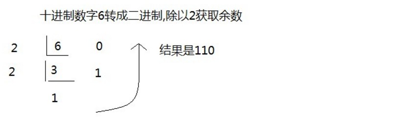
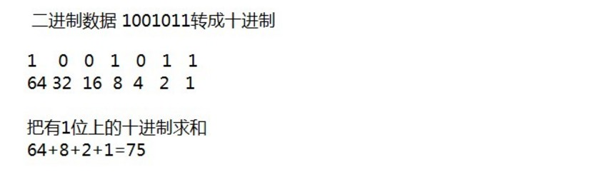
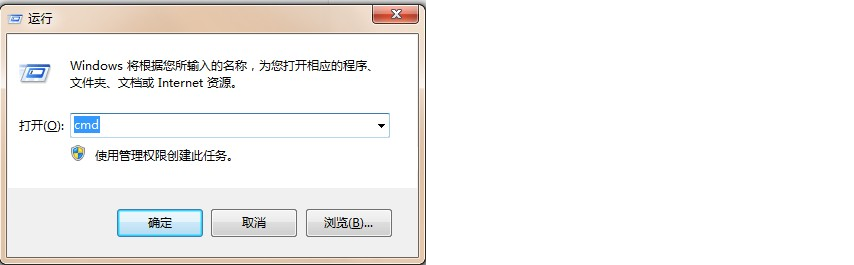
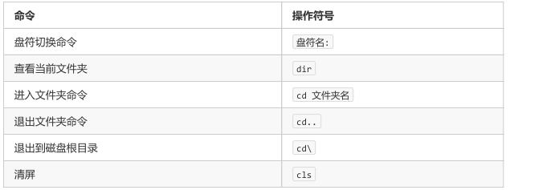
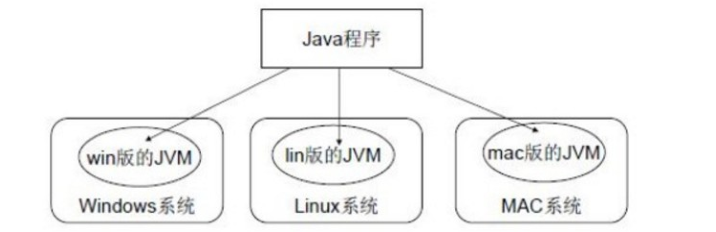
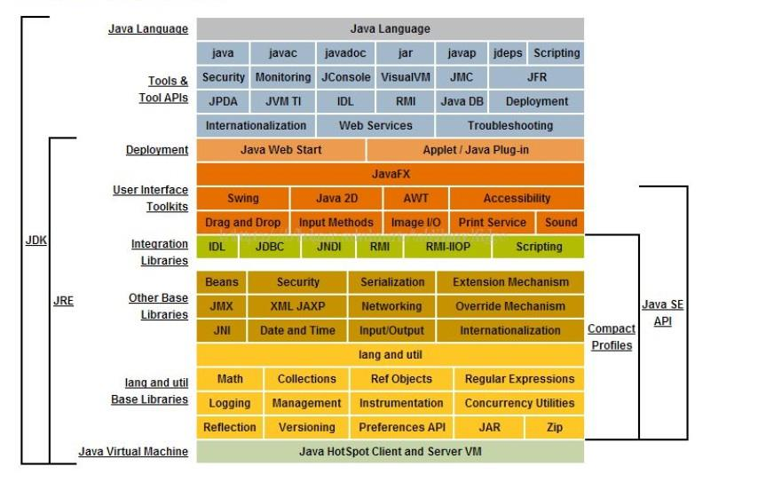
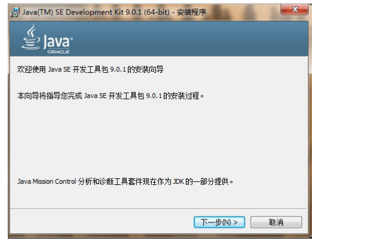

#  第一章 开发前言

## 1.1 Java 语言概述

### 1.1.1 什么是Java语言

Java语言是美国Sun公司（Stanford University Network），在1995年推出的高级的编程语言。所谓编程语言，

是计算机的语言，人们可以使用编程语言对计算机下达命令，让计算机完成人们需要的功能。

### 1.1.2  Java语言发展历史

- 1995 年Sun公司发布Java1.0版本
- 1997 年发布Java 1.1版本
- 1998 年发布Java 1.2版本
- 2000 年发布Java 1.3版本
- 2002 年发布Java 1.4版本
- 2004 年发布Java 1.5版本
- 2006 年发布Java 1.6版本
- 2009 年Oracle甲骨文公司收购Sun公司，并于2011发布Java 1.7版本
- 2014 年发布Java 1.8版本
- 2017 年发布Java 9.0版本

### 1.1.3 Java语言能做什么

Java语言主要应用在互联网程序的开发领域。常见的互联网程序比如天猫、京东、物流系统、网银系统等，以及服务器后台处理大数据的存储、查询、数据挖掘等也有很多应用。

## 1.2 计算机基础知识

### 1.2.1 二进制

计算机中的数据不同于人们生活中的数据，人们生活采用十进制数，而计算机中全部采用二进制数表示，它只包含0、1两个数，逢二进一，1+1=10。每一个0或者每一个1，叫做一个bit（比特）。

下面了解一下十进制和二进制数据之间的转换计算。

- 十进制数据转成二进制数据： 使用除以2获取余数的方式

  

- 二进制数据转成十进制数据： 使用8421编码的方式

  

> 小贴士： 二进制数系统中，每个0或1就是一个位，叫做bit（比特）。

### 1.2.2 字节

字节是我们常见的计算机中最小存储单元。计算机存储任何的数据，都是以字节的形式存储，右键点击文件属性，

我们可以查看文件的字节大小。

8个bit（二进制位） 0000-0000表示为1个字节，写成1 byte或者1 B。

- 8 bit = 1 B
- 1024 B =1 KB
- 1024 KB =1 MB
- 1024 MB =1 GB
- 1024 GB = 1 TB

###  1.2.3 常用DOS命令

Java语言的初学者，学习一些DOS命令，会非常有帮助。DOS是一个早期的操作系统，现在已经被Windows系统

取代，对于我们开发人员，目前需要在DOS中完成一些事情，因此就需要掌握一些必要的命令。

- 进入 DOS操作窗口

  - 按下 Windows+R键盘，打开运行窗口，输入cmd回车，进入到DOS的操作窗口。

    

  - 打开 DOS命令行后，看到一个路径 c:\user 就表示我们现在操作的磁盘是c盘。

    

- 常用命令

  

#  第二章 Java语言开发环境搭建

## 2.1 Java 虚拟机——JVM

如图所示，Java的虚拟机本身不具备跨平台功能的，每个操作系统下都有不同版本的虚拟机。

##  2.2 JRE 和 JDK

- JRE (Java Runtime Environment) ：是Java程序的运行时环境，包含 JVM 和运行时所需要的 核心类库 。
- JDK (Java Development Kit)：是Java程序开发工具包，包含 JRE 和开发人员使用的工具。

我们想要运行一个已有的Java程序，那么只需安装 JRE 即可。

我们想要开发一个全新的Java程序，那么必须安装 JDK 。

> 小贴士： 三者关系： JDK > JRE > JVM

##  2.3 JDK9 安装图解

