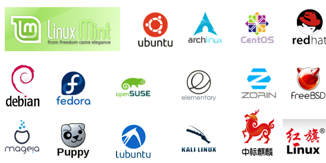

# Linux的简介 多任务多用户的操作系统

## 1．Linux的概述

Linux是基于Unix的开源免费的操作系统，由于系统的稳定性和安全性几乎成为程序代码运行的最佳系统环境。Linux是由Linus Torvalds（林纳斯·托瓦兹）起初开发的，由于源代码的开放性，现在已经衍生出了成千上百种不同的Linux系统。

Linux系统的应用非常广泛，不仅可以长时间的运行我们编写的程序代码，还可以安装在各种计算机硬件设备中，比如手机、平板电脑、路由器等。尤其在这里提及一下，我们熟知是Android程序最底层就是运行在linux系统上的。

## 2. 1．Linux的分类
(1)Linux根据市场需求不同，基本分为两个方向：

1）图形化界面版：注重用户体验，类似window操作系统，但目前成熟度不够

2）服务器版：没有好看的界面，是以在控制台窗口中输入命令操作系统的，类似 于DOS，是我们架设服务器的最佳选择

(2)Linux根据原生程度，又分为两种：

1）内核版本：在Linus领导下的内核小组开发维护的系统内核的版本号

2）发行版本：一些组织或公司在内核版基础上进行二次开发而重新发行的版本

(3)Linux发行版本不同，又可以分为n多种：

