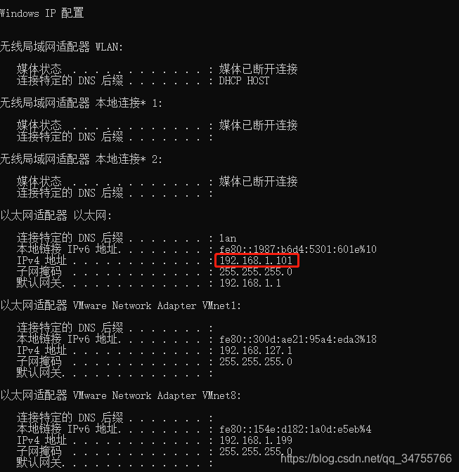
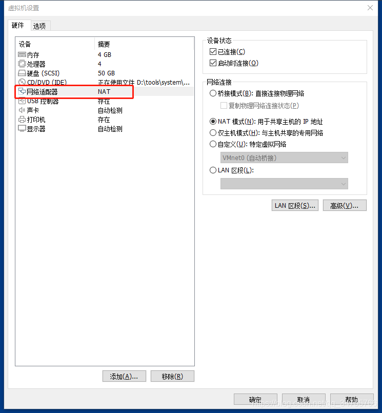
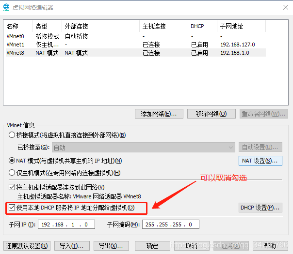
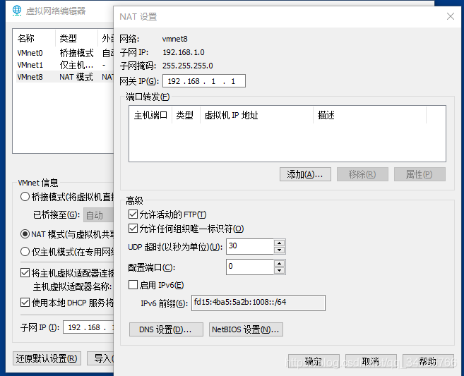
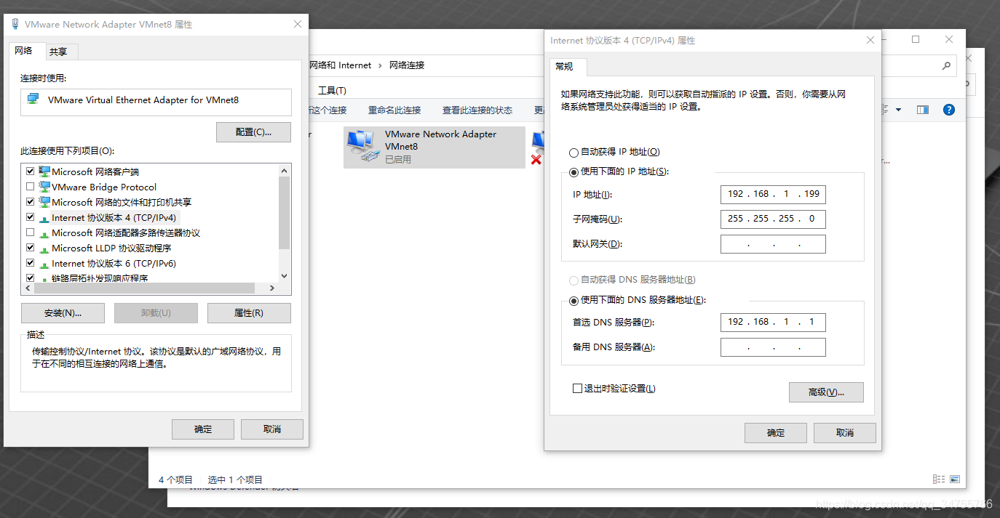
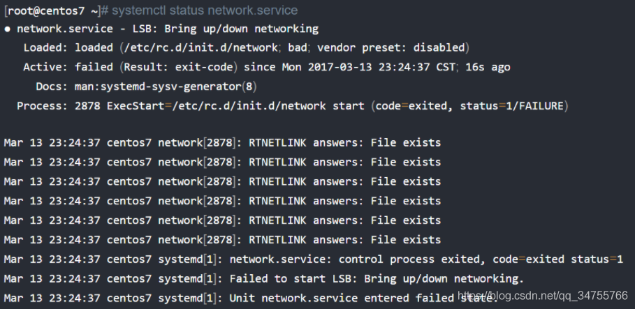
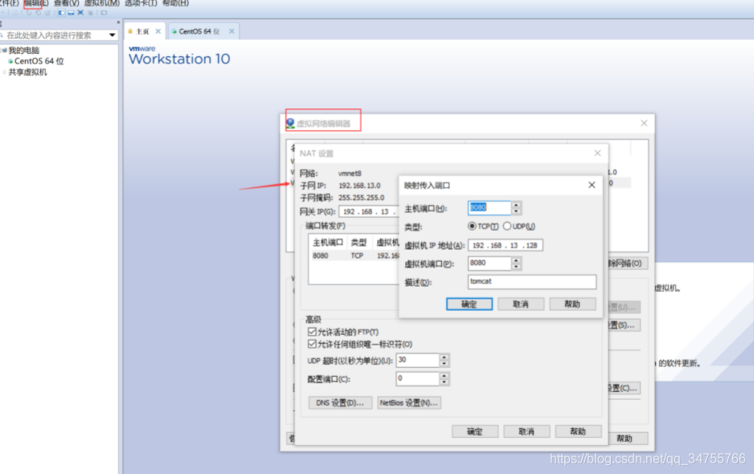
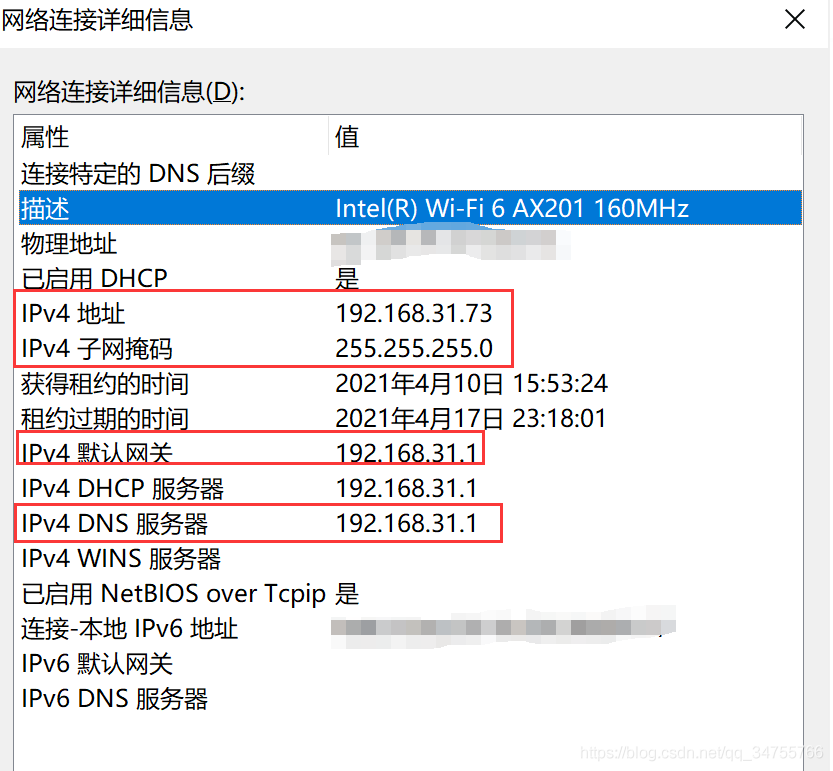
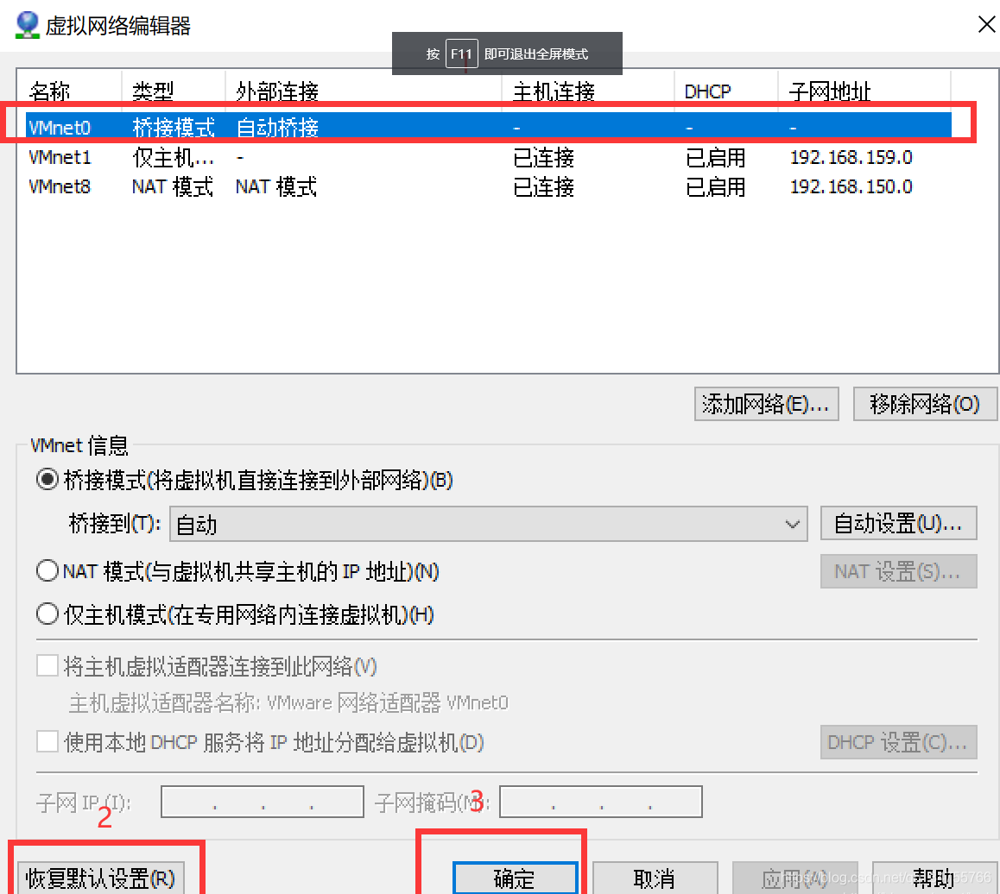
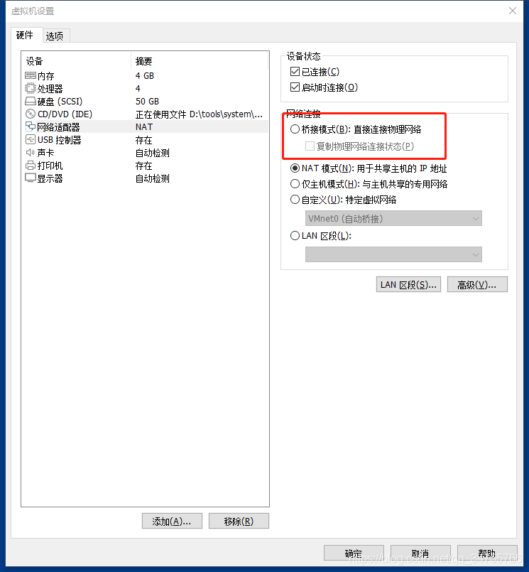

- 第一步 打开windows命令行，查看本地网络情况：ipconfig

  

- 第二步：虚拟机网络设置为NAT模式：
  
  
  
- 第三步 打开VMware虚拟网络编辑器
  
  
  
  点击NAT设置，将网关设置一致：
  
  

  
  
- 第四步：本地网络适配器设置虚拟机虚拟网络
  
  

- 第五步：centos网络配置
  ①.打开centos网卡信息：```/etc/sysconfig/network-scripts```
  ②.修改不部分配置：```vi ifcfg-ens33```
  ```
  TYPE=Ethernet
  PROXY_METHOD=none
  BROWSER_ONLY=no
  BOOTPROTO=static
  DEFROUTE=yes
  IPV4_FAILURE_FATAL=no
  IPV6INIT=yes
  IPV6_AUTOCONF=yes
  IPV6_DEFROUTE=yes
  IPV6_FAILURE_FATAL=no
  IPV6_ADDR_GEN_MODE=stable-privacy
  NAME=ens33
  UUID=9df2f28f-45b9-4f2d-9d64-1721d5c4ee9f
  DEVICE=ens33
  ONBOOT=yes
  IPADDR=192.168.1.100
  GATEWAY=192.168.1.1
  DNS1=8.8.8.8
  NETmASK=255.255.255.0
  IPV6_PRIVACY=no
  PREFIX=24
  ```
  
- 第六步:重启
  ```
  重启网络服务：service network restart
  重启服务器：reboot（也可以不重启）
  ```

> 更新一些问题解决
> 1、克隆一份虚拟机后，ip地址不存在如何解决，network起不来现象：
>
> 
>
> 解决办法：
> 
> ①[failed-to-start-lsb-bring-up-down-networking](https://www.cyberithub.com/failed-to-start-lsb-bring-up-down-networking/)
>
> ②[各种姿势解决CentOS 7下无法启动网络的问题](https://cloud.tencent.com/developer/article/1354933)
>
> 我是通过博客2，systemctl stop NetworkManager后开启network成功的，不对的话多尝试博客提到的其他方法。
>
> 2、使用NAT模式，其他主机无法访问虚拟机的IP
>
> 结论：使用NAT模式，其他主机无法访问虚拟机的IP，要使用桥接模式。但是如果只是想访问虚拟机部署的项目也可以不改变模式，例如Tomcat，就可以通过nat设置把8080端口代理到本主机访问，然后通过本主机的IP加端口访问。
> 
>
> 参考资料：添加链接描述
> ①[VMware网络连接模式——桥接模式、NAT模式以及仅主机模式的介绍和区别](https://www.cnblogs.com/xuliangxing/p/7027124.html)
>
> ②：win10系统ping另一台电脑上虚拟机的IP
>
> 刚刚因为虚拟机与主机没法互相ping通的事情，奋战到将近凌晨一点。现在把这个过程总结一下，以方便后加入该行业的广大IT精英。
>
> VMWare提供了三种工作模式：bridged(桥接模式)、NAT(网络地址转换模式)和host-only(主机模式)。
>
> （1）bridged(桥接模式)
>
> 　　在这种模式下，VMWare虚拟出来的操作系统就像是局域网中的一台独立主机，它可以访问网内任何一台机器。在桥接模式下，你需要手工为虚拟系统配置IP地址、子网掩码，而且还要和宿主机器处于同一网段，这样虚拟系统才能和宿主机器进行通信。同时，由于这个虚拟系统是局域网中的一个独立的主机系统，那么就可以手工配置它的TCP/IP配置信息，以实现通过局域网的网关或路由器访问互联网。使用桥接模式的虚拟系统和宿主机器的关系，就像连接在同一个Hub上的两台电脑。想让它们相互通讯，你就需要为虚拟系统配置IP地址和子网掩码，否则就无法通信。
>
> 　　如果你想利用VMWare在局域网内新建一个虚拟服务器，为局域网用户提供网络服务，就应该选择桥接模式。
>
> （2）NAT(网络地址转换模式)
>
> 　　使用NAT模式，就是让虚拟系统借助NAT(网络地址转换)功能，通过宿主机器所在的网络来访问公网。也就是说，使用NAT模式可以实现在虚拟系统里访问互联网。NAT模式下的虚拟系统的TCP/IP配置信息是由VMnet8(NAT)虚拟网络的DHCP服务器提供的，无法进行手工修改，因此虚拟系统也就无法和本局域网中的其他真实主机进行通讯。采用NAT模式最大的优势是虚拟系统接入互联网非常简单，你不需要进行任何其他的配置，只需要宿主机器能访问互联网即可。
> 　　如果你想利用VMWare安装一个新的虚拟系统，在虚拟系统中不用进行任何手工配置就能直接访问互联网，建议你采用NAT模式。
>
> 3、使用桥接模式使虚拟机类似作为一台“独立主机”网络环境
> 
>
> （1）关闭虚拟机，配置虚拟网络编辑器
>
> 
>
> (2)设置网络适配器为“桥接模式”
>
> 
>
> (3)启动虚拟机，设置ifcfg-ens33配置固定IP
>
> 上面已经有介绍
>
> 小话题：windows查看端口被占用如何关闭？
>
> ①进入windows命令窗口之后，输入命令，输入netstat -ano然后回车，就可以看到系统当前所有的端口使用情况。
>
> ②通过命令查找某一特定端口，在命令窗口中输入命令中输入netstat -ano |findstr “端口号”，然后回车就可以看到这个端口被哪个应用占用。
>
> ③查看到对应的进程id之后，就可以通过id查找对应的进程名称，使用命令tasklist |findstr “进程id号”
>
> ④通过命令杀掉进程，或者是直接根据进程的名称杀掉所有的进程，，在命令框中输入如下命令taskkill /f /t /im “进程id或者进程名称”
>
> ⑤杀掉对应的进程id或者是进程名称之后，然后再通过查找命令，查找对应的端口，现在就可以看到这个端口没有被其他应用所占用，