# 数组概述

- Java是一种强类型语言
- Java中的数据类型分为简单类型和引用类型
  简单类型：byte,short,int,long,float,double,boolean,char
  引用类型：String str;  Student stu;
  数组：就是一种可以存放一组相同类型的数据的数据结构
  数组是一种引用类型
  数组的定义/声明
  数组的创建

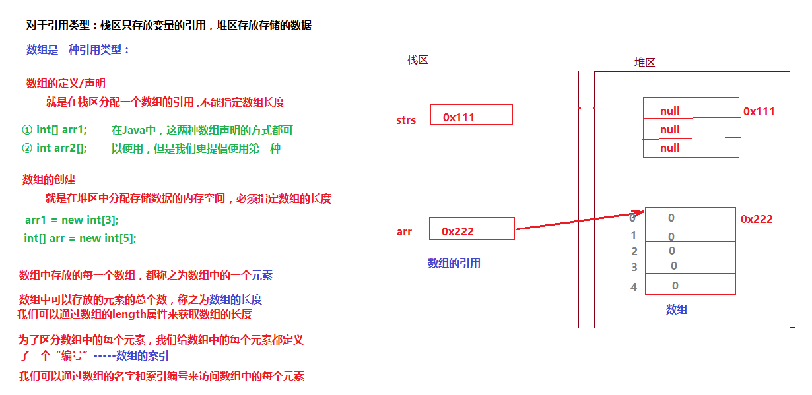

# 数组的初始化

数组的初始化：就是给数组中的元素赋初始值

如果数组创建完成之后没有初始化，则每个元素都会有默认值

| **数组中可以存放的元素的类型** | **数组元素的默认值** |
| ------------------------------ | -------------------- |
| 整数(byte,short,int,long)      | 0                    |
| 浮点型(float,double)           | 0.0                  |
| 布尔(boolean)                  | false                |
| 字符(char)                     | ‘\u0000’             |
| 引用类型(String,Student…)      | null                 |

数组的初始化有两种方式：静态初始化和动态初始化

- 静态初始化：在数组创建的同时直接指定数组中的元素值

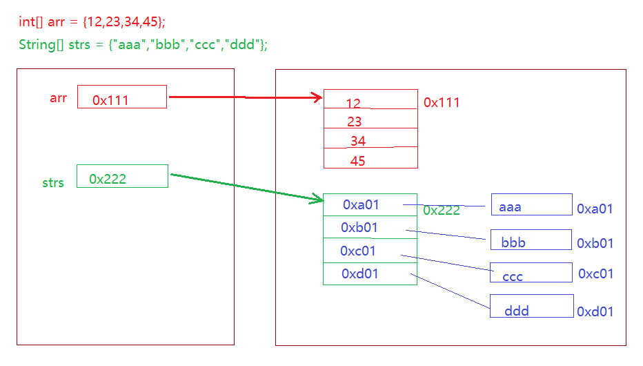

- 动态初始化：先完成数组的声明和数组的创建，然后再通过数组的索引取到数组中的每个元素来赋值

```java
int[] arr = new int[4];
for(int i=0 ; i<arr.length; i++){
   arr[i] = i+1;
}
```

# 数组的遍历

数组的遍历：将数组中的元素依次取出

- 正序遍历：从索引为0的元素开始，依次取出，直到索引为arr.length-1

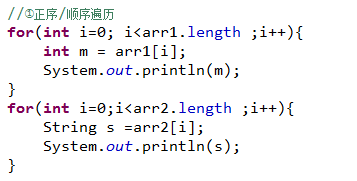

- 倒序遍历

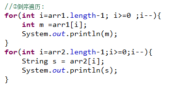

- forEach遍历

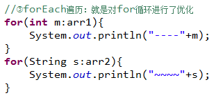

# 对象数组

创建一个数组存放多个对象

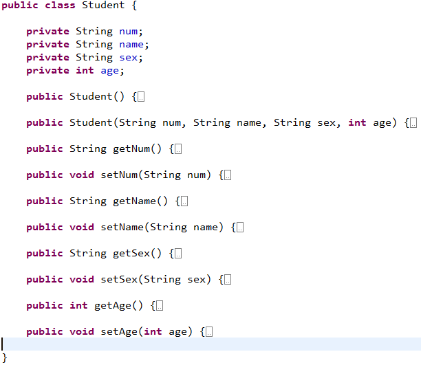

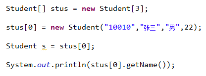

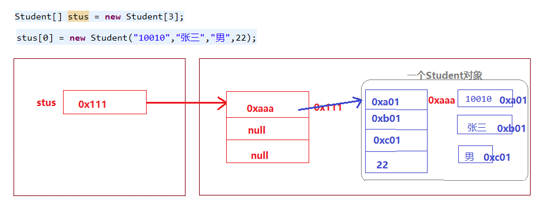

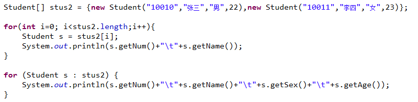

# 数组的特性

在同一个数组中，只能存放一种数据类型的数据

在创建数组的时候，必须指定数组的长度，数组长度一旦指定就不能改变

- “改变数组的长度”

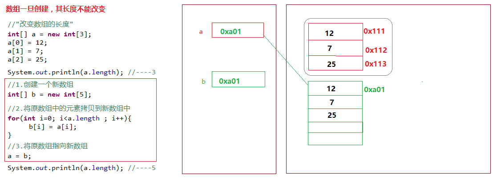

- 完成数组的拷贝：

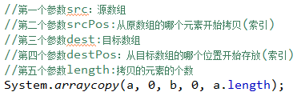

# 二维数组

int[] arr1 = new int[10];

String[] strs = new String[5];

Student[] stus = new Student[5];

int[] [] arr = new int[5] [];

二维数组：数组的数组，数组中的每个元素都是一个数组

## 二维数组声明和创建

- **声明**

  ​     int[][] arr1;

  ​     String[][] arr2;

  ​     Student[][] arr3;

- **创建：必须指定大数组的长度**

int[] [] arr = new int[5] [];  没有指定小数组的长度，大数组中没有创建小数组

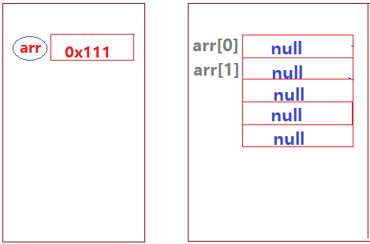

arr[0] = new int[3];  arr[1] = new int[4];

int[] [] arr = new int[5] [4]; 指定了大数组中小数组的长度，会同时完成小数组的创建

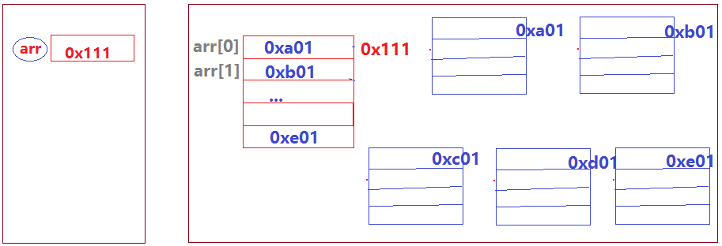

## 二维数组的初始化：

- 静态初始化

int[][] arr={{3,5,7},{2,9},{5,7,3,6}};

String[][] arr = {{“aaa”,”bbb”,”ccc”},{“haha”,”hehe”},{“jdb”,”wlj”,”hqz”},{“whh”,”sww”}};

- 动态初始化

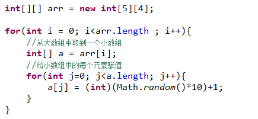

## 二维数组的遍历：

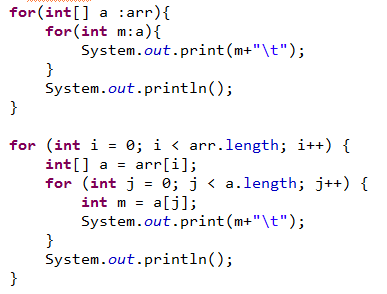

