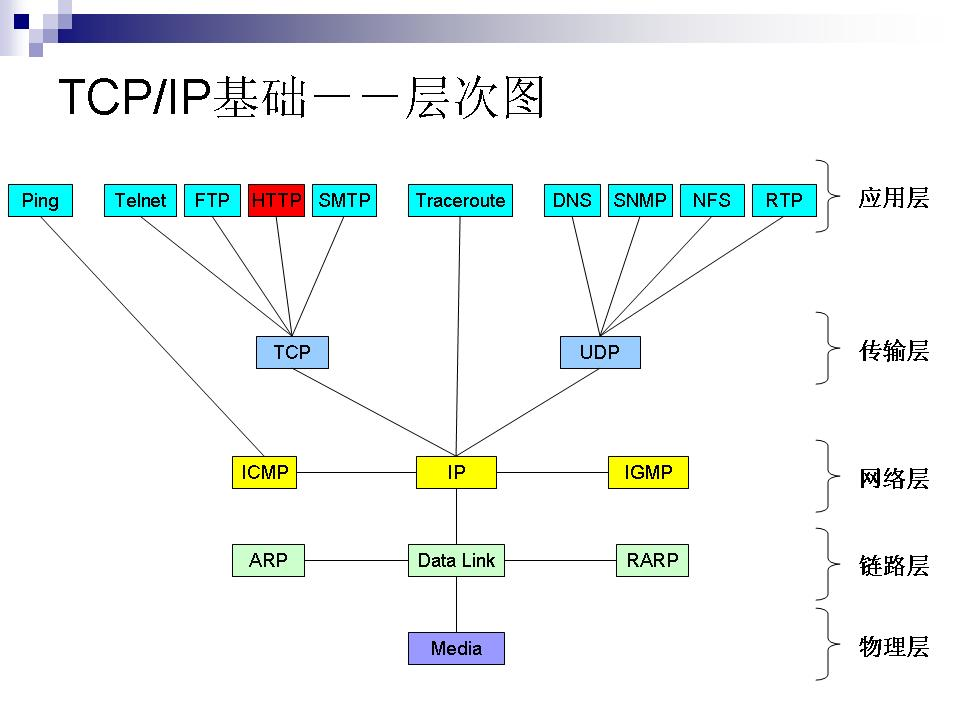
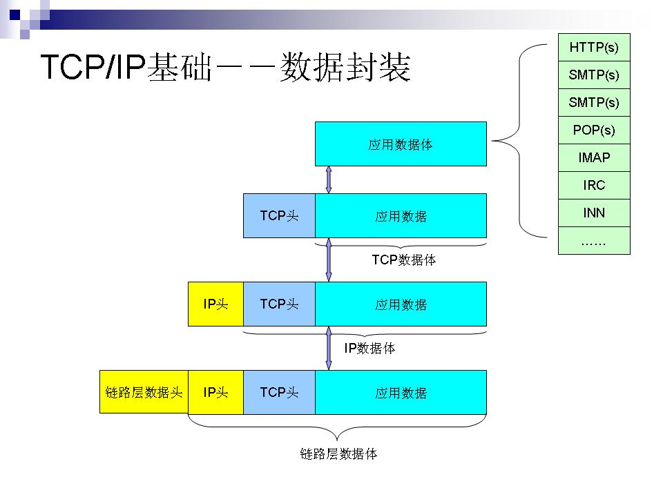
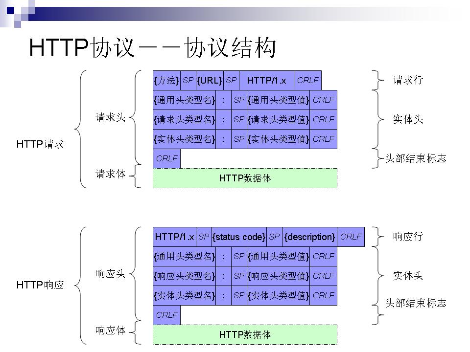
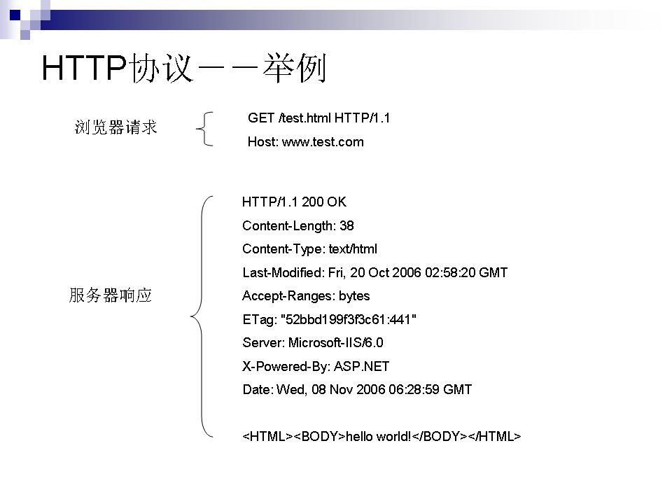
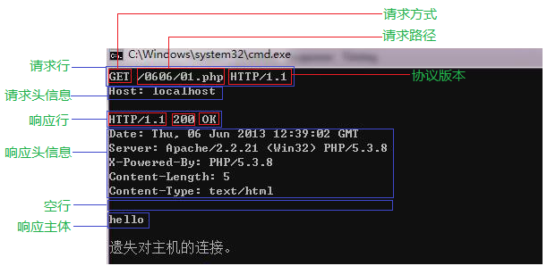
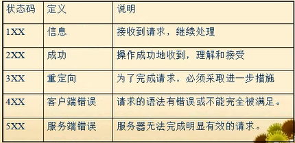

# 一、TCP/IP 协议介绍

​	在介绍 HTTP 协议之前，先简单说一下TCP/IP协议的相关内容。TCP/IP协议是分层的，从底层至应用层分别为：物理层、链路层、网络层、传输层和应用层，如下图所示：

　从应用层至物理层，数据是一层层封装，封装的方式一般都是在原有数据的前面加一个数据控制头，数据封装格式如下：

 

​         其中，对于TCP传输协议，客户端在于服务器建立连接前需要经过TCP三层握手，过程如下：  

# 二、HTTP协议

## 2.1　简介

​	超文本传输协议（Hypertext Transfer Protocol，简称HTTP）是应用层协议，自 1990 年起，HTTP 就已经被应用于 WWW 全球信息服务系统。
 　HTTP 是一种请求/响应式的协议。一个客户机与服务器建立连接后，发送一个请求给服务器；服务器接到请求后，给予相应的响应信息。
 　HTTP 的第一版本 HTTP/0.9是一种简单的用于网络间原始数据传输的协议；
 　HTTP/1.0由 RFC 1945 定义 ，在原 HTTP/0.9 的基础上，有了进一步的改进，允许消息以类 MIME 信息格式存　在，包括请求/响应范式中的已传输数据和修饰符等方面的信息；
 　HTTP/1.1(RFC2616) 的要求更加严格以确保服务的可靠性，增强了在HTTP/1.0 没有充分考虑到分层代理服务器、高速缓冲存储器、持久连接需求或虚拟主机等方面的效能；
 　安全增强版的 HTTP （即S-HTTP或HTTPS），则是HTTP协议与安全套接口层(SSL)的结合，使HTTP的协议数据在传输过程中更加安全。

## 2.2　协议结构

HTTP协议格式也比较简单，格式如下：

 

## 2.3　HTTP 协议举例

下面是一个HTTP请求及响应的例子：

## 2.4　请求头格式

### 2.4.1通用头(general-header)：

- Cache-Control：客户端希望服务端如何缓存自己的请求数据，如"Cache-Control: no-cache"，"Cache-Control: max-age=0"；
- Connection：客户端是否希望与服务端之间保持长连接，如"Connection: close", "Connection: keep-alive"；
- Date：只有当请求方法为POST或PUT方法时客户端才可能会有些字段；
- Pragma：包含了客户端一些特殊请求信息，如 "Pragma: no-cache" 客户端希望代理或应用服务器不应缓存与该请求相关的结果数据；
- Via：一般用在代理网关向应用服务器发送的请求头中，表明该来自客户端的请求经过了网关代理，
       格式为："Via: 请求协议版本  网关标识   [其它信息] "，
       如 ：" Via: 1.1  webcache_250_199.hexun.com:80 (squid)"

### 2.4.2请求头(request-header)：

- Accept： 表明客户同端可接受的请求回应的媒体类型范围列表。星号“*”用于按范围将类型分组，用“*/*”指示可接受全部类型；用“type/*”指示可接受 type类型的所有子类型，如“ Accept: image/gif, image/jpeg, */*”；
- Accept-Charset：客户端所能识别的字符集编码格式，格式：“Accept-Charset: 字符集1[:权重]，字符集2[:权重]”，如：“ Accept-Charset: iso-8859-5, unicode-1-1;q=0.8”；
- Accept-Language：客户端所能识别的语言，格式：“Accept-Language: 语言1[:权重]，语言2[:权重]”，如：” Accept-Language: zh, en;q=0.7”；
- Host：客户请求的主机域名或主机IP，格式：“Host: 域名或IP[:端口号]”，如：“Host: www.hexun.com:80“，请求行中若有HTTP/1.1则必须有该请求头；
- User-Agent：表明用户所使用的浏览器标识，主要用于统计的目的；
- Referer：指明该请求是从哪个关联连接而来；
- Accept-Encoding：客户端所能识别的编码压缩格式，如：“Accept-Encoding: gzip, deflate”；
- If- Modified-Since：该字段与客户端缓存相关，客户端所访问的URL自该指定日期以来在服务端是否被修改过，如果修改过则服务端返回新的修改后 的信息，如果未修改过则服务器返回304表明此请求所指URL未曾修改过，如：“If-Modified-Since: Fri, 2 Sep 2006 19:37:36 GMT”；
- If-None-Match：该字段与客户端缓存相关，客户端发送URL请求的同时发送该字段及标识，如 果服务端的标识与客户端的标识一致，则返回304表明此URL未修改过，如果不一致则服务端返回完整的数据信息，如：“If-None-Match: 0f0a893aad8c61:253, 0f0a893aad8c61:252, 0f0a893aad8c61:251”；
- Cookie：为扩展字段，存储于客户端，向同一域名的服务端发送属于该域的cookie，如：“Cookie: MailUserName=whouse”；

### 2.4.3实体头(entity-header): (此类头存在时要求有数据体)

- Content-Encoding：客户端所能识别的编码压缩格式，如：“Content-Encoding: gzip, deflate”；
-  Content-Length：客户端以POST方法上传数据时数据体部分的内容长度，如：“ Content-Length: 24”；
-  Content- Type：客户端发送的数据体的内容类型，如：“Content-Type: application/x-www-form-urlencoded”为以普通的POST方法发送的数据；“Content-Type: multipart/form-data; boundary=---------------------------5169208281820”，则表明数据体由多部分组成，分隔符为 “-----------------------------5169208281820”；

## 2.5响应格式

### 2.5.1通用头(general-header)：

- Cache- Control：服务端要求中间代理及客户端如何缓存自己响应的数据，如“Cache-Control: no-cache”，如：“Cache-Control: private” 不希望被缓存，“Cache-Control: public” 可以被缓存；
-  Connection：服务端是否希望与客户端之间保持长连接，如“Connection: close”, “Connection: keep-alive”；
-  Date：只有当请求方法为POST或PUT方法时客户端才可能会有些字段；
   Pragma：包含了服务端一些特殊响应信息，如 “Pragma: no-cache” 服务端希望代理或客户端不应缓存结果数据；
- Transfer-Encoding：服务端向客户端传输数据所采用的传输模式(仅在HTTP1.1中出现)，如：“Transfer-Encoding: chunked”，注：该字段的优先级要高于“Content-Length”　字段的优先级；

### 2.5.2响应头(response-header)：

- Accept-Ranges：表明服务端接收的数据单位，如：“Accept-Ranges: bytes”, ；
   Location：服务端向客户端返回此信息以使客户端进行重定向，如：“Location: http://www.hexun.com”；
-  Server：服务端返回的用于标识自己的一些信息，如：“ Server: Microsoft-IIS/6.0”；
-  ETag：服务端返回的响应数据的标识字段，客户端可根据此字段的值向服务器发送某URL是否更新的信息；

### 2.5.3实体头(entity-header): (此类头存在时要求有数据体)

- Content-Encoding：服务端所响应数据的编码格式，如：“Content-Encoding: gzip”；
-  Content-Length：服务端所返回数据的数据体部分的内容长度，如：“ Content-Length: 24”；
-  Content-Type：服务端所返回的数据体的内容类型，如：“Content-Type: text/html; charset=gb2312” ；
-  Set-Cookie：服务端返回给客户端的cookie数据，如：“ Set-Cookie: ASP.NET_SessionId=icnh2ku2dqlmkciyobgvzl55; path=/”

## 2.6服务器返回状态码

1xx：表明服务端接收了客户端请求，客户端继续发送请求；
 2xx：客户端发送的请求被服务端成功接收并成功进行了处理；
 3xx：服务端给客户端返回用于重定向的信息；
 4xx：客户端的请求有非法内容；
 5xx：服务端未能正常处理客户端的请求而出现意外错误。

 

举例：

“100” ; 服务端希望客户端继续；
 “200” ; 服务端成功接收并处理了客户端的请求；
 “301” ; 客户端所请求的URL已经移走，需要客户端重定向到其它的URL；
 “304” ; 客户端所请求的URL未发生变化；
 “400” ; 客户端请求错误；
 “403” ; 客户端请求被服务端所禁止；
 “404” ; 客户端所请求的URL在服务端不存在；
 “500” ; 服务端在处理客户端请求时出现异常；
 “501” ; 服务端未实现客户端请求的方法或内容；
 “502” ; 此为中间代理返回给客户端的出错信息，表明服务端返回给代理时出错；
 “503” ; 服务端由于负载过高或其它错误而无法正常响应客户端请求；
 “504” ; 此为中间代理返回给客户端的出错信息，表明代理连接服务端出现超时。