#          数据库相关术语  

## 数据（Data）

​	数据实际上就是描述事物的符号记录。

## 数据库（Database，简称DB）

​	数据库是长期存储在计算机内有结构的、大量的、共享的数据集合。

## 数据库管理系统（Database Management System，简称DBMS）

​	数据库管理系统是位于用户与操作系统之间的一层数据管理软件。

## 数据库系统管理员（Database Administrator，简称DBA）

​	数据库系统管理员负责数据库的建立、使用和维护的专门的人员。

## 数据库系统（Database System，简称DBS）

​	数据库系统是指在计算机系统中引入数据库后的系统构成，一般由数据库、数据库管理系统（及其开发工具）、应用系统、数据库管理员和用户构成。

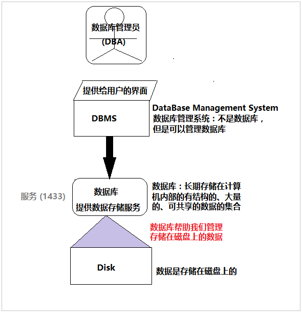

# 数据库安装

常见的数据库：Oracle，MySQL，SQLServer，达梦数据库

SQLServer版本：2005/2008,  2014

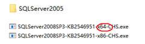

# SQLServer2008安装

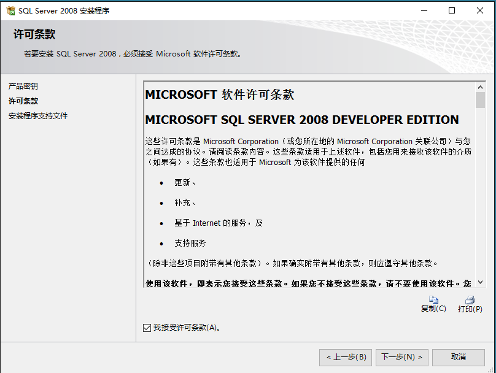

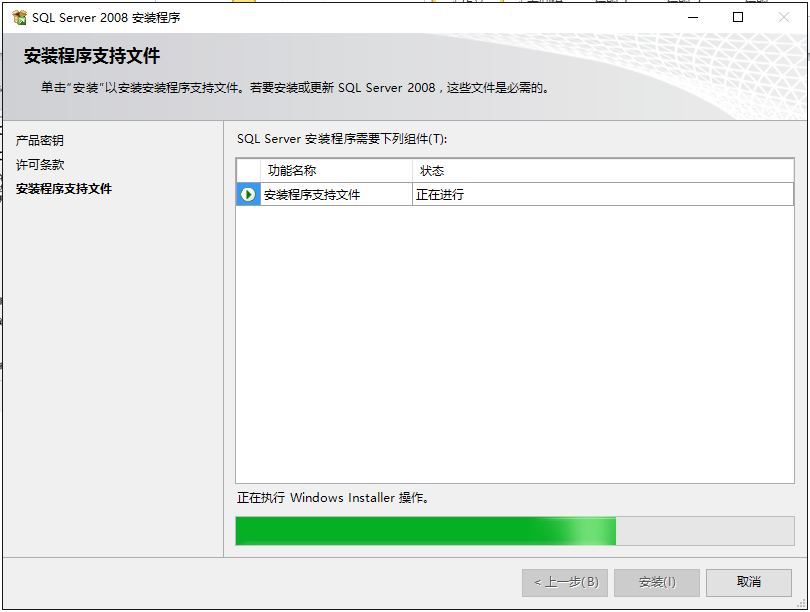

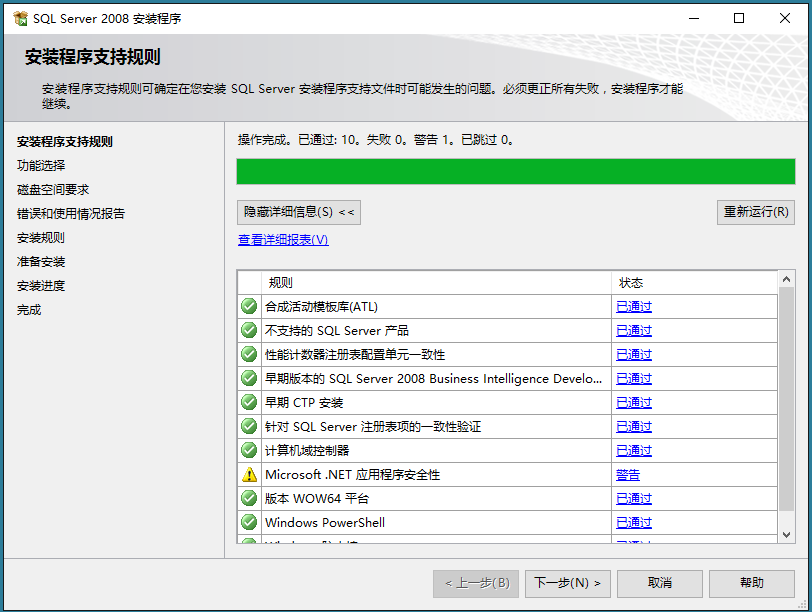

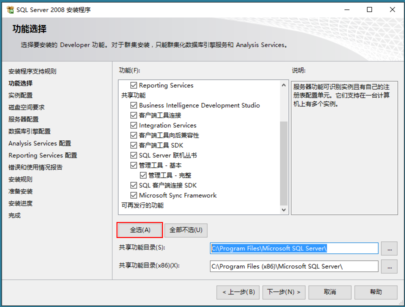

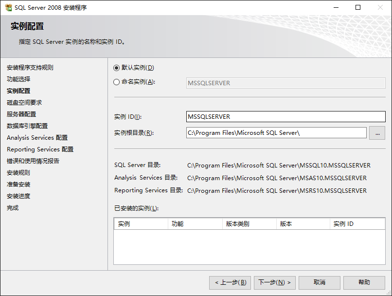

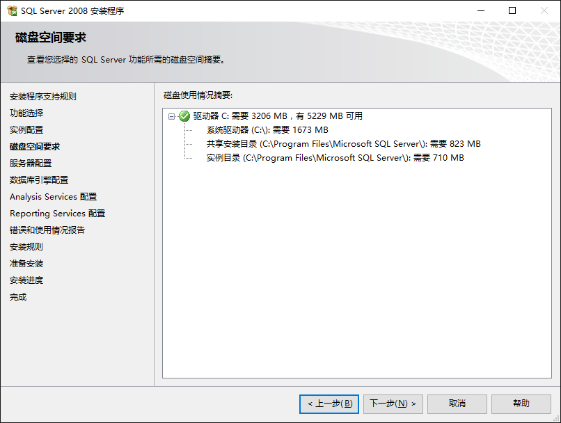

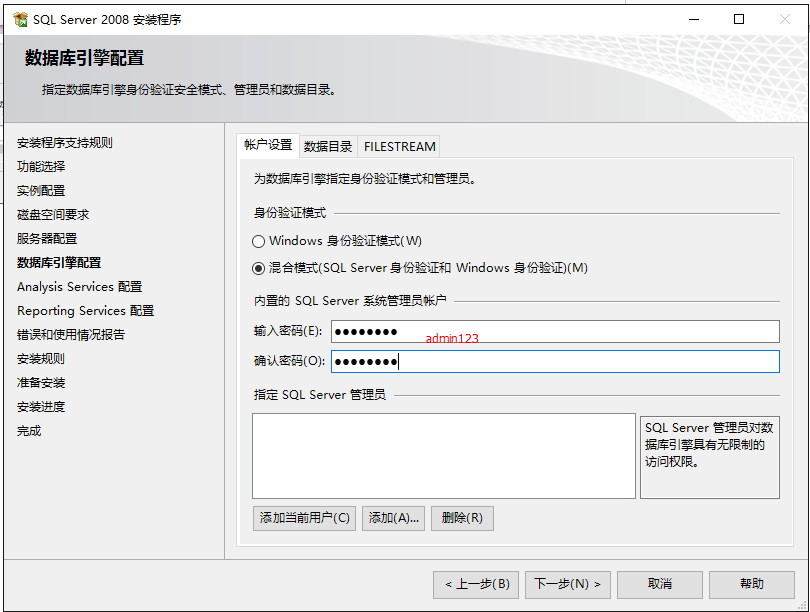

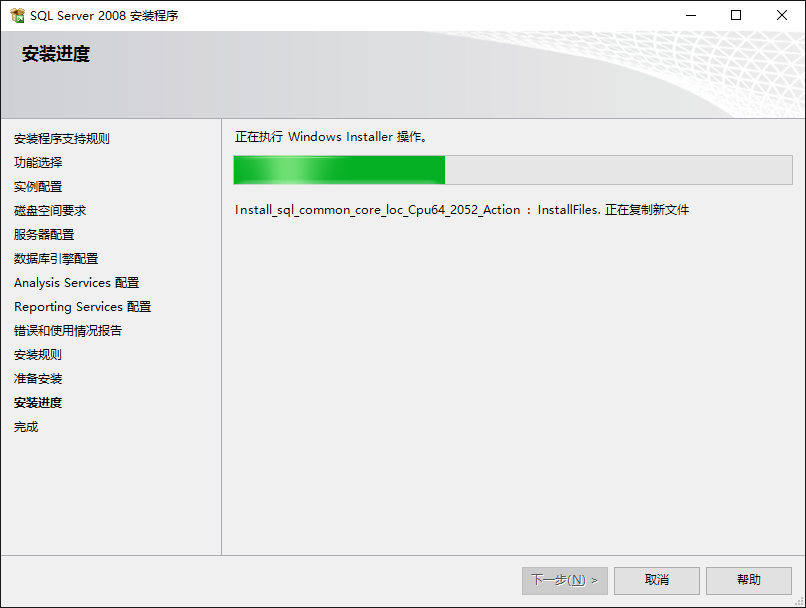

# 通过DMBS连接到数据库

- 修改数据库连接模式
- 创建并启用SQLServer用户

**windows身份验证**

​          只适用于在数据库本机上进行登录

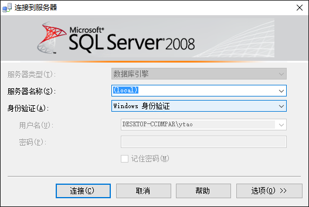

**SQLServer身份验证**
	可以连接到本机数据库，也可以连接到网络数据库

- SQLServer数据库连接模式必须是“混合模式”
- 连接的帐号和密码必须存在并启用

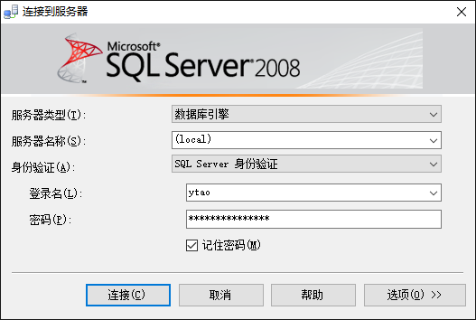

**SQLServer身份连接网络端数据库**

​          网络端的数据库必须启用TCP/IP协议

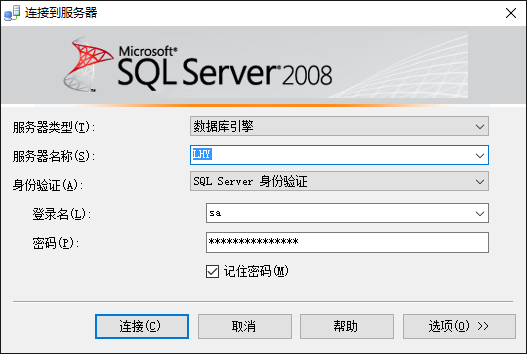

# 数据库中的专业术语

**数据结构化**：数据非纯文本的，有各种数据类型，以及各种类型的数据规范

**数据的共享性**：数据的共享性是指由于数据库系统是从整体角度上看待和描述数据的，数据不再面向某个应用，而是面向整个系统。

**数据冗余度**：指的多余的相同数据

**数据的一致性**：就是一条column的数据在多个表中保持同步更新

**物理独立性**：物理独立性是指用户的应用程序与存储在磁盘上的数据库中数据是相互独立的。即，数据在磁盘上怎样存储由DBMS管理，用户程序不需要了解，应用程序要处理的只是数据的逻辑结构，这样当数据的物理存储改变了，应用程序不用改变。

**逻辑独立性**：逻辑独立性是指用户的应用程序与数据库的逻辑结构是相互独立的，即，当数据的逻辑结构改变时，用户程序也可以不变。

**数据的安全性（Security）**：指存储介质的物理安全，数据的保密程度或是访问权限，网络安全

**数据的完整性（Integrity）**：是指在进行数据库设计时，要站在全局需要的角度进行抽象和组织数据；要完整的、准确的描述数据自身和数据之间联系的情况；要建立设和整日需要的数据模型

**并发（Concurrency）控制**：当多个用户并发的对数据库进行操作时，对他们加以控制和协调，以保证并发操作的正确执行，保持数据库的一致性。（事务管理）

**数据库恢复（Recovery）**：数据库恢复是指通过技术手段，将保存在数据库中上丢失的电子数据进行抢救和恢复。

**为什么要使数据有完整性和共享性：**

数据的完整性高会使得数据库中的数据冗余度变小，从而避免了由于数据冗余度大带来的数据冲突问题，也避免了由此产生的数据维护麻烦和数据统计错误问题。数据共享度高会提高数据的利用率，它使得数据更有价值和更容易、更方便地被使用

