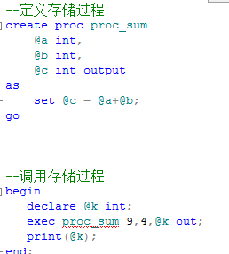
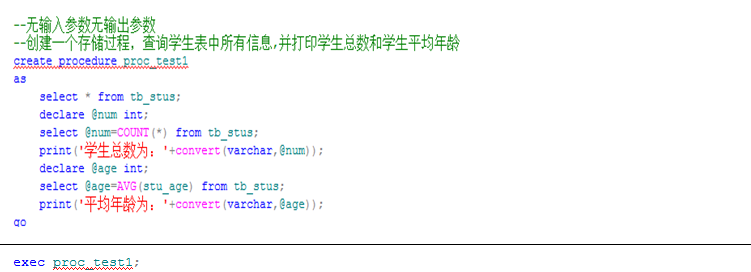
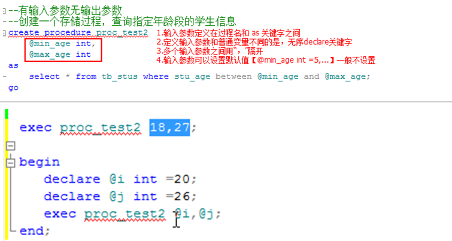
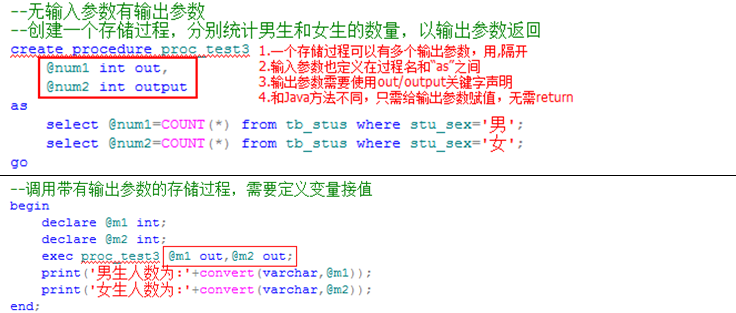
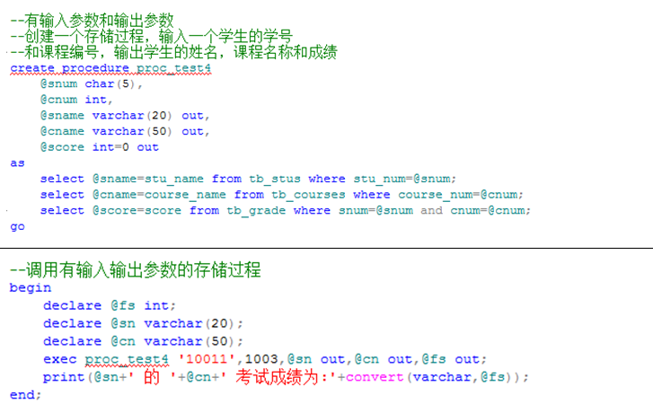
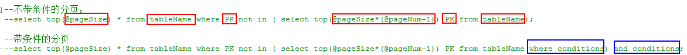
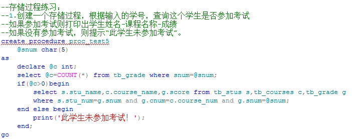
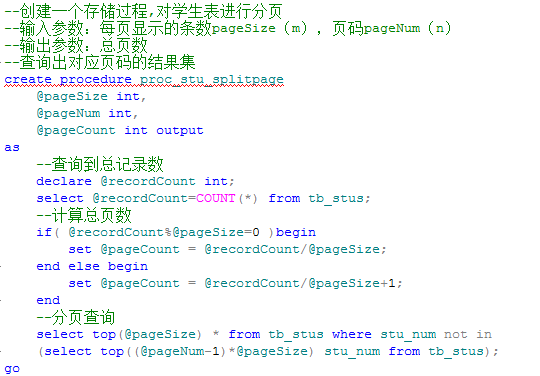
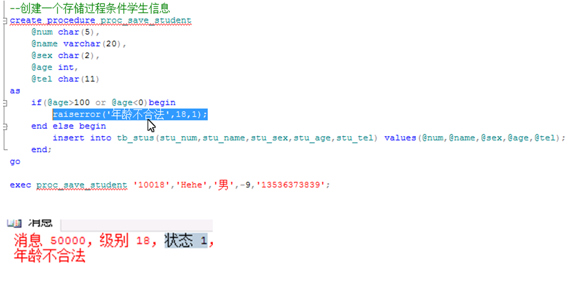
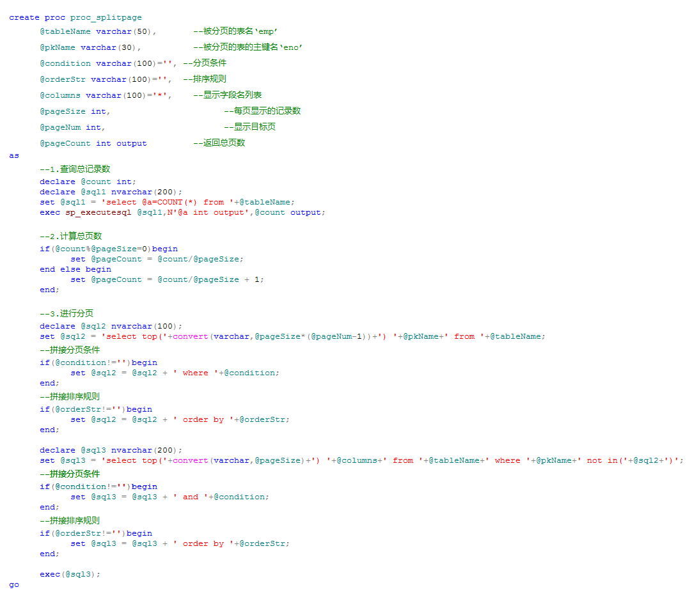

# 存储过程简介

SQL语句：一条单独的指令可以完成一个独立的功能

​     问题：如果我们进行一项复杂的功能操作，往往需要多条SQL语句配合执行，并且还可能需要对应的逻辑判断等，此时我们应该如何实现？

​     我们可以将这多条**SQL语句**及对应的**逻辑控制**单独定义成一个有逻辑有结构的代码块，定义的这个代码块就称之为**过程（方法）**。

​     由于我们定义的SQL代码块（过程）是存储在数据库端，所以我们把这样的过程称之为存储过程。

- **存储过程**：就是存储在数据库端的可以独立完成一项相对复杂的业务功能的SQL代码块。

- **存储过程的组成**：SQL指令，变量，逻辑控制(条件语句，循环语句)



# 存储过程的定义

根据存储过程有无输入参数/输出参数，可以分为四类：

```sql
存储过程定义:create proc[edure] <proc_name>
            [参数定义部分]
       as
            [过程体]
       go
变量的定义：①局部变量要定义在过程体中，并必须以@开头
      ②语法：【declare @num int;】
给变量赋值：①通过set指令给变量赋值【set @num = 5;】
      ②通过查询语句给变量赋值【select @num=COUNT(*) from tb_stus;】
```

## 无输入参数无输出参数



## 有输入参数无输出参数


## 无输入参数有输出参数



## 有输入参数和输出参数



# 分页



# 存储过程练习



---



# 存储过程异常处理



# 系统存储过程

系统存储过程：就是已经定义好且存在与数据库端的过程，可供我们直接调用。

系统存储过程通常以”sp_”或者“xp_”开头，位于master数据库中

- 了解常用的系统存储过程的名字及作用

- 调用系统存储过程

| **存储过程名称**     | **作用**                         | **调用**                              |
| -------------------- | -------------------------------- | ------------------------------------- |
| sp_databases         | 列出当前数据库服务器上所有数据库 | execute sp_databases;                 |
| sp_helpdb            | 列出所有/指定数据库的详细信息    | exec sp_helpdb **[**'db_test'**]**;   |
| sp_renamedb          | 修改数据库名称                   | exec sp_renamedb 'db_hehe','db_test'; |
| sp_tables            | 列出当前数据库中所有的表和视图   | exec sp_tables;                       |
| sp_columns           | 列出指定数据表的字段信息         | exec sp_columns 'tb_stus';            |
| sp_help              | 列出当前数据库所有/指定的表信息  | exec sp_help **[**'tb_stus'**]**;     |
| sp_helpconstraint    | 查看指定表中的主键、外键约束信息 | exec sp_helpconstraint 'tb_grade';    |
| sp_helpindex         | 查看指定表中的索引信息           | exec sp_helpindex 'tb_stus';          |
| sp_stored_procedures | 显示当前数据库中所有的存储过程   | exec sp_stored_procedures;            |
| sp_password          | 修改当前帐号的密码               | exec sp_password 'oPwd','nPwd','sa';  |

```sql
--常用的系统存储过程
--列出当前数据库服务器上所有的数据库
execute sp_databases;

--列出所有/指定数据库的详细信息
exec sp_helpdb;
exec sp_helpdb 'db_test';

--修改数据库名称
--第一个参数：原数据库名
--第二个参数：新数据库名
exec sp_renamedb 'db_hehe','db_test';

--列出当前数据库中所有的表和视图信息
exec sp_tables;

--列出指定数据表的字段信息
exec sp_columns 'tb_stus';

--列出当前数据库下所有的数据库对象（对象名称，所属者，类型）
exec sp_help;
--列出指定的数据表的详细信息（表信息，字段信息，索引，视图，约束，主外键）
exec sp_help 'tb_stus';

--查看指定表的主键、外键的约束信息
exec sp_helpconstraint 'tb_grade';

--查看指定表中的索引信息
exec sp_helpindex 'tb_stus';

--列出当前数据库下所有的存储过程
exec sp_stored_procedures;

--修改当前账户的密码
exec sp_password 'oldPwd','newPwd','sa';
```

# 分页存储过程（通用版）：



# 触发器

触发器的概念：是一种特殊的存储过程，触发器无需调用，当特定的情况发生时会自动调用。

触发器的定义语法：

```sql
create trigger tri_name on tableName for insert|update|delete
as
    print(‘我是一个触发器’);
go
--创建触发器
create trigger tri_test on tb_stus for insert
as
    print('又添加一个学生信息');
go

--修改触发器
alter trigger tri_test2 on tb_stus for delete
as
	select * from tb_stus;
go

--删除触发器
drop trigger tri_test;

insert into tb_stus(stu_num,stu_name,stu_sex,stu_age,stu_tel)
values('10021','XiaoZhang','男',39,'13434343347');

delete from tb_stus where stu_num='10020';
```

