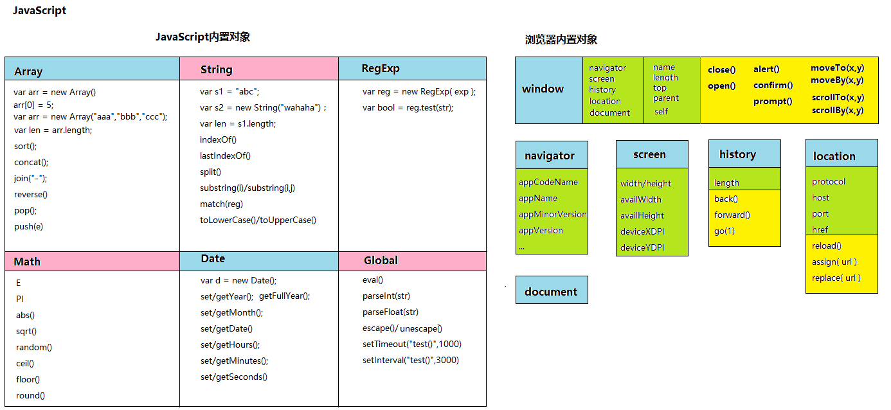
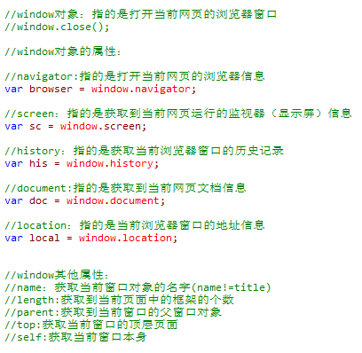
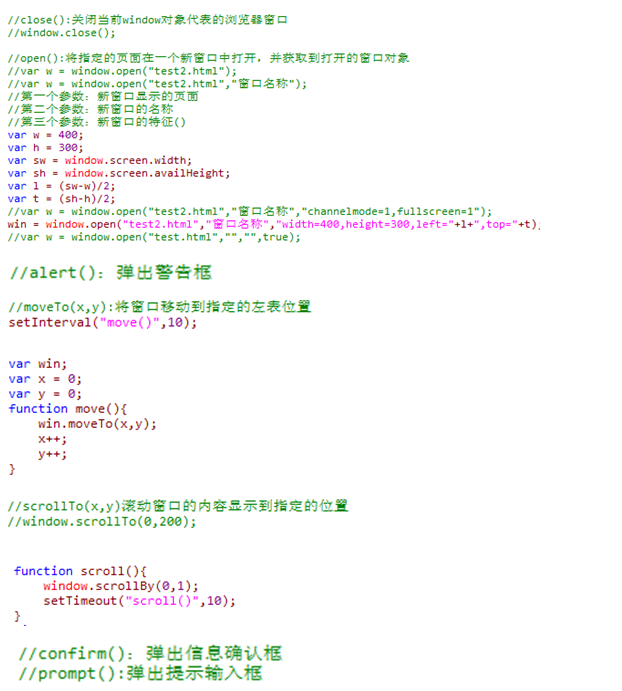
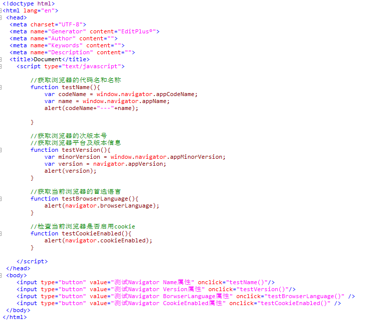
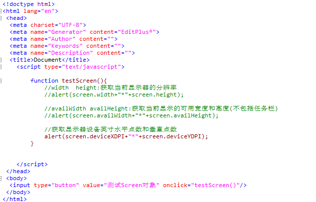
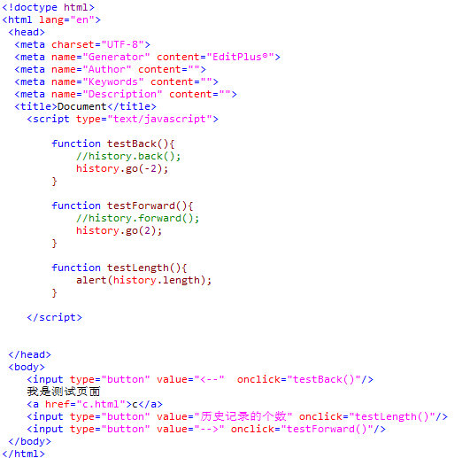
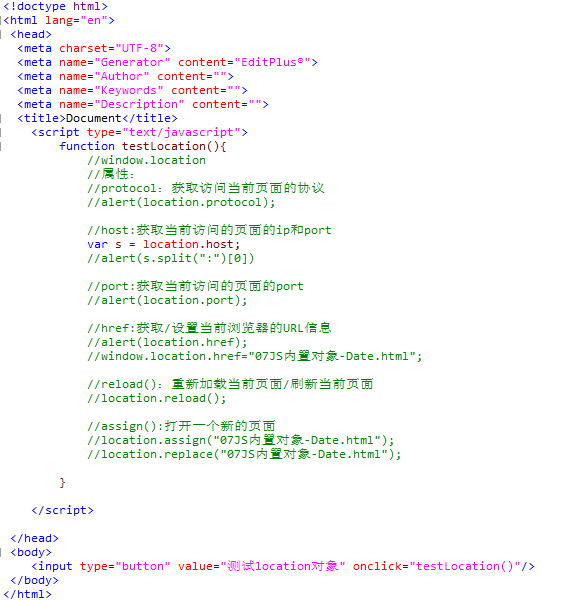
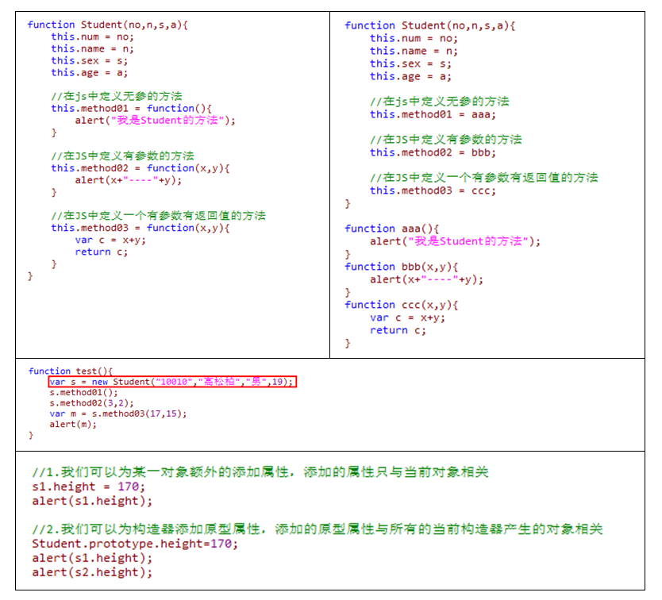

# 浏览器内置对象

浏览器对象：与当前网页运行的环境相关。

## 1.window对象：

表示的是当前网页打开的浏览器窗口，可以在JS中直接调用。

- 属性

- 方法

## 2.navigator对象（只读对象）：

window对象的一个属性，包含打开当前页面的浏览器信息

## 3.screen对象（只读对象）：

从window对象中获取，表示当前浏览器运行的显示器信息

## 4.history对象：

包含了当前浏览器窗口的历史访问记录

## 5.location对象：

从window对象获取，包含了当前浏览器窗口的URL（地址）信息

# JS自定义对象

JavaScript是一种基于对象的语言。
JS对象不是由类产生，JS中不存在类的概念。JS中的对象是通过构造器产生的。
JS构造器定义如下：

