# Document对象
- window：打开当前网页的浏览器窗口
- navigator：当前浏览器窗口所在的浏览器对象（包含了当前浏览器信息）
- screen：指的是显示当前窗口的显示器对象
- history：指的是当前浏览器窗口显示的网页的历史记录
- location：指的是当前浏览器窗口的URL地址信息

# document：

指的是当前浏览器窗口打开的网页文件(内容)

## 属性：

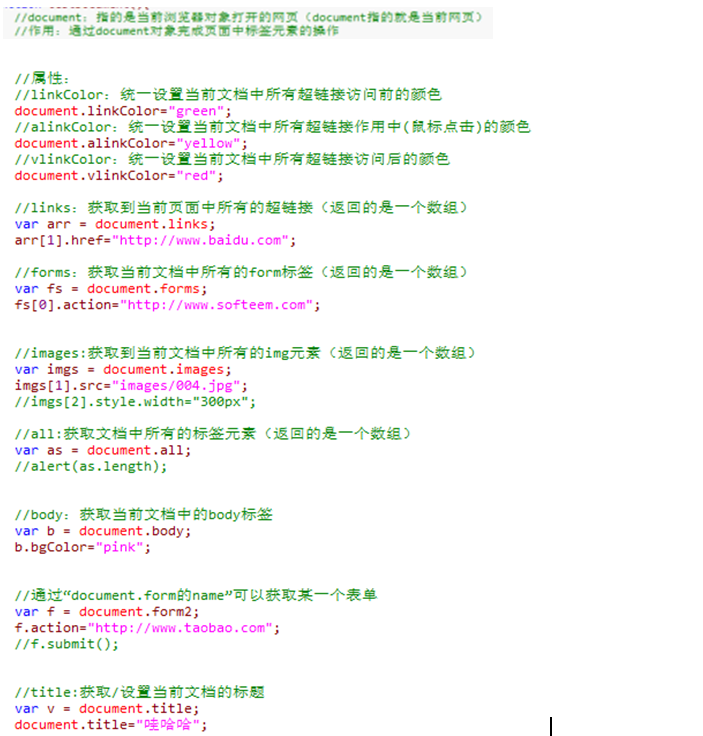

## 方法

- getElementsByTagName(tagName)：获取到页面中所有的参数指定的标签元素（返回的是一个数组）
- getElementsByName(name):获取到页面中所有name属性值等于参数的标签元素（返回的是一个数组）
- getElementById(id):根据指定的id从当前文档中获取某一个标签元素
- document.open();打开一个指向当前文档body的输出流
- document.writeln("aaaa");将指定的内容写到文档的body中
- document.write("bbbb");
- document.close();关闭指向文档的输出流

## Document案例：

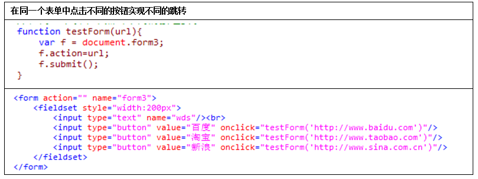

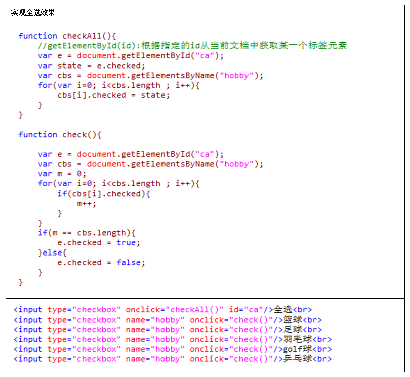

# HTML文档结构

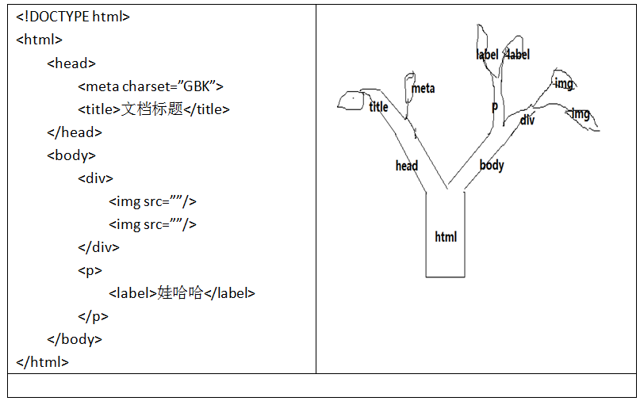

## 节点：

一个HTML文档中的任何一个标签、属性、文本都是一个独立的节点

节点属性：

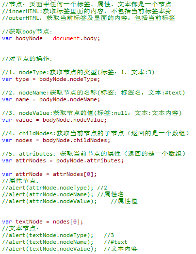

### 添加节点：

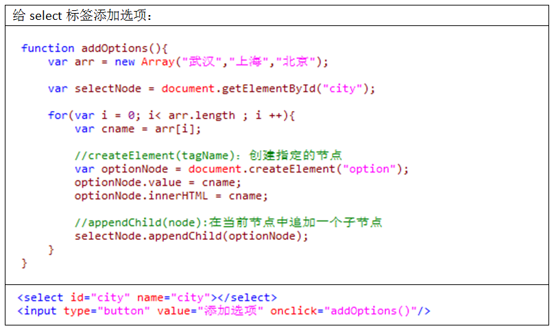

### 删除节点：

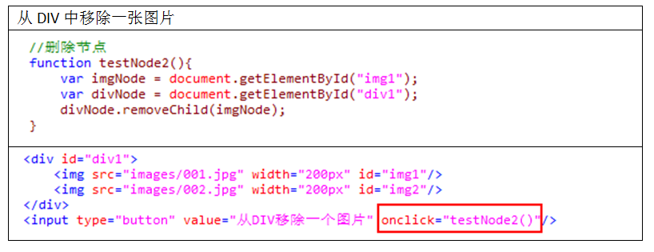

### 插入节点：

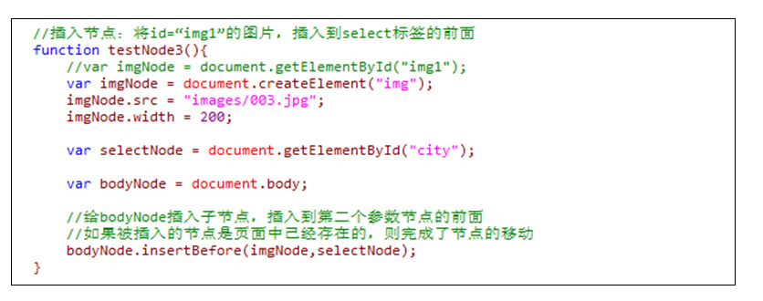

### 替换节点:

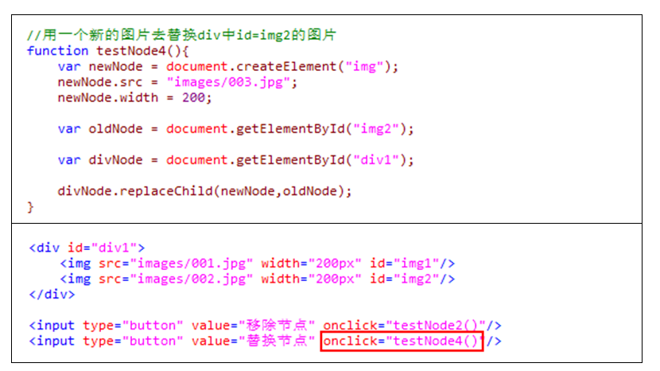

# JS修改页面元素的属性

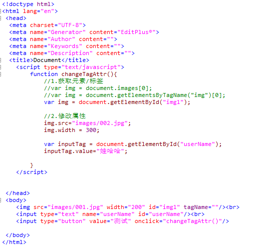

# JS修改页面元素的style样式

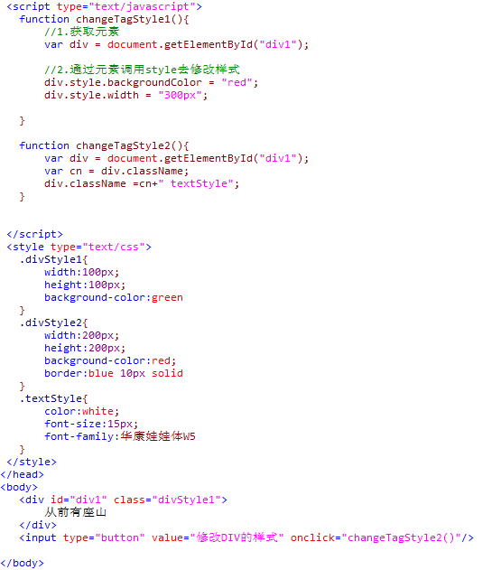

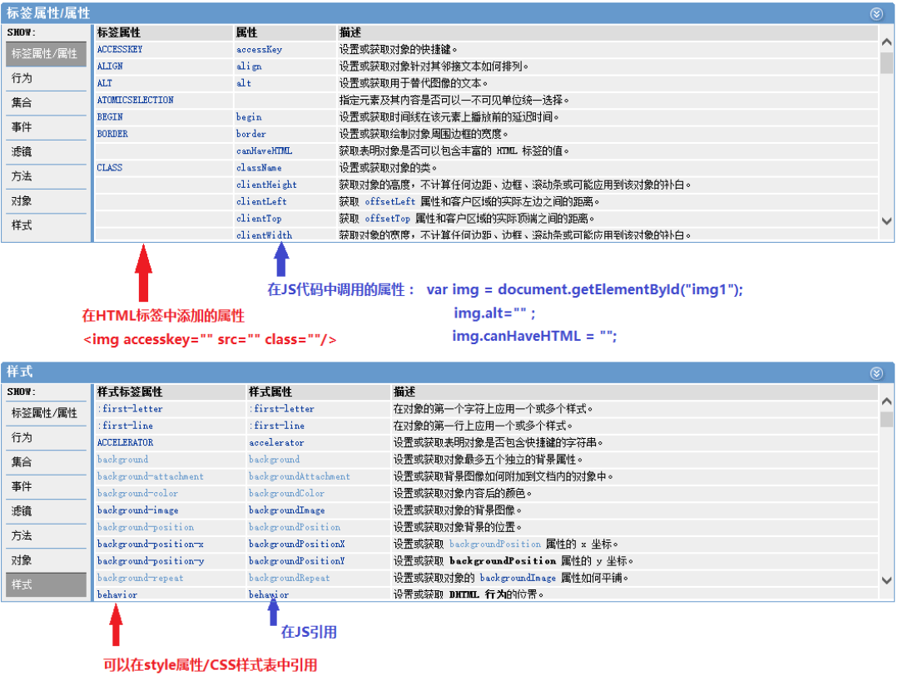

# JS验证页面表单元素

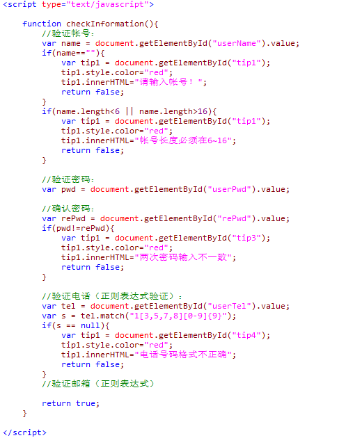

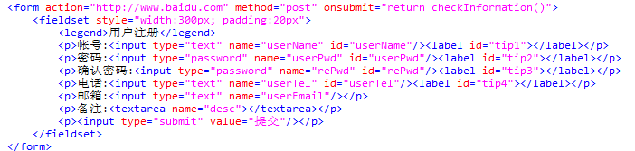

