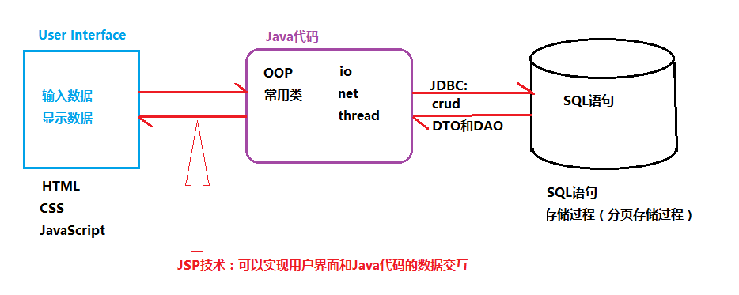
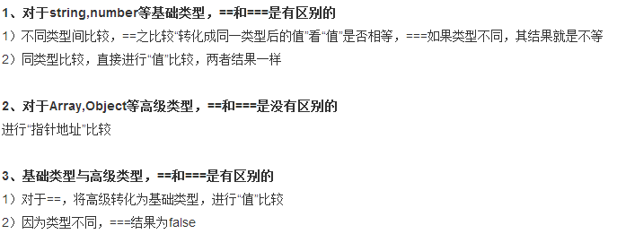
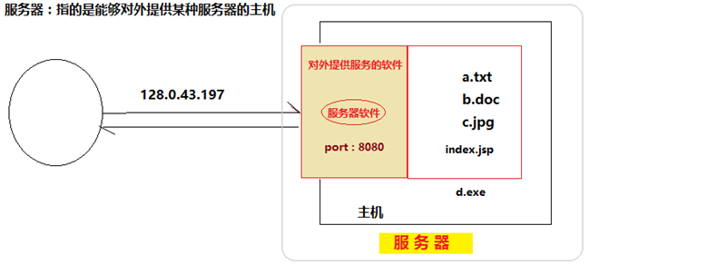
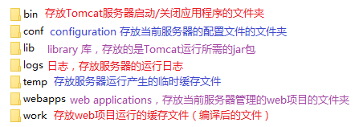
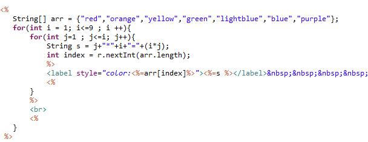

# JSP简介

由于HTML页面不能和Java代码及数据库直接进行数据交互，所以我们需要一种新的技术-JSP



JSP技术：可以实现用户界面和Java代码之间的数据交互

**JSP(Java Server Page):**

​     Page：JSP和HTML一样可以给用户展现一个用户界面

​     Java：HTML文件中只支持HTML标签，JSP文件中可以支持Java代码和HTML标签

​     Server：JSP不能直接通过浏览器打开，必须依赖于服务器运行

# 在javascript中==和===的区别



# JSP和HTML的区别

HTML和JSP都可以在浏览器中展示一个用户界面，不同点是：
	1.后缀名不同
	2.HTML文件中只能有HTML标签，JSP文件中可以包含Java代码和HTML 标签
	3.HTML文件可以直接通过浏览器打开，但是JSP必须依赖于服务器运行。
	4.JSP文件第一行需要<%@ page language="java" import="java.util.*" pageEncoding="UTF-8" %>
	如何将一个HTML文件转换成JSP文件？
		a.创建一个文件和HTML文件相同的后缀名为”.jsp”文件
		b.将HTML文件内容拷贝到JSP文件中
		c.在JSP文件第一行添加JS文件的页面属性信息

# 服务器

广义：能够对外提供某种服务的主机（包含了主机及其中的服务器软件）
狭义：安装在计算机上的服务器软件



## 1、安装Tomcat服务器（软件）：
​	IIS websphere weblogic jboss tomcat
​	apache.org

## 2、启动和关闭服务器
​	命令窗口模式：home/bin/tomcat7.exe
​	窗口操作模式：home/bin/tomcat7w.exe

## 3、Tomcat服务器的目录结构



## 4、如何将web项目添加到服务器？
​	a.将项目打包成war文件，拷贝存放到服务器的webapps目录
​	b.通过MyEclipse等IDE工具将项目部署到服务器

## 5、如何在MyEclipse中配置自定义服务器？
显示MyEclipse服务器插件列表：windowshow viewservers
	a. 打开服务器配置窗口

​	b.在打开的界面中进行配置

​	c.在MyEclipse中启动和关闭服务器

## 6.如何通过浏览器访问服务器中的项目？
​	http://主机ip:服务器port/项目名/文件名

# Web项目

Tomcat是一个web应用程序服务器，只能加载web项目。
	Web项目：B/S架构可以通过浏览器访问的项目（用HTML文件、JSP文件做为界面）。

## 1.创建web项目
​	File  New  web project  输入项目名称  Finish

## 2.web项目的目录结构（web项目和java项目的区别）


3.将web项目部署到服务器
4.启动服务器，并通过浏览器访问服务器中的项目中的页面

# JSP特性

## 特性1-Page：


​	JSP和HTML一样，可以通过浏览器展示一个页面；JSP页面中支持所有HTML标签，CSS样式和JavaScript脚本

## 特性2-Java:
在JSP页面中可以嵌入Java代码:
1.代码必须嵌入在页面的“<%”和“%>”区域中，如果不写在该区域中，则会被默认为页面中的文本。
2.如果需要将Java变量的值显示在页面中，必须使用”<%=attr %>”形式。
3.JSP页面中的Java代码在客户端浏览器访问该页面时执行，访问一次执行一次。
## 特性3-Server:
JSP页面不能被浏览器直接打开，必须放在服务器上执行。

# 在页面中打印乘法口诀表：



# JSP的文件结构

HTML标签

CSS样式

 JavaScript脚本

Java代码：<%! 全局变量定义%>  <%变量，代码%> <%=变量名/表达式 %>

#  JSP指令：

编译指令【<%@编译指令 %>】

- page：用在JSP页面的最前面，声明当前页面支持属性，还可以用来导包

```jsp
<%@ page 
anguage=”java” 
import=””           导入当前页面中Java代码所需的包
pageEncoding=””     指定当前页面内容的字符编码
isErrorPage=””       指定当前页面是否可以作为错误页面
errorPage=””  %>    指定当前页面如果发生错误可以跳转到的错误页面
```

- taglib：在当前页面引入第三方标签库

```jsp
<%@ taglib prefix="c" uri="http://java.sun.com/jsp/jstl/core" %>
```

- include：在当前页面静态引用其他的页面

```jsp
<%@ include file="test.jsp" %>
```

