# 反射

## 什么是反射？

​     反射：通过类的描述路径（包名.类名）字符串，可以加载这个类、创建这个类的实例、获取这个类中的方法并完成方法的调用。

## 反射的作用

 可以通过用户配置，灵活改变程序的通用性。

## 反射技术：

### ①加载类

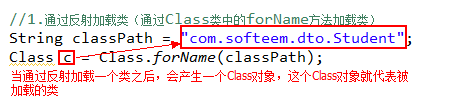

### ②创建实例

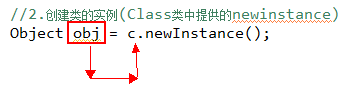

### ③获取类中的元素

- 属性

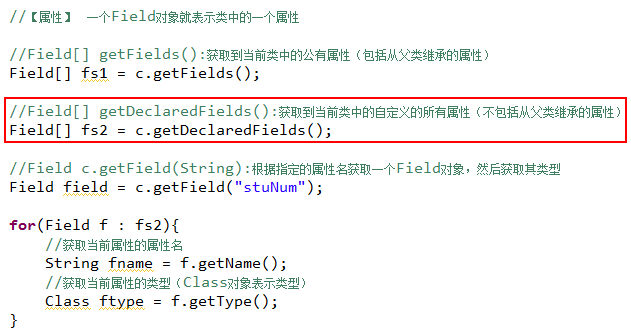

- 方法

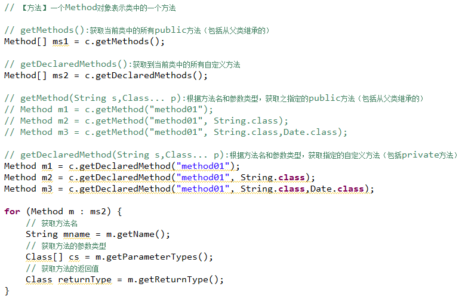

- 构造器

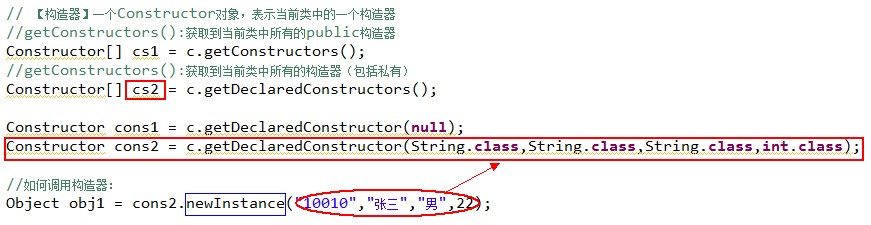

- 方法调用

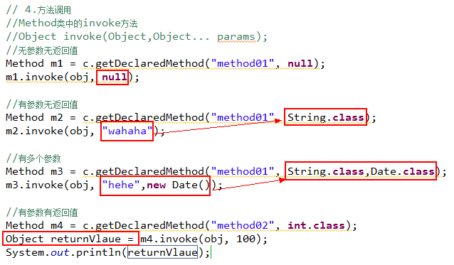

## 反射练习1：将Map中值封装到对象中

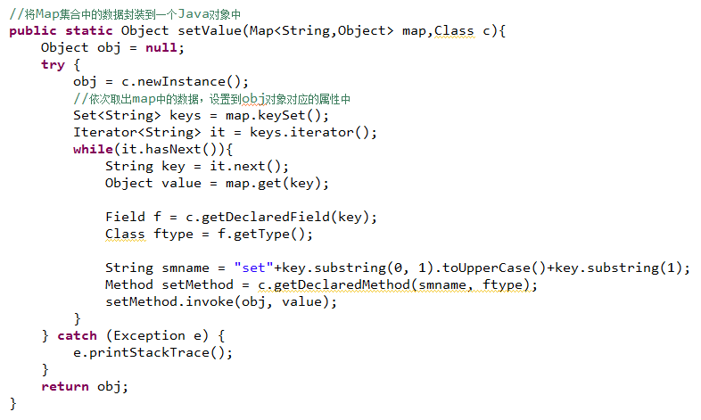

## 反射练习2：将HttpServletRequest中的数据封装到DTO对象中

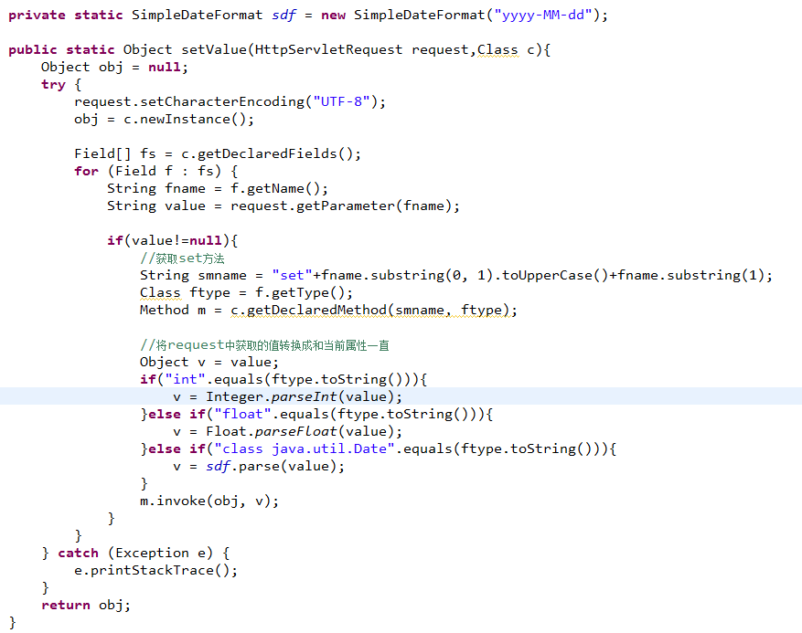

# 代理

## **静态代理**

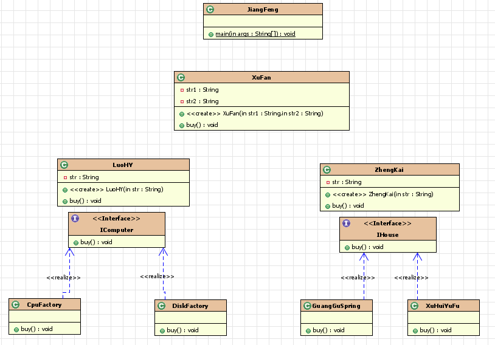

## 动态代理：

可以动态的创建被代理类的代理对象。

JDK动态代理类：只能为实现了接口的类产生代理对象

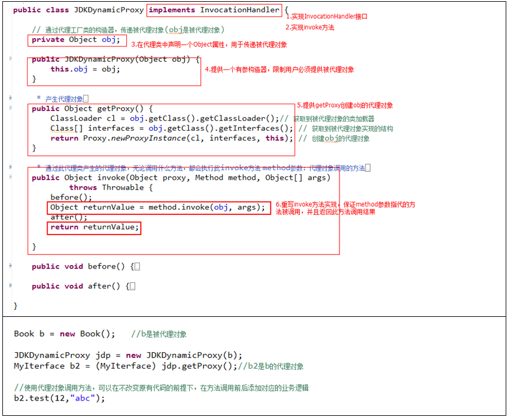

## CGLIB动态代理类：不能为final类创建代理对象

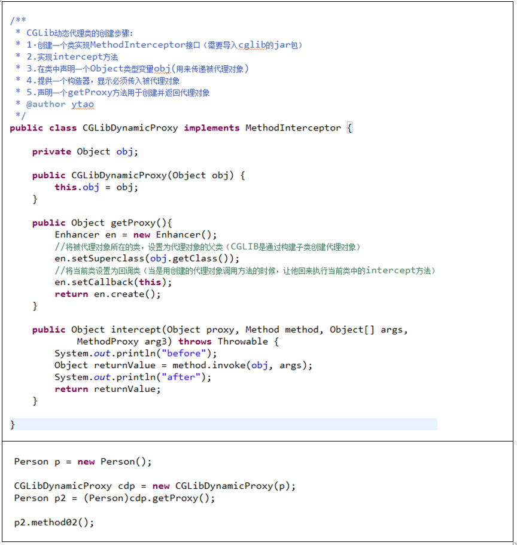

