MVC：实现页面到代码之间的数据交互。

# Struts2框架的部署

1.下载jar包

2.创建一个web项目

3.将struts2资源包解压后lib文件夹中的10个jar导入到web项目中

```
 commons-fileupload-1.3.1.jar
 commons-io-2.2.jar
 commons-lang-2.4.jar
 commons-lang3-3.2.jar
 commons-logging-1.1.3.jar
 freemarker-2.3.22.jar
 javassist-3.11.0.GA.jar
 ognl-3.0.6.jar
 struts2-core-2.3.24.jar
 xwork-core-2.3.24.jar
```

4.在web.xml中配置Struts2的核心过滤器，用于拦截所有请求

5在src中配置Struts2配置文件：struts.xml

​     ①在src中创建名为struts.xml的文件

​     ②在struts.xml文件中引入dtd规范

# Struts2的工作原理

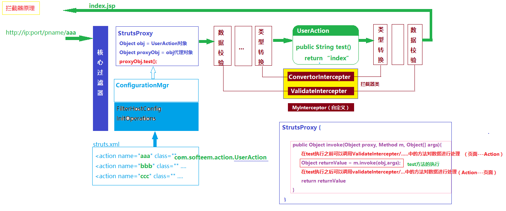

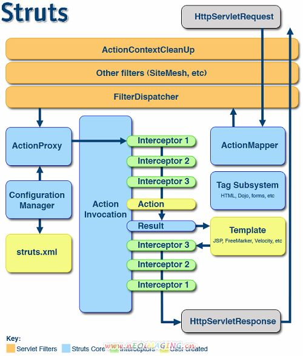

# Struts2框架的使用

## Struts2中Action类的创建

在Strtus2中，我们把可以接收页面请求/数据的类称之为Action类。
Action类的创建方式有三种：
	1.创建一个类实现com.opensymphony.xwork2.Ation接口,实现execute方法（要求必须有execute方法）
	2.创建一个类继承ActionSupport类（优点：可以使用ActionSupport中已经定义好的方法）
	3.直接创建一个类（优点：灵活）

> Action类的名字建议以”Action”结尾
>
> Action类中接收请求的方法必须是无参数有类型返回值的方法

## Struts2的常量配置

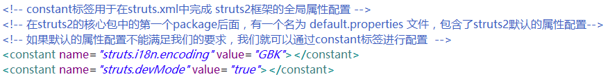

## Struts2中Action类的配置

### 为每个Action类中每个方法都配置一个action标签

缺点：如果有多个Action类和多个方法，则需要很多的action标签配置
如果没有配置method，则默认访问execute方法

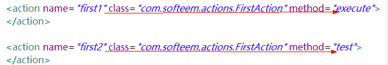

### 为所有的Action类中的所有方法，只配置一个action标签（通配符配置）

优点：配置非常简单
缺点：result配置不够灵活（可通过Action参数解决），result配置繁琐（多）
注意：访问时，必须使用“类名_方法名”

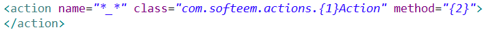

### 为每个Action类配置一个action标签

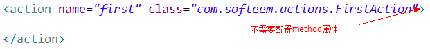

访问：采用DMI动态方法调用来访问（…./first!methodName）

需要通过常量配置启用DMI:

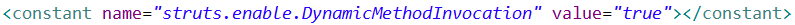

## 页面请求（跳转）到Action类

1.如果每个Action类中的每个方法都配置一个action标签，只需提交到action标签的name属性；

2.如果Action类采用的是通配符配置，则页面提交的路径必须是“Action类名_方法名”；

3.如果为每个Action类配置一个action标签，页面需要通过DMI调用(name!方法名)，需要注意的是，采用DMI调用，需要在struts.xml进行常量配置启用DMI。

## 在Action类中接收页面提交的数据                                                

1.属性接收数据
		a.在Action类中，定义属性，用于接收页面数据，同时提供get/set方法
		b.修改页面form表单中的输入框的name属性值与Action类中对应属性名相同
2.对象接收数据
		a.创建存放数据的DTO类
		b.在Action类中定义一个属性，属性为DTO类的类型，并提供属性的get/set方法
		c.修改页面form表单中输入框的name属性值为“Action类中对象名.属性名”
3.ModelDriven接值（对象）
		a.让Action类实现ModelDriven接口,实现getModel方法
		b.在Action类定义一个属性，属性为DTO类的类型，并手动创建对象，无需get/set
		c.重写getModel方法，直接返回DTO类型的属性
		d.修改页面form表单中输入框的name属性值为“属性名”

## 从Action类中的页面跳转

​     在Action类中的方法，都是无参数有String类型返回值的方法，我们通过返回的字符串找到对应的result配置类进行页面响应。

我们是通过result配置来完成Action页面跳转的。

**result的type属性：**

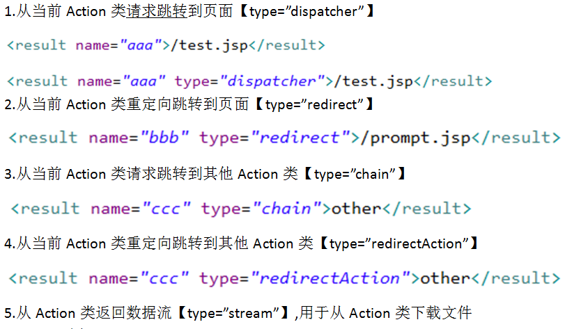

## 全局Result配置：

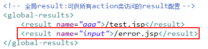

## 动态结果集

1.在Action类中定义一个属性”private String page;”提供get方法

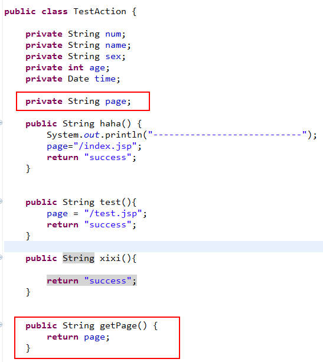

2.在Action类的配置中，添加result配置，但是页面不能固定，取到Action类中的page属性值。

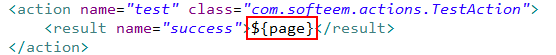

## result配置中通过url传值到页面：

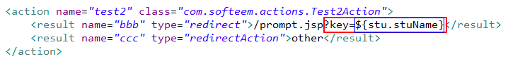

## 从Action类传值到页面

1.通过Action上下文传值：当从Action类跳转到页面的时候，Action类中的全局属性都会被传递到页面（这些全局属性必须有get方法）。       

2.通过web元素传值：（request,session,application）

