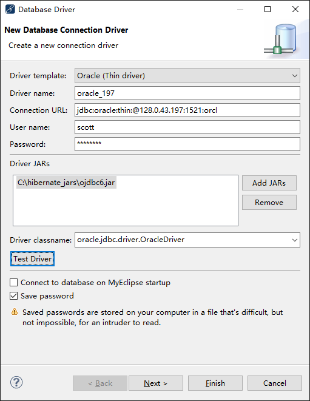
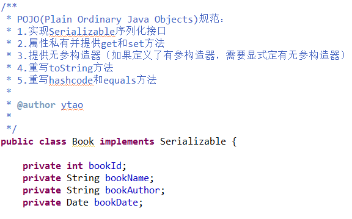
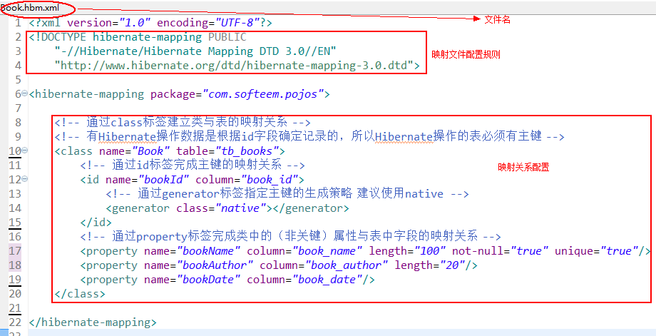
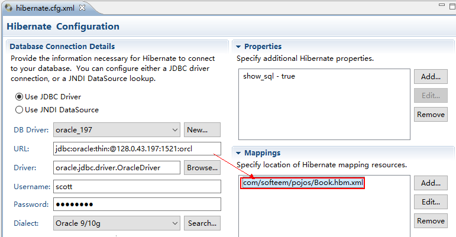
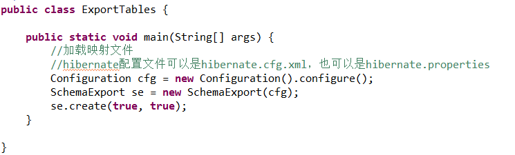
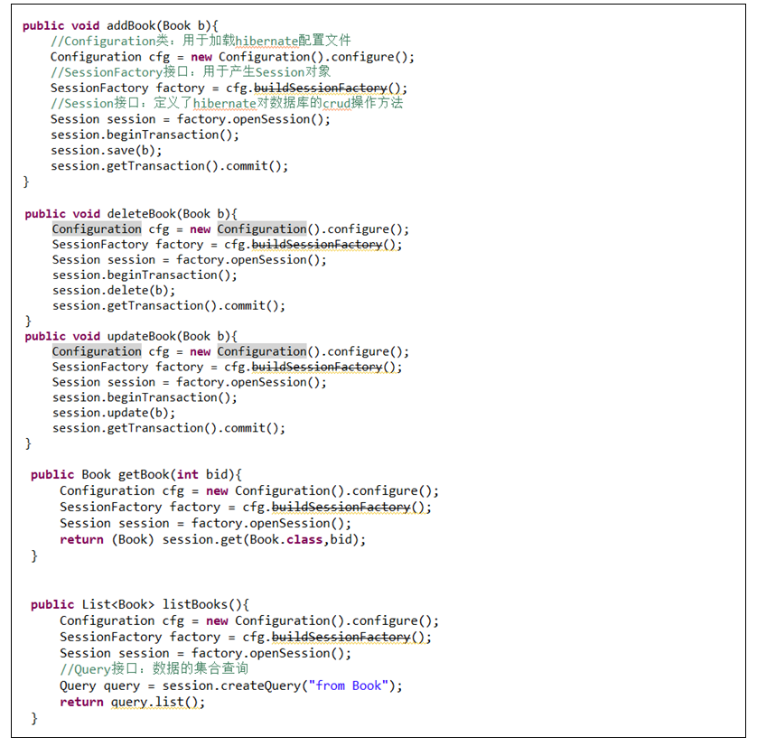

# Hibernate简介

- Hibernate是一个ORM框架，封装了通用的JDBC操作，可以通过映射文件的配置，来完成对象的持久化操作。

- Hibernate之父 Gavin King

- Hibernate版本：Hibernate2.x, Hibernate3.x, Hibernate4.x, Hibernate5.、Hibernate5.0、Hibernate5.2.2

# Hibernate框架的部署

1.创建一个Java/web工程
2.在项目中导入Hiberante所需的jar包：
  -------------------【3.x版本】---------------------
  *home/hibernate3.jar
  *home/lib/*.jar
  *数据库驱动jar包
  -------------------【4.x版本】---------------------
  *home/lib/required/*.jar
  *数据库驱动jar包
3.创建Hibernate核心配置文件：hibernate.cfg.xml
  *在src中新建一个名为hibernate.cfg.xml文件
  *在hibernate.cfg.xml中引入hibernate配置文件的DTD规范
    （hibernate核心jar包第一个package最后有DTD和xsd两种规范文件）
    DTD:拷贝dtd文件的3~5行
  *在hibernate.cfg.xml中配置数据库连接信息



# Hibernate使用步骤

1.创建一个POJO(等同于DTO)类



2.为POJO类创建映射文件，并完成类与表的映射关系配置
	*在pojos包中创建一个名为“POJO类名.hbm.xml”文件
	*在创建的映射文件中，引入映射文件的配置规范
	*在映射文件中，进行类与表的映射关系配置



3.将配置好的映射文件添加到hibernate.cfg.xml



```xml
<?xml version="1.0" encoding="UTF-8"?>
<!DOCTYPE hibernate-configuration PUBLIC
    "-//Hibernate/Hibernate Configuration DTD 3.0//EN"
    "http://www.hibernate.org/dtd/hibernate-configuration-3.0.dtd">
<hibernate-configuration>
    <session-factory>
        <!-- property 元素用于配置Hibernate中的属性
            键:值 
          -->
          <!-- hibernate.connection.driver_class : 连接数据库的驱动  -->
        <property name="hibernate.connection.driver_class">com.mysql.jdbc.Driver</property>

          <!-- hibernate.connection.username : 连接数据库的用户名 -->
        <property name="hibernate.connection.username">root</property>

          <!-- hibernate.connection.password : 连接数据库的密码 -->
        <property name="hibernate.connection.password">123</property>

          <!-- hibernate.connection.url : 连接数据库的地址,路径 -->
        <property name="hibernate.connection.url">jdbc:mysql://localhost:3306/hibernatedemｏ</property>
      <!-------------------------------------------------------------------------------->
        <!-- show_sql: 操作数据库时,会 向控制台打印sql语句 -->
        <property name="show_sql">true</property>
      <!-------------------------------------------------------------------------------->

        <!-- format_sql: 打印sql语句前,会将sql语句先格式化  -->
        <property name="format_sql">true</property>
      <!-------------------------------------------------------------------------------->

        <!-- hbm2ddl.auto: 生成表结构的策略配置
             update(最常用的取值): 如果当前数据库中不存在表结构,那么自动创建表结构. 
                     如果存在表结构,并且表结构与实体一致,那么不做修改
                     如果存在表结构,并且表结构与实体不一致,那么会修改表结构.会保留原有列.
             create(很少):无论是否存在表结构.每次启动Hibernate都会重新创建表结构.(数据会丢失)
             create-drop(极少): 无论是否存在表结构.每次启动Hibernate都会重新创建表结构.每次Hibernate运行结束时,删除表结构.
             validate(很少):不会自动创建表结构.也不会自动维护表结构.Hibernate只校验表结构. 如果表结构不一致将会抛出异常.
          -->
        <property name="hbm2ddl.auto">update</property>

    <!-------------------------------------------------------------------------------->

        <!-- 数据库方言配置 
         org.hibernate.dialect.MySQLDialect (选择最短的)
         -->
        <property name="hibernate.dialect">org.hibernate.dialect.MySQLDialect</property>
     <!-------------------------------------------------------------------------------->
        <!-- hibernate.connection.autocommit: 事务自动提交  -->
        <property name="hibernate.connection.autocommit">true</property>
        <!-------------------------------------------------------------------------------->
        <!-- 将Session与线程绑定=> 只有配置了该配置,才能使用getCurrentSession -->
        <property name="hibernate.current_session_context_class">thread</property>
      <!-------------------------------------------------------------------------------->
       <!-- 引入ORM 映射文件 
            填写src之后的路径
         -->
        <mapping resource="com/itheima/a_hello/User.hbm.xml"/>
    </session-factory>
</hibernate-configuration>
```

4.如果映射文件中配置的表不存在，则需要创建一个帮助类来根据映射文件生成数据表



这个方法主要功能是将hbm生成ddl语句，进行建表。DDL是用来操作数据库、表、视图等，所以最终需要转换成ddl语句来完成建表。这样也比较麻烦，每次建表都要单独执行该类。还有一种方法，修改配置文件。每次加载hibernate时都会删除上一次的生成的表，然后根据你的model类再重新来生成新表。但这个参数并不建议使用，正是因为每次加载都会重新生成表，会使得表中的数据丢失。

```xml
<properties>  
	<property name="hibernate.hbm2ddl.auto" value="create" />  
</properties>  
```

5.创建DAO类完成CRUD操作



