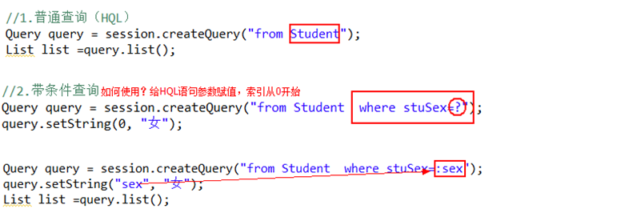
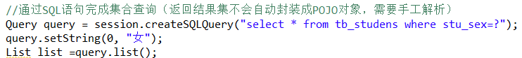
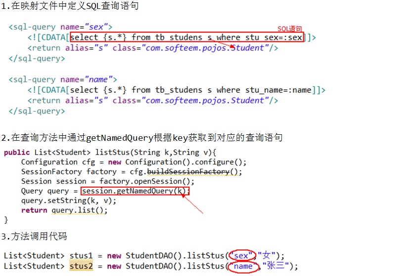
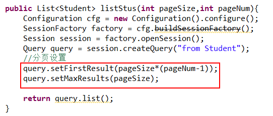
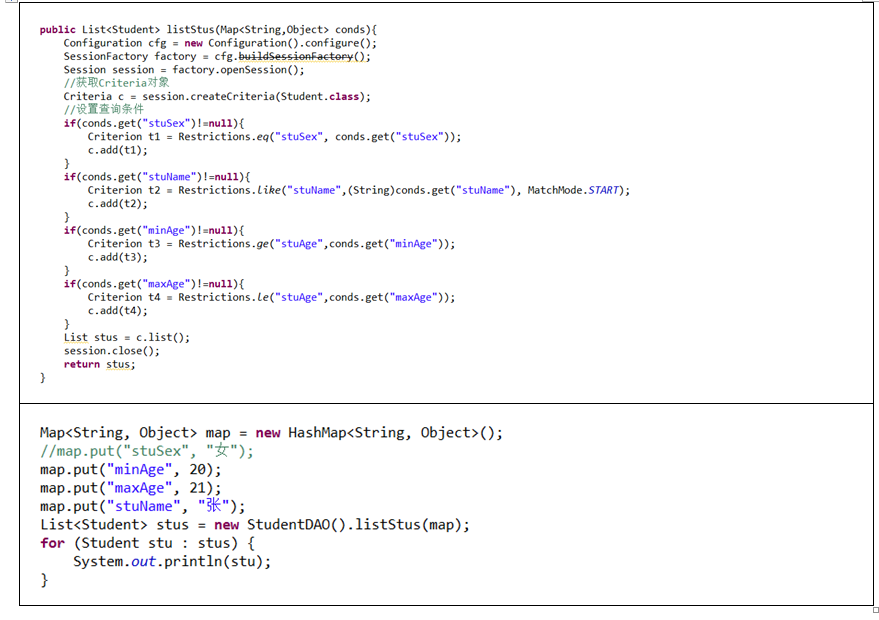
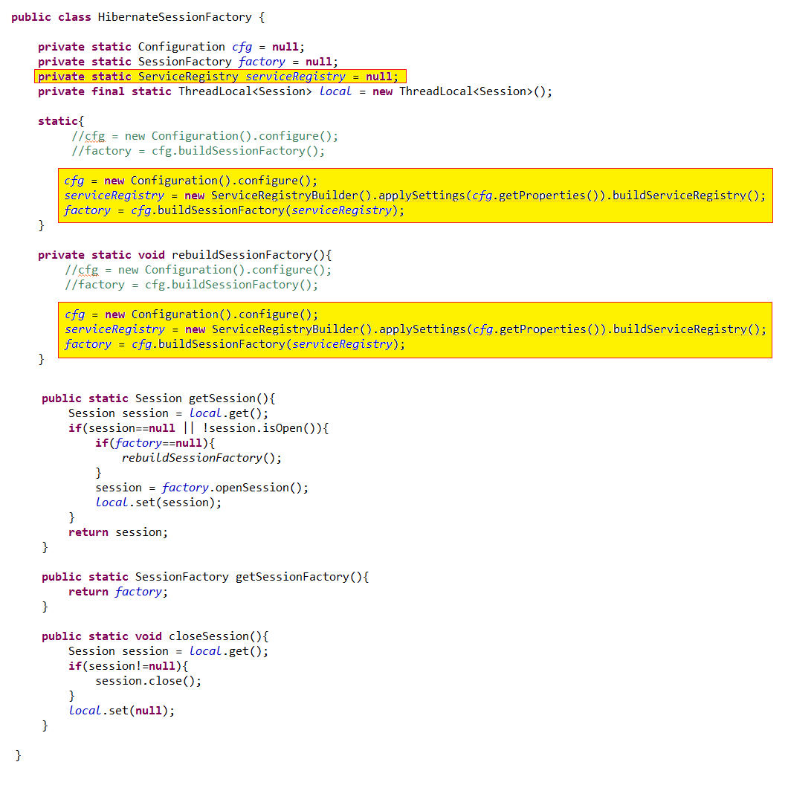
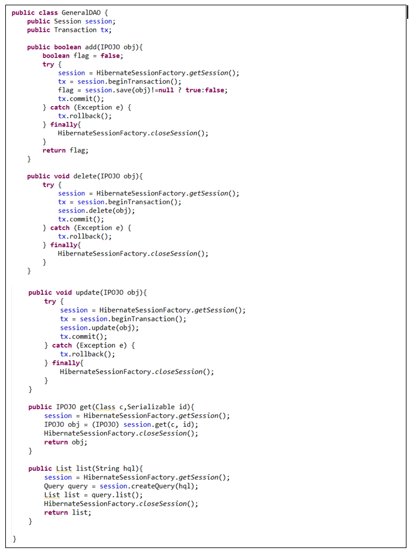

# Hibernate接口

## 1.Configuration类
作用：用于加载Hibernate配置文件,产生SessionFactory对象

- 加载配置文件

```java
hibernate.cfg.xml
Configuration cfg = new Configuration().configure();
hibernate.properties
Configuration cfg = new Configuration();
```

- 产生SessionFactory对象

```java
【3.x版本】
SessionFactory factory = cfg.buildSessionFactory();
【4.0~4.2.2版本】
ServiceRegistryBuilder srb = new ServiceRegistryBuilder().applySettings(cfg.getProperties());
StandardServiceRegistry sr = srb.buildServiceRegistry();
StandardServiceRegistryBuilder ssrb = new StandardServiceRegistryBuilder().configure();
StandardServiceRegistry serviceRegistry = ssrb.build();
SessionFactory factory = cfg.buildSessionFactory(serviceRegistry);
【4.2.2+版本】
StandardServiceRegistryBuilder ssrb = new StandardServiceRegistryBuilder().configure();
StandardServiceRegistry  serviceRegistry = ssrb.build(); 
Metadata m = new MetadataSources(serviceRegistry).buildMetadata();
SessionFactory factory = m.buildSessionFactory();
```

## 2.SessionFactory接口

作用：用于获取Session对象及hibernate二级缓存管理。

```java
//根据配置文件的连接信息创建一个与数据库之间的会话
Session session = factory.openSession();
//获取一个已经打开的连接（Spring与Hibernate整合时使用）
Session session = factory.getCurrentSession();
//如果从不同的SessionFactory对象中获取的session对象，二级缓存不能共享
//如果想要多个session对象共享二级缓存，则需要从同一个Sessionfactory对象获取
```

## 3.Session接口
作用：	

1.提供了增删查改数据库操作的规范		

2.提供了事务管理操作

3.用于产生Query接口和Criteria接口 	

4.管理一级缓存（session缓存）

- 增删查改

```java
session.save(obj);
session.delete(obj);
session.update(obj);
session.saveOrUpdate(obj);
Object pojo =session.get(Class c, id);
Object pojo =session.load(Class c, id);
```

- 事务管理

```java
//开启事务，并返回事务对象
Transaction tx = session.beginTransaction(); 
//获取已经开始的事务
Transaction tx = session.getTransaction();
```

- 产生Query对象和Criteria对象：

```java
Query query = session.createQuery("HQL");
Query query = session.createSQLQuery("SQL");
Query query = session.getNamedQuery("key");
Query query = session.getNamedProcedureCall("key");
Criteria c = session.createCriteria(Student.class);
```

## 4.Transaction接口	


## 5.Query接口
作用：专门用于集合查询

- Query query = session.createQuery("from Student");



- Query query = session.createSQLQuery("SQL");



- Query query = session.getNamedQuery("key");



- Query接口实现分页查询：



## 6.Criteria接口

作用：进行模糊查询/动态条件查询



# HibernateSessionFactory封装



## GeneralDAO封装



## 数据库事务管理

## 1.什么是事务？
​	完成一个完整的功能多个数据库操作步骤的集合。
## 2.事务的特性（ACID）：
​	a 原子性(Atomicity)：数据库的逻辑工作单位，事务的处理步骤要么同时成功，要么全部不执行。
​	b 一致性(Comsistemcy)：事务操作前与事务操作后，数据库状态都满足所有的完整性约束。
​	c 隔离性(Isolation)：两个事务同时操作的时候互不影响。
​	d 持久性(Durability)：事务完成提交以后，在数据库中的修改是永久性的，不能够再被回滚。
## 3.并发事务引起的问题：
​	更新丢失：两个事务操作同一行数据，如果第二个事务执行失败，进行回滚操作（此时事务1没有提交）导致事务1和事务2的更新操作都失效了。
​	脏读：读取到了脏数据（脏数据：未保存到数据库的无效数据），一个事务读取到了另一个事务还没有提交的数据。 例如：事务1执行了添加操作，但是还没有提交事务，此时事务2执行了查询操作，将事务1添加的数据查询出来，之后事务1执行了回滚操作。
​	不可重复读：在同一个事务中进行了两次查询同一条数据，却查询到了不同的结果。
​	幻读：在同一个事务中进行了两次查询，两次查询结果集不一致。
## 4.事务的隔离级别：
​	未授权读取：当前事务在读取数据的时候允许其他事务读数据或者修改数据；当前事务在修改数据的时候允许其他事务读数据，但是不允许其他事务改数据。
​	授权读取：当前事务在读取数据的时候允许其他事务读数据或者修改数据；当前事务在修改数据的时候，不允许其他事务读和写。
​	可重复读取：当前事务在读取数据的时候允许其他事务读但是不允许修改；前事务在修改数据的时候，不允许其他事务读和写。
​	序列化：无论当前事务读或者修改，其他事务既不能读也不能修改。

|            | **当前事务** | **其他事务** |          |
| ---------- | ------------ | ------------ | -------- |
| 未授权读取 | 读操作       | 允许读       | 允许写   |
| 写操作     | 允许读       | 不允许写     |          |
| 授权读取   | 读操作       | 允许读       | 允许写   |
| 写操作     | 不允许读     | 不允许写     |          |
| 可重复读取 | 读操作       | 允许读       | 不允许写 |
| 写操作     | 不允许读     | 不允许写     |          |
| 序列化     | 读操作       | 不允许读     | 不允许写 |
| 写操作     | 不允许读     | 不允许       |          |

## 5.事务操作：
​	开启事务
​	提交事务
​	回滚事务

# Hibernate查询语言（HQL）

HQL:将SQL与中的表名替换成映射文件中对应的类名，将SQL语句中表字段名替换成映射文件中对应的类的属性名。

 