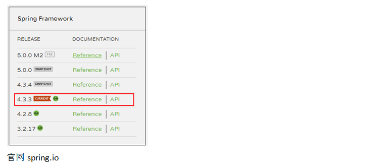
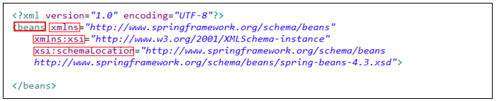
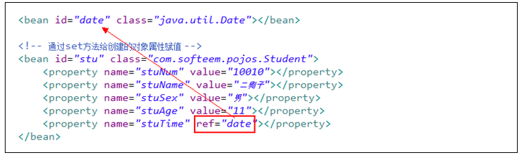
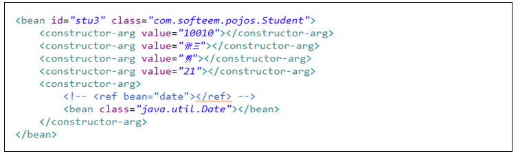
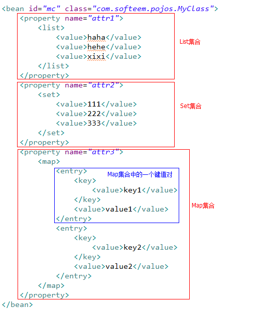
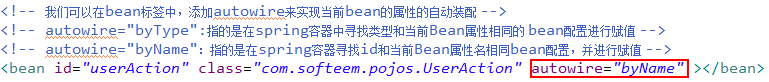
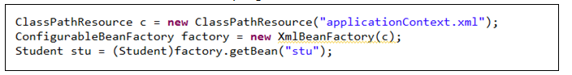

# Spring简介

**Spring  春天，泉水**
Spring是一个控制反转和面向切面的轻量级容器框架。
	1、控制反转(IoC)：可以由Spring完成对象的创建及属性的赋值，无需业务类自己完成。
	2、面向切面(AOP)：在不改变原有业务逻辑的情况下，可以在指定的连接点前后添加特定的业务逻辑（事务管理，日志管理，权限验证）。
	3、轻量级：小
	4、容器：可以帮助我们创建并管理JavaBean（DTO,POJO….）

**Spring版本与下载：**

# 面向接口编程（多态）

​     面向接口编程：当我们使用对象调用方法的时候，如果调用的方法有多种实现，则无需用子类对象调用，直接用接口对象调用；当我们赋予接口对象不同的子类时，可以有不同的实现。

​     面向接口编程的好处：代码灵活易维护，当用户需求发生改变可以在不改变源代码的情况下实现。

# Spring框架引入步骤

1.创建项目
2.导入基础jar包：

- home/libs/spring-core-…jar
- home/libs/spring-beans-…jar
- commons-logging.jar

3.在src中创建Spring配置文件

- 在src中创建名为applicationContext.xml文件
- 在配置文件中添加跟标签beans
- 在beans标签中引入spring配置文件规范（spring-beans.jar/…xml/spring-beans-4.3.xsd）

# Spring核心思想之IoC

**IoC(Inverse of Control)：控制反转(DI，依赖注入)**
	我们可以将Java类通过配置交给Spring容器管理。Spring可以帮助我们完成对象的创建，及对象属性的注入。
**IoC使用步骤**
	1.创建一个Java类
	2.在spring的配置文件applicationContext.xml中进行配置，让Spring来管理这个类

# Spring属性注入三种方式

## 1.set方法

## 2.构造器

## bean的集合属性赋值

# bean的作用域

- 在bean标签中可以添加一个scope属性，用来指定当前bean的作用域,默认的是singleton，表示无论取多少次都是同一个对象，单例模式；
- 当设置成prototype则表示可以创建多个实例，每次获取都创建不同的对象；
- 如果需要创建struts2的action实例，则推荐使用prototype
- request、session在web应用时才起作用

# bean属性自动装配

# 生命周期

生命周期（api3.3.4）

 lazy-init="true"：在bean中配置lazy-init="true"表示在调用getBean方法的时候才初始化这个bean，如果不配置，则在加载ClassPathXmlApplicationContext类的时候就初始化这个bean

init-method="init"和destroy-method="destroy"：

用来指定当前bean的初始化和destroy方法，不要和scope="prototype"一起使用（不会监控）

# Ioc总结

- spring框架引入（jar包和配置文件）
- 创建类，在applicationContext.xml进行配置
- 加载配置文件，获取对象工厂，从Spring容器中获取对象

- 属性赋值（注入）

