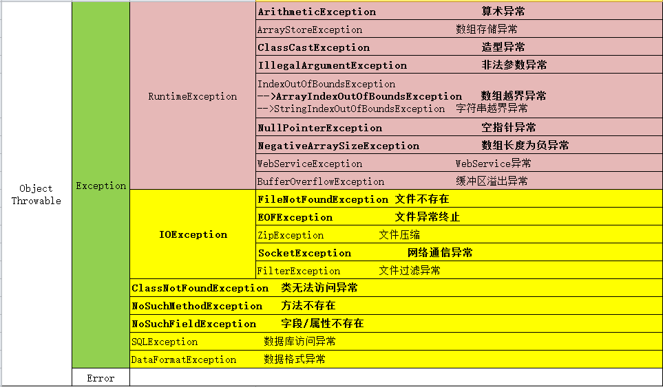
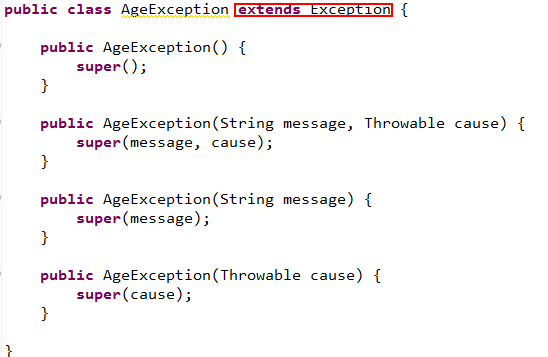
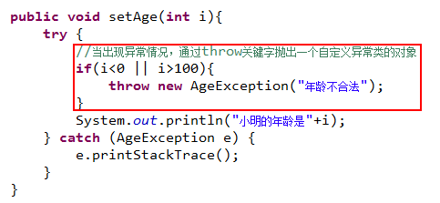

# 异常概述

不要指望你的程序永远不出问题

Java程序中的异常情况分为两类：错误和异常

​     错误：由于JVM内部错误、资源耗尽等外界问题导致程序不能正常运行

​     异常：由于编程问题或者偶然的可处理的外在因素导致的程序不能正常运行

# 异常的分类

Java中的异常分为：运行时异常和一般性异常

运行时异常：可能在 Java 虚拟机正常运行期间抛出的异常

一般性异常：在Java代码运行之前就提示抛出的异常（可能出现的异常）     

在Java中定义多个类来表示不同的异常，这些类都继承了Exception，我们把这些类称之为异常类



# 异常处理机制

关键字：try,catch,throw,throws,finally

语法：

```java
try{
   //可能出现异常的代码放在try的{}中
}catch( ){
   //一旦发现try中的代码出现异常，就调用catch中的代码来处理异常
}

try{
		
}catch(FileNotFoundException e){
		//代码1
}catch (IOException e) {
		//代码2
}finally{
}
```

# **异常的处理过程：**

- 如果try中的代码不出现异常，所有代码按顺序执行，catch中的代码不会执行

- 如果try中的代码出现异常：

在异常出现之前，所有代码按顺序正常执行；

**抛出异常**：一旦发现异常，首先确认异常种类，然后创建这个异常种类的对象，接着把这个异常对象提交到Java的异常堆栈中；

**捕获异常：**Java系统一旦发现异常堆栈中有异常对象，就终止try中代码的执行，去寻找一个类型与异常对象匹配的catch代码块来处理异常；

如果没有找到类型与异常对象匹配的catch，则程序终止。

- 如果try/catch有finally代码块，则无论try中的代码是否出现异常，finally代码块中的代码总会执行（如果没有异常，则在try中代码执行之后执行；如果出现异常，则在catch执行之后执行）

​     一个try代码块后面可以有多个catch代码块来处理多种异常，如果多个异常类型之间有继承关系，子类异常必须写在前面；父类类型的catch可以处理子类异常。

## final、finally及finalize()的区别？
- final可以用来修饰类、属性和方法：
- final修饰的属性表示常量，其值不能被改变；

- final修饰的方法表示最终方法，不能被其子类重写/覆盖；
- final修饰的类表示最终类，不能被其他类继承；
- finally用在try/catch之后，表示无论是否出现异常都会执行的代码块；
- finalize()是Object类中定义的方法，当某个对象在被GC回收时会自动调用的方法，就是用来回收对象的。

**如果一个方法中出现了异常，可以自己通过try/catch自行处理，如果自己处理不了，也可以在方法名的()后面通过throws关键字将异常向上外抛出，交个方法的调用者来处理；如果直到main方法中都没有得到处理，则程序终止执行。**

### 子类重写/覆盖父类方法的异常处理

当子类重写从父类继承的方法时：

​     1.如果父类中的方法通过throws向外抛出了异常，则子类重写的方法可以抛出异常，但是不能抛出父类中方法异常的父异常；

​     2.如果父类中的方法没有通过throws向外抛出了异常，则子类重写的方法不能通过throws关键字向外抛出异常，如果有异常只能通过try/catch来处理。

# 自定义异常

​     在Java的类库中，定义很多异常类，每个异常类代表一种异常，但是这些异常类总是有限的；当我们在实际的项目开发中，有很多看似正常的情况在具体的环境下就有可能编程异常情况（比如： int i = -5; 但是如果此时i变量代表年龄的时候就异常了），所以我们在很多情况下，都要自定义自己的异常类。

## 自定义异常类的创建：

​     1.创建一个类，继承Exception/RuntimeException类

​     2.在子类中，参考父类中的构造器，创建四个相同参数的构造器

​    

## 自定义异常类的使用：

​     当程序满足自定义的异常条件，通过throw关键字抛出一个自定义异常类的对象

