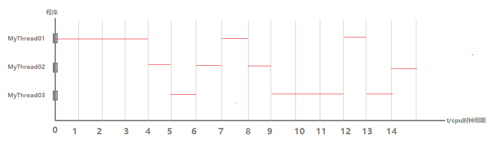
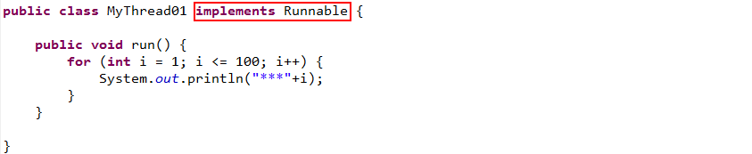
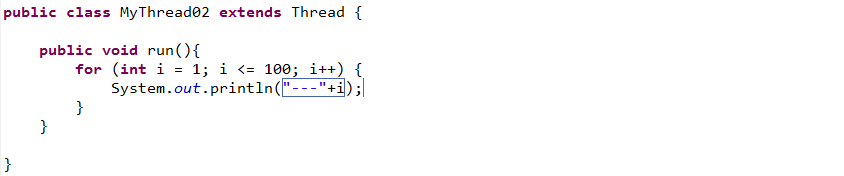
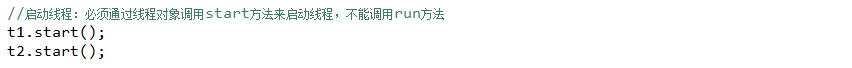
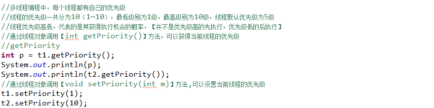
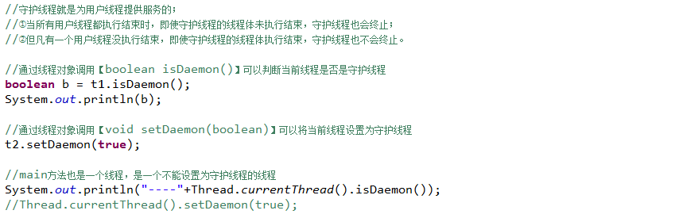
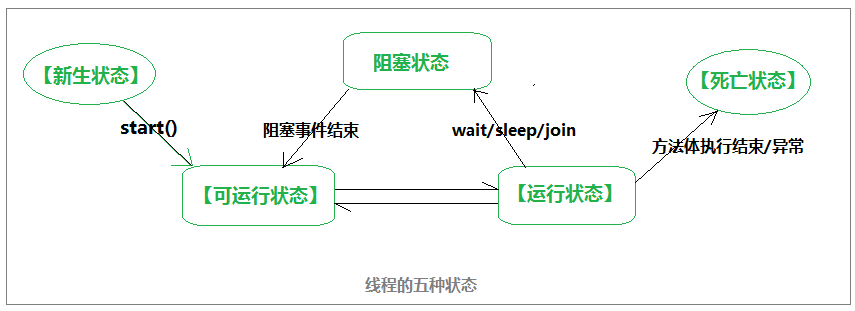
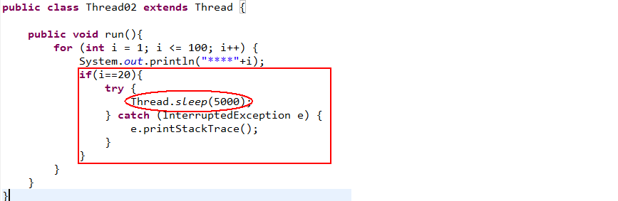
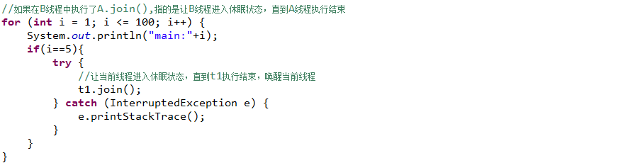

# 概述

​         线程：在实际的应用程序开发中，为了满足软件功能的需要，往往需要多段代码同时执行，我们把多段同时执行的代码中的每一段都称之为一个线程，这样的应用编程也称之为多线程编程。  

- 多进程：在操作系统中能（同时）运行多个任务(程序)
- 多线程：在同一应用程序中有多个顺序流（同时）执行

# 多线程编程

# 线程类的创建有两种方式：

###          **实现Runnable接口**  

- 线程类的创建

  ①创建一个类实现Runnable接口

  ②实现Runnable接口中的run方法

  ③在run 

- 创建线程对象

- 获取线程名称

- 设置线程名称

###          **继承Thread类**  

- 线程类的创建

​	①创建一个类继承Thread类

​	②重写run方法

​	③在run

- 创建线程对象

- 获取线程名称

- 设置线程名称

- 启动线程

# 线程优先级

# 守护线程

线程根据其作用分为：用户线程（客户）和守护线程（服务员）
	用户线程：用来实现具体功能，线程体会执行结束
	守护线程：守护线程就是为用户线程提供服务的；当所有用户线程都执行结束时，即使守护线程的线程体未执行结束，守护线程也会终止；但凡有一个用户线程没执行结束，即使守护线程的线程体执行结束，守护线程也不会终止。

# 线程的状态

线程的状态：当我们创建一个Thread对象后，这个对象拥有多种状态

# 阻塞事件

##          sleep  

##          join  

## yield  

