# 一、HTML介绍：

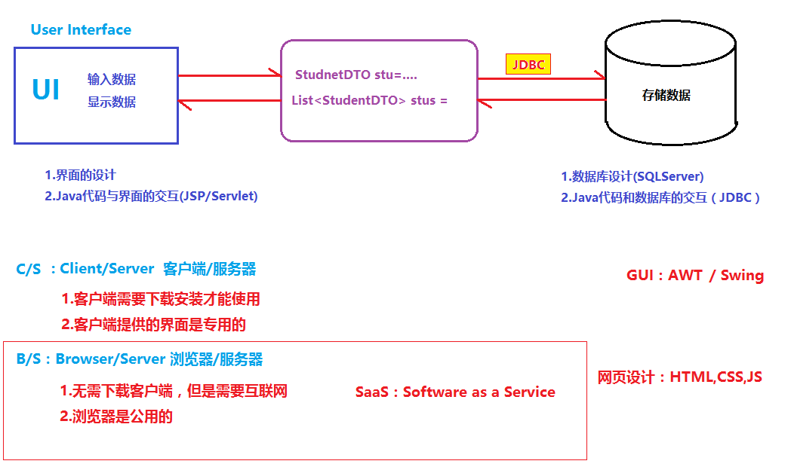

HTML(HyperText Markup Language):

超文本标记语言，用于通过浏览器展示用户界面/视图。

将HTML一个标记写在一个网页文件中，通过浏览器打开可以显示一个视图效果。

# 二、HTML基本语法

1.HTML标签必须写在后缀名为”.htm”或者”.html”的网页文件（网页文件可以通过浏览器打开）

2.标记/标签：就是由一对<>加上一个关键字组成的整体

​          单标签：**<**tagName**/>**

​          双标签：<tagName>**tagName> 【双标签可以有子标签】

3.属性：我们可以在标签名后添加键值对（key=”value”）,从而改变这个标签的功能或者外在显示效果。

​          <tagName key1=”value1” key2=”value2” />

​          <tagName key1=”value1” key2=”value2”></tagName>

4.网页文件的基本格式：

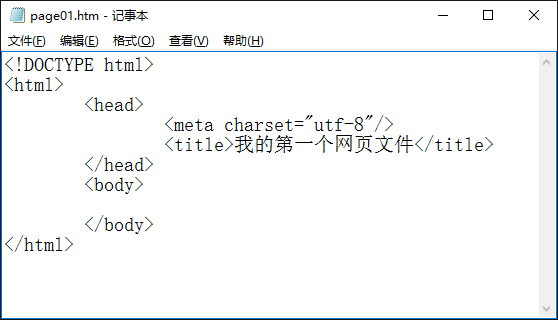

​		  a.网页文件第一行通常是文档类型的声明：<!DOCTYPE html>

​          b.网页文件必须有一对根标签<html></html>

​          c.在根标签下通常包含两对子标签head和body

​          d.head标签中用于定义当前网页文件的属性，通常要给出meta定义网页的编码格式，以及一对名为title的子标签，用于定义当前网页的标题

​          e.body标签中用于定义当前网页显示的内容

​     5.标签与标签之间可以嵌套，也可以并列，但是不能交叉。

# 三、常用标签：

根据页面中标签的功能不同，我们可以把标签分为：显示标签、输入标签、布局标签、功能标签。

## 显示标签：

- 显示文本

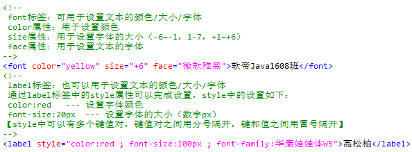

- 显示图片

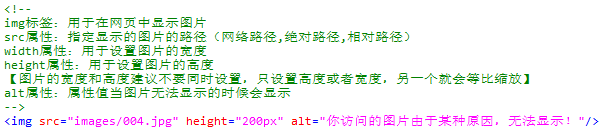

- 播放声音和视频（HTML5中有专门的标签可用于播放声音和视频）

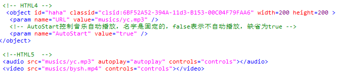

## **输入标签**：

在网页中提供对应的输入视图（输入框等…）供用户输入数据  

- 1.输入框一般都需要提供name属性和id属性（name允许重复，id不允许重复）
- 2.输入框都有属性，属性的值通常指的是输入框中的值

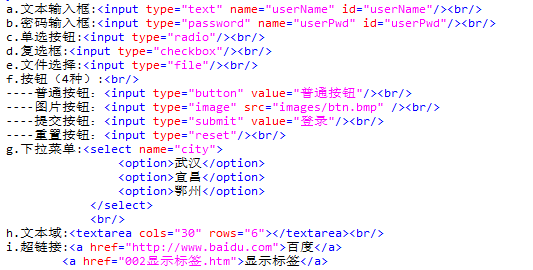

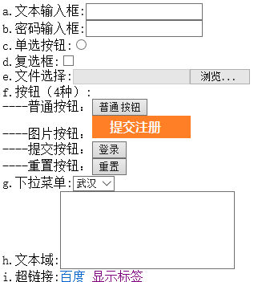

- 对于文本输入框可以添加placeholder属性进行输入提示

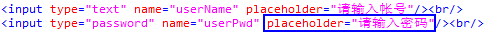

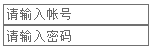

- 对于单选按钮，要求如下：

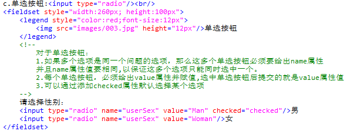

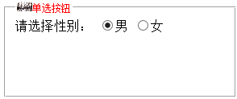

- 对于复选框，要求和单选按钮一致

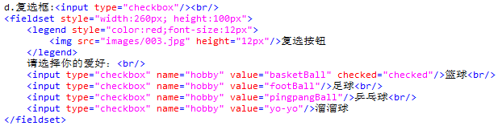

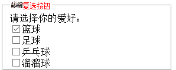

- form标签用于提交数据，如果输入框中的数据需要被提交，就必须放在一对form标签中。

    action属性：用于指定提交的目标地址

    method属性：用于指定表单数据的提交方式（get|post）

- <input type="submit"/>用于提交当前表单

- <input type="reset"/>用于重置当前表单中的输入框

- <input type="image" src=""/>作用和提交按钮一样，用于提交当前表单