# 在Action类中获取web元素

web元素：request，session，application对象

## request对象在Action类中有两种表现形式：
### ①以web对象表现形式

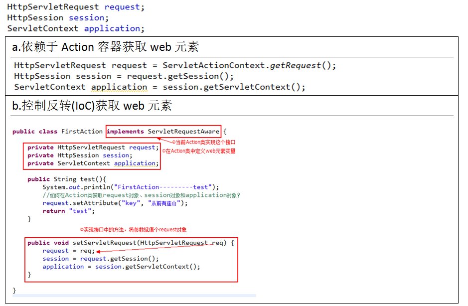

### **②以Map集合形式存在**  

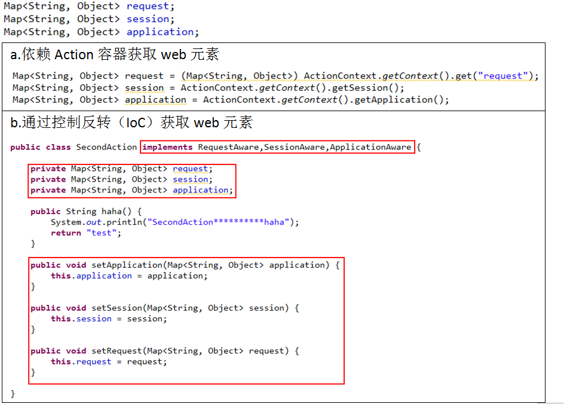

# 在JSP页面接收Action类传递的数据

## 1.Java代码接收数据

  略  

## 2.JSTL+EL表达式

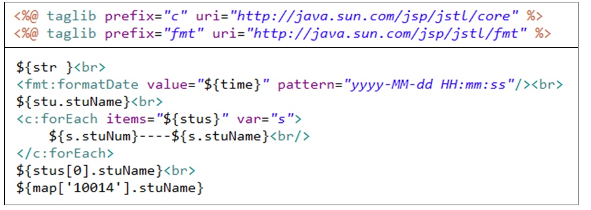

## 3.通过struts2标签接收数据  

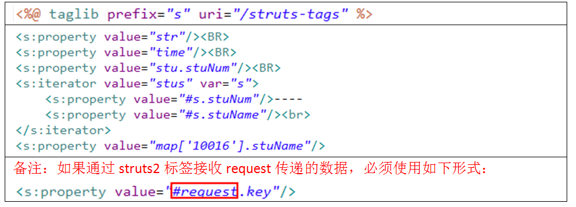

# OGNL

Object Graph Navigation Language(对象图导航语言)

> 1,访问Action值栈中的普通属性：
>
> ​     <s:property value="attrName"/>
>
> 2,访问Action值栈中的对象属性中的属性(要有get set方法)：
>
> ​     <s:property value="obj.attrName"/>
>
> ​     <s:property value="obj1.obj2.attrName"/>
>
> 3,访问值栈中对象属性的方法
>
> ​     <s:property value="obj.methodName()"/>
>
> 4,访问值栈中action的普通方法：
>
> ​     <s:property value="methodName()"/>
>
> 5,访问静态方法：
>
> ​    <!-- 调用静态方法：需要在struts.xml中通过constant标签 -->
>
> ​    <!-- <constant name="struts.ognl.allowStaticMethodAccess" value="true"/> -->
>
> ​     <s:property value="stu.method03()"/> 
>
> ​    <s:property value="@com.softeem.dto.StudentDTO@method03()"/>     
>
> 6,访问静态属性：
>
> ​     <s:property value="@com.softeem.LoginAction@attrName"/> 
>
> 7,访问Math类的静态方法：
>
> ​     <s:property value="@java.lang.Math@random()"/> 
>
> ​    <s:property value="@@random()"/> 
>
> 8,访问普通类的构造方法：
>
> ​     <s:property value="new com.softeem.User(2)"/>
>
> 9,访问集合：
>
> ​     ①list集合对象
>
> ​     <s:property value="listName"/>
>
> ​     ②list集合中的某个元素
>
> ​     <s:property value="listName[1]"/>
>
> ​     ③list中某个属性的集合
>
> ​     <s:property value="listName.{field}"/>
>
> ​     ④list中某个属性集合的特定值
>
> ​     <s:property value="listName.{field}[0]"/>
>
> ​     遍历集合：
>
> ​      <s:iterator value="stus" var="ss">
>
> ​         学号：<s:property value="#ss.stuNum"/> 
>
> ​         姓名：<s:property value="#ss.stuName"/> 
>
> ​         年龄：<s:property value="#ss.stuAge"/> 
>
> ​         入学日期：<s:property value="#ss.stuDate"/> 
>
> ​         班级编号：<s:property value="#ss.cla.claId"/> 
>
> ​         班级名称：<s:property value="#ss.cla.claName"/> 
>
> ​         

>
> ​      </s:iterator>
>
> ​     ⑤访问set
>
> ​     <s:property value="setName"/>
>
> ​     ⑥访问set中某个元素
>
> ​     <s:property value="setName[0]"/>
>
>  
>
> ​	⑦访问map
>
> ​     <s:property value="mapName"/>
>
> ​	⑧根据key访问Map中的元素
>
> ​     <s:property value="mapName.key"/>
>
> ​     <s:property value="mapName['key']"/>
>
> ​     <s:property value="mapName[\"key\"]"/>
>
> ​	⑨访问map中所有的key
>
> ​     <s:property value="mapName.keys"/>
>
> 10,访问map中所有的values
>
> ​     <s:property value="mapName.values"/>
>
> 11,访问map的大小
>
> ​     <s:property value="mapName.size()"/> 
>
> 12,投影
>
> ​     ?:表示取到满足条件的所有记录
>
> ​     ^:表示取到满足条件的第一条记录
>
> ​     $:表示取到满足条件的最后一条记录
>
> ​     <s:property value="listName.{?#this.age==1}"/>
>
> ​     <s:property value="listName.{^#this.age>1}"/>
>
> ​     <s:property value="listName.{$#this.age==1}"/>
>
> ​     <s:property value="listName.{$#this.age==1}.{age}==null"/>
>
> ​     []:<s:property value="[0]"/>值栈中的对象
>
> 13，获取值栈中的数据和获取上下文中的数据方式有区别：
>
> ​      值栈：<s:property value="key"/>
>
> ​    上下文：<s:property value="#key"/>

# Struts2配置文件模块化

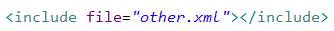

# Struts2默认Action类配置

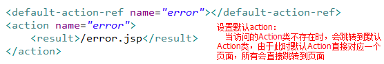

# Struts2的标签库

在页面中使用struts2标签，必须首先通过<%@ taglib prefix=*"s"* uri=*"/struts-tags"* %>引入标签。

根据Struts2标签库中标签作用的不同，可以将Struts2标签分为三类：

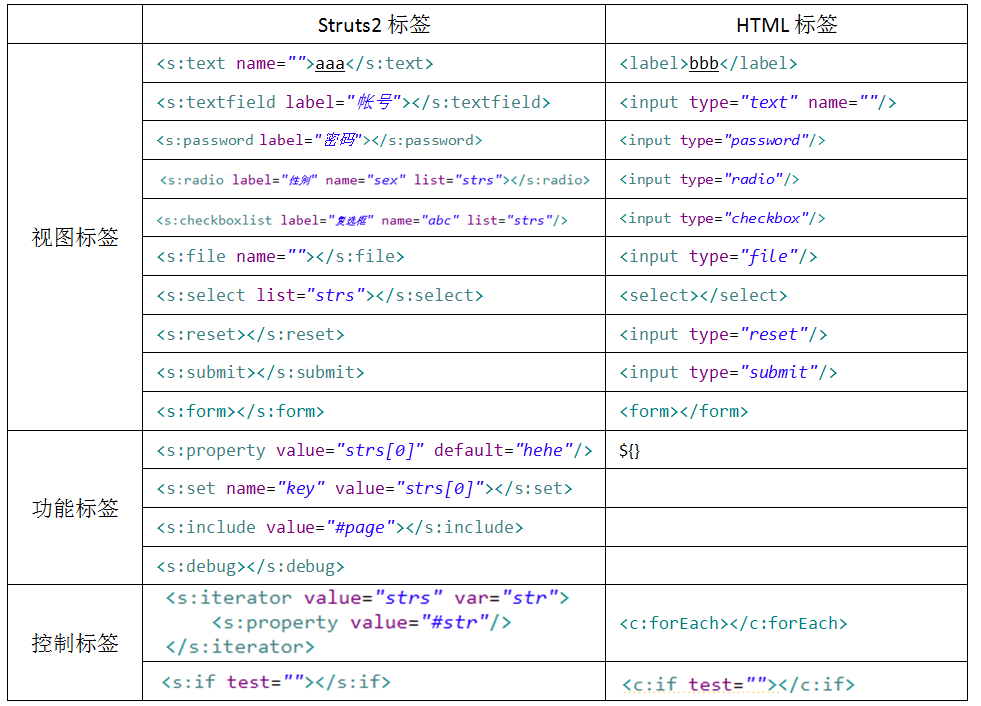

# 拦截器

## 1.拦截器原理：

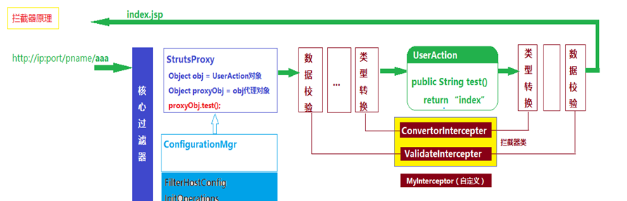

## 2.自定义拦截器：
​	a.创建一个类实现interceptor接口
​	b.实现三个方法：init,intercept,destroy
​	c.重写intercept方法

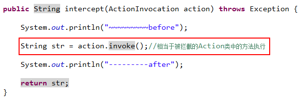

d.配置拦截器

- 声明拦截器：在package标签下的interceptors子标签中进行声明

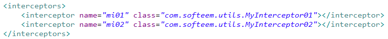

- 为Action配置拦截器

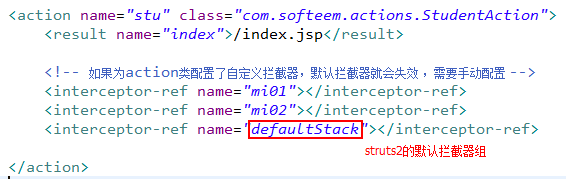

## 3.拦截器组
我们把常用的多个拦截器封装在一个组中，可以引用拦截器组来引用组中的多个拦截器。
拦截器组的声明：

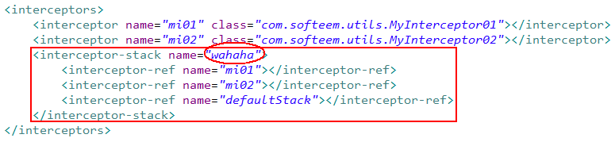

拦截器组的引用：

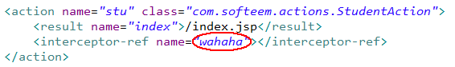

