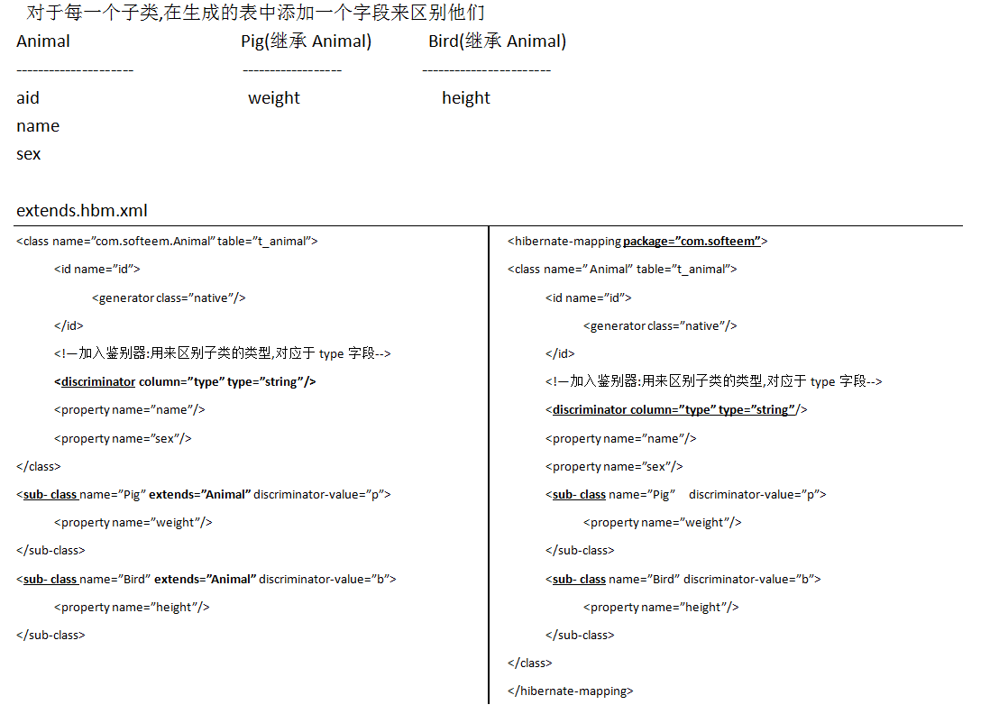
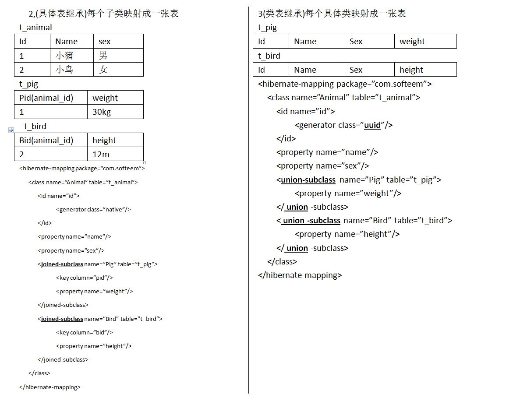

继承映射的三种策略:

1,(单表继承)每棵类继承树映射成一张表

2,(具体表继承)每个子类映射成一张表

3,(类表继承)每个具体类映射成一张表 

1,每棵继承树映射成一张表(就是将父类和子类中所有的属性都映射成一张表的字段)

| Id   | Name | Sex  | Weight | Height | type（鉴别器） |
| ---- | ---- | ---- | ------ | ------ | -------------- |
| 101  | poly | F    | null   | 188    | b              |
| 102  | 八戒 | M    | 288    | null   | p              |
| 103  | bage | M    | null   | null   |                |

 对于每一个子类,在生成的表中添加一个字段来区别他们

---

