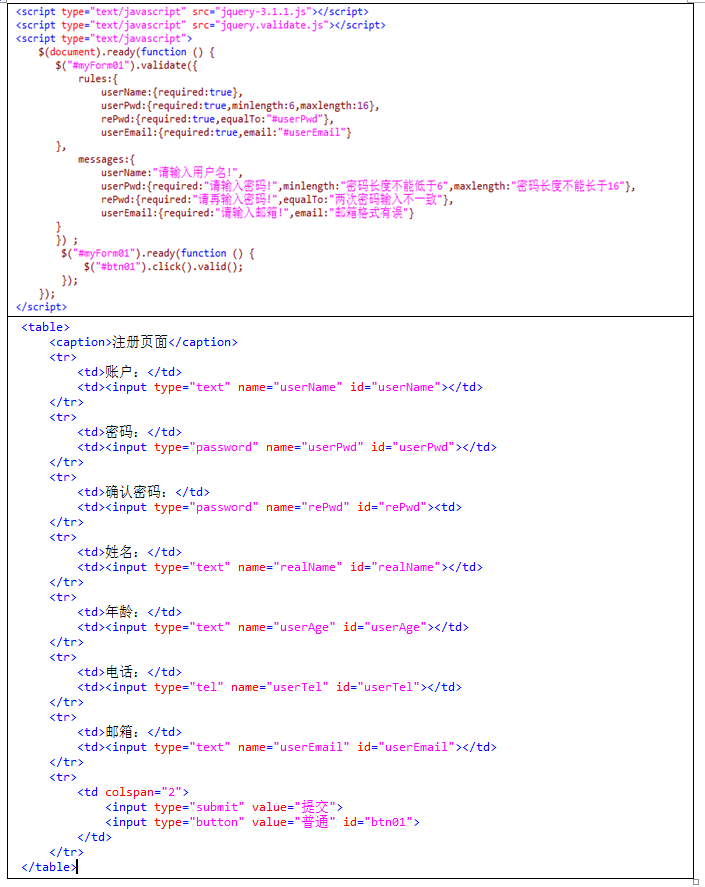

使用验证框架需要导入jQuery和jQuery-validate

validate 自带的默认验证 ：

​	required: " 必选字段 ", 

​	remote: " 请修正该字段 ", 

​	email: " 请输入正确格式的电子邮件 ", 

​	url: " 请输入合法的网址 ", 

​	date: " 请输入合法的日期 ", 支持各种日期分割符号（/-=.）

​	dateISO: " 请输入合法的日期 (ISO).", 

​	number: " 请输入合法的数字 ", 

​	digits: " 只能输入整数 ", 

​	creditcard: " 请输入合法的信用卡号 ", 

​	equalTo: " 请再次输入相同的值 ", 

​	accept: " 请输入拥有合法后缀名的字符串 ", 

​	maxlength: jQuery.format(" 请输入一个长度最多是 {0} 的字符串 "), 

​	minlength: jQuery.format(" 请输入一个长度最少是 {0} 的字符串 "), 

​	rangelength: jQuery.format(" 请输入一个长度介于 {0} 和 {1} 之间的字符串 "), 

​	range: jQuery.format(" 请输入一个介于 {0} 和 {1} 之间的值 "), 

​	max: jQuery.format(" 请输入一个最大为 {0} 的值 "), 

​	min: jQuery.format(" 请输入一个最小为 {0} 的值 ")

1，class引用样式验证：

```
<script type="text/javascript" >
    $(document).ready(function(){
        $("#signupForm").validate();
    })
</script>
```

```
<form id="signupForm" method="get" action="">
	<fieldset>
		<legend>Validating a complete form</legend>
		<p>
			<label for="firstname">Firstname</label>
			<input id="firstname" name="firstname" class="required" />
		</p>
		<p>
			<label for="lastname">Lastname</label>
			<input id="lastname" name="lastname" />
		</p>
		<p>
			<label for="username">Username</label>
			<input id="username" name="username" />
		</p>
		<p>
			<label for="password">Password
			</label><input id="password" name="password" type="password" />
		</p>
		<p>
			<label for="confirm_password">Confirm password</label>
			<input id="confirm_password" name="confirm_password" type="password" />
		</p>
		<p>
			<label for="email">Email</label>
			<input id="email" name="email" />
		</p>
		<p>
			<input class="submit" type="submit" value="Submit" />
		</p>
	</fieldset>
</form>
```

2，<script></script>中定义验证规则：（注意密码和email的验证）

```
<script type="text/javascript" src="jquery-1.8.1.js"></script>
<script type="text/javascript" src="jquery.validate.js"></script>
<script type="text/javascript" >
	$(document).ready(function() {
		$("#signupForm").validate(
		/*-------------在validate函数括号中定义验证规则及提示信息---------------*/
			{
				//定义验证规则
				rules : {
					firstname : "required",
					lastname : "required",
					username : "required",
					password :{ required:true, minlength:4, maxlength:15 },
					confirm_password : {required : true,equalTo : "#password"},
					email : {required : true,email : true}
				},
				//定义提示信息：如果不定义则显示默认样式
				messages:{
					firstname:"必须输入用户名！",
					password:{ required:" 必填项",
						minlength:jQuery.format(" 密码长度不少于 {0} 位 "),
						maxlength:jQuery.format(" 密码长度不超过 {0} 位 ") 
					},
					email:{required:"必须输入邮箱！",email:"邮箱格式不正确"}
				}				
			}
		/*------------------------------------------------------------------------*/
		);
	})
</script>
```

可以定义错误信息的样式：

```
<style type="text/css"> 
	#signupForm label.error { 	
		color:red; font-family:"微软雅黑"; font-size:12px; background-color:#FFCC99
	} 
</style>
```

实例



