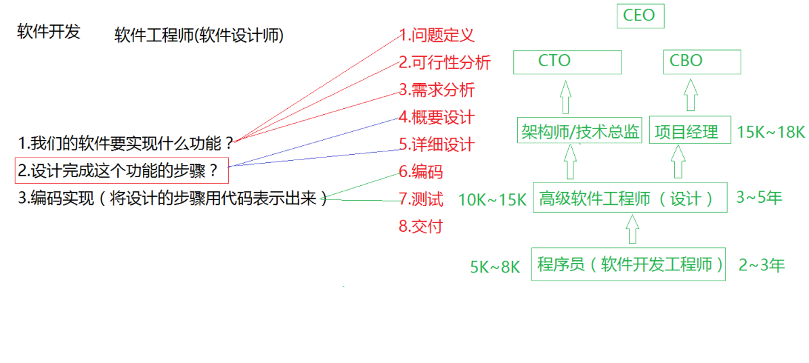
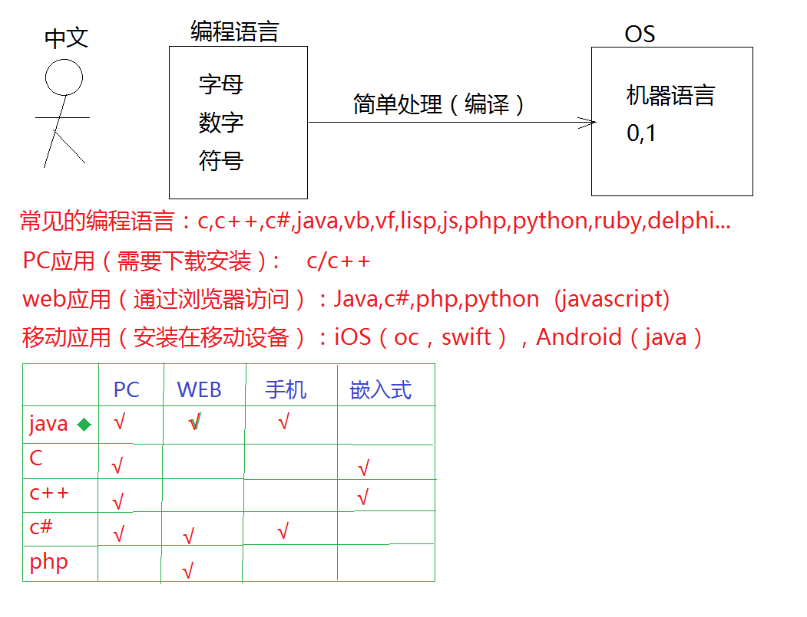
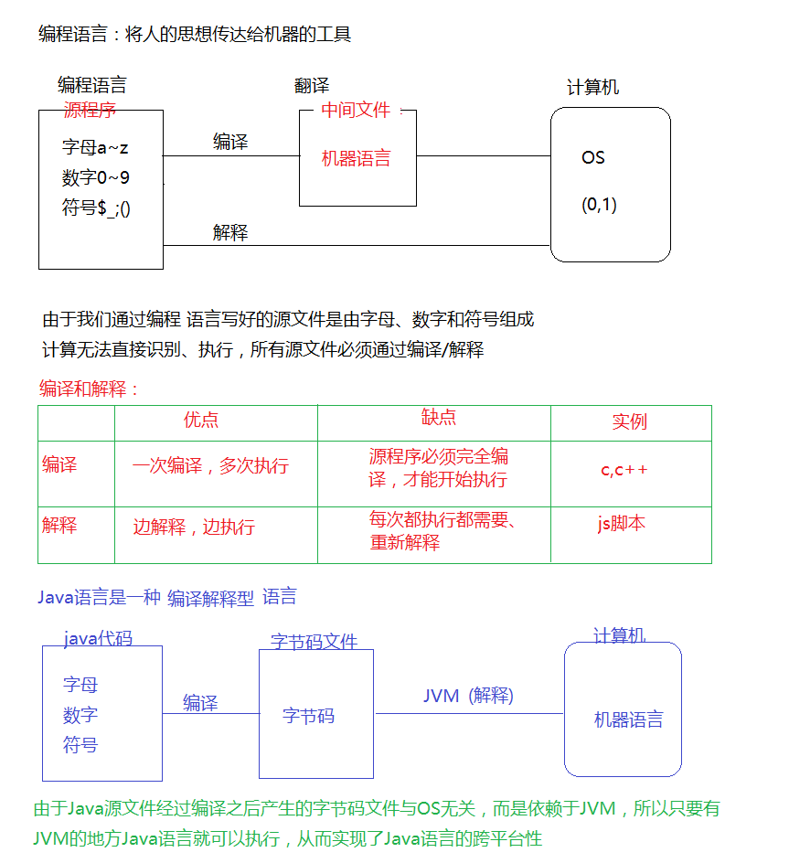
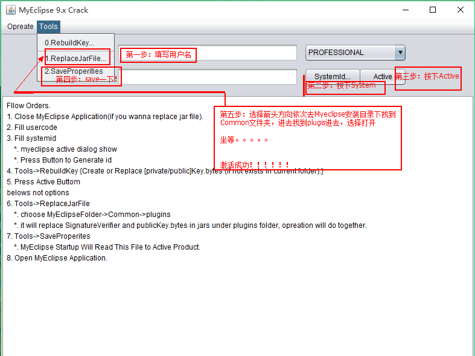

# 软件开发介绍

# 编程语言介绍

# 编译和解释

# Java语言介绍

> Java语言出现于1991年，正式发布于1995年
>
> Java语言之父：James·Gosling（詹姆斯·高斯林）
>
> Java出生地：SUN
>
> Java语言历史版本：1.0，1.1，1.2，1.3，1.4，5.0，6.0，7.0，8.0
>
> Java的技术架构体系：
>
> - J2ME
>
> - J2SE
>
> - JavaEE
>
> - Android-SDK
>
> Web： J2SE-JavaEE
>
> Android：J2SE-AndroidSDK
>
> - Java语言是一种编译解释型语言
>
> - Java语言是一种面向对象的语言
>
> - Java语言是一种大小写敏感的语言

# Java的开发环境

## 术语

- JDK：Java Development Kit Java开发工具集

- JVM：Java Virtual Machine Java虚拟机  

- JRE：Java Runtime Environment Java运行环境

## JDK的下载及安装

**检测计算机是否已经具有Java开发环境？**   

 “win+R” 输入“cmd”回车 输入Java/Javac指令回车

**下载JDK?**

​     www.oracle.com

**安装并配置开发环境？**

- 安装路径中不要包含空格和中文

- 配置环境变量就是为了告诉操作系统工具的路径

## JDK环境变量设置

系统变量→新建 JAVA_HOME 变量 。

变量值填写jdk的安装目录（本人是 E:\Java\jdk1.7.0)

系统变量→寻找 Path 变量→编辑

在变量值最后输入 %JAVA_HOME%\bin;%JAVA_HOME%\jre\bin;

（注意原来Path的变量值末尾有没有;号，如果没有，先输入；号再输入上面的代码）

系统变量→新建 CLASSPATH 变量

变量值填写 .;%JAVA_HOME%\lib;%JAVA_HOME%\lib\tools.jar（注意最前面有一点）

系统变量配置完毕

# MyEclipse破解步骤：

