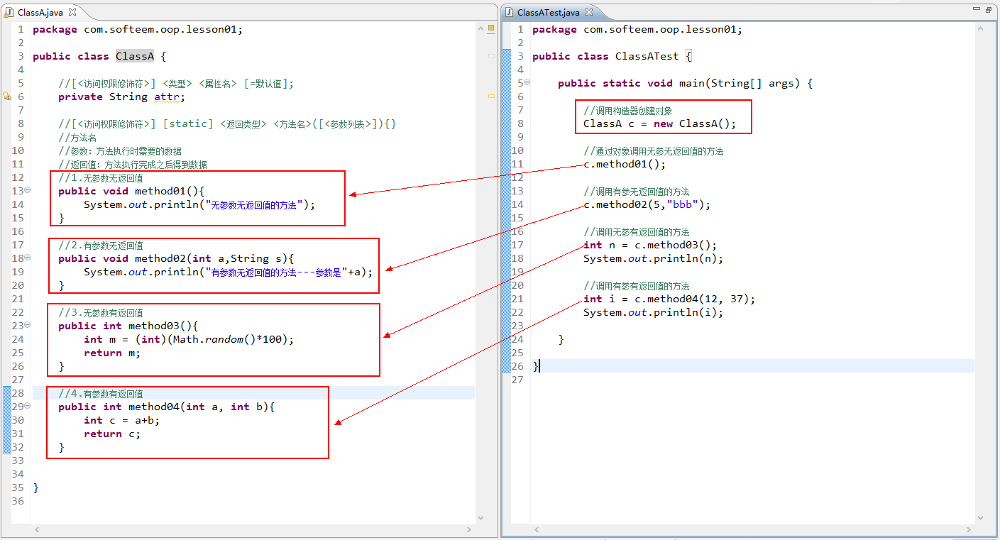
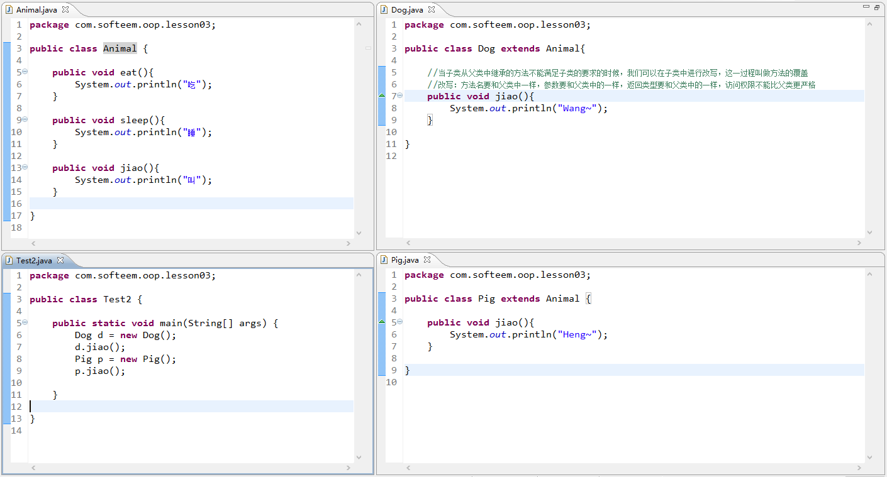
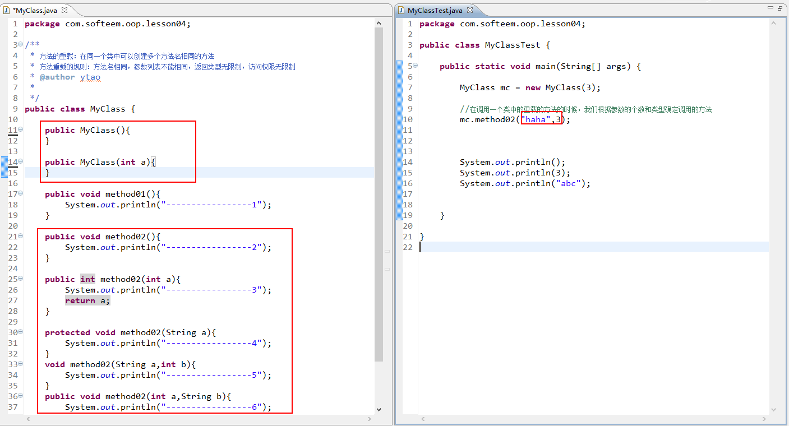
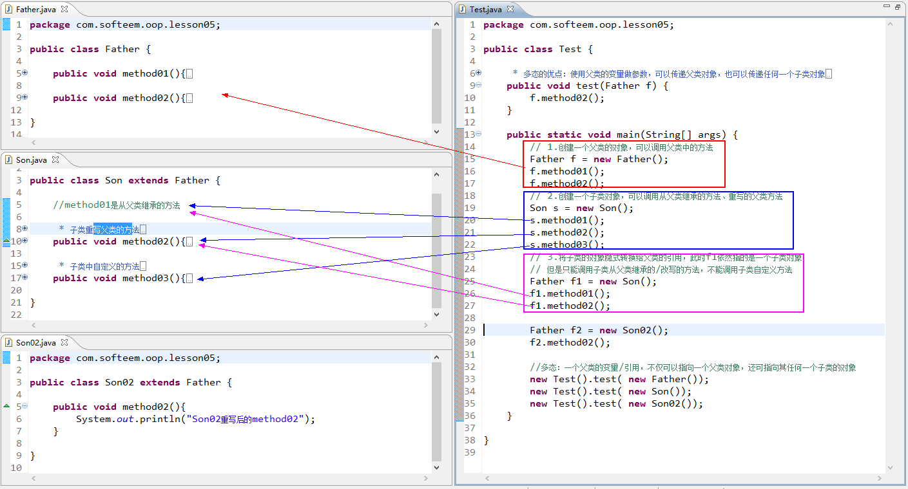
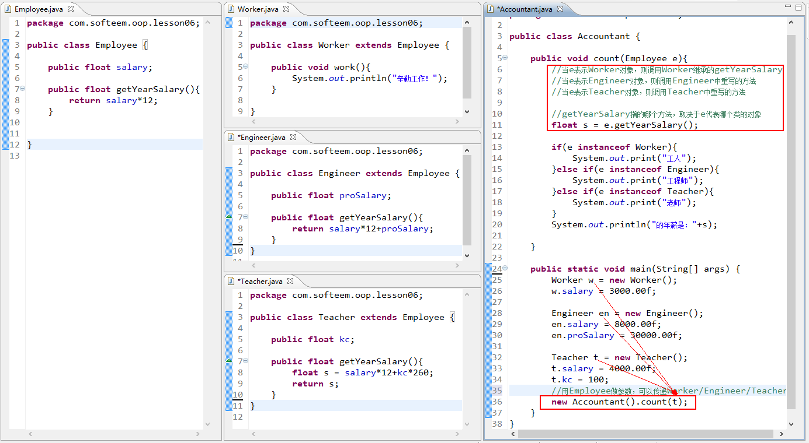

# 面向对象基础（类、对象、方法）

用Java中的类来描述一类事物的行为和特征

- 属性：用来描述事物的静态特征

- 方法：用来描述事物的动态行为

# 面向对象—继承

面向对象的四大基本特征：抽象、继承、封装、多态

继承：**可以让一个类继承一个现有类，从而获得现有类中的属性和方法**

可以让ClassB类继承ClassA，从获得ClassA中已经存在的属性和方法

- 父类中的属性和方法可以被子类继承，但是构造器不能被继承

- Java中的继承是单继承（一个子类只能继承一个父类），但是我们可以通过传递继承，来让一个类获得多个类中的属性和方法

- 一个子类只能**继承**一个父类，但是一个父类可以**派生**多个子类

- 在Java所有的类都会默认继承Object类，Object类是所有类的超父类

# 访问权限修饰符

当我们定义变量或者定义方法时可以使用private/protected/public来修饰，当一个方法/变量被不同的访问权限修饰时，其访问范围也有所区别

|               | **本类** | **同包中的类** | **不同包的子类** | **其他包其他类** |
| ------------- | -------- | -------------- | ---------------- | ---------------- |
| **private**   | **√**    |                |                  |                  |
| *default*     | **√**    | **√**          |                  |                  |
| **protected** | **√**    | **√**          | **√**            |                  |
| **public**    | **√**    | **√**          | **√**            | **√**            |

# 方法的重写

- 继承：子类继承父类，可以获得父类中的属性和方法（protected和public）

- 子类继承父类以后，获得了父类中的属性和方法，在子类中还可以定义自己的方法

> 方法的重写：当子类从父类继承的方法不能满足子类的要求，可以在子类中进行改写
>
> 方法重写的规则：方法名要与父类一致，参数列表要与父类一致，返回类型也要与父类一致，访问权限不能比父类更为严格。

- 当在子类中对父类的方法进行重写以后，子类对象调用的就是子类中重写后的方法

# 方法的重载

我们可以在一个类中定义多个方法名相同的方法

方法的重写与方法的重载区别：

|          | 方法的重写/覆盖                                              | 方法的重载                                      |
| -------- | ------------------------------------------------------------ | ----------------------------------------------- |
| 定义     | 当子类从父类继承的方法不能满足子类要求的时候，可以在子类中进行改写 | 在同一类中，可以创建多个方法名相同的方法        |
| 方法名   | 子类中方法名必须与父类方法名保持一致                         | 多个方法的方法名相同                            |
| 参数列表 | 子类中方法的参数必须与父类方法保持一致                       | 多个方法的参数列表不能相同（个数不同/类型不同） |
| 返回类型 | 子类中方法的返回类型必须与父类保持一致                       | 多个方法返回类型无限制                          |
| 访问权限 | 子类中方法的访问权限不能比父类更为严格                       | 多个方法访问权限无限制                          |

# 多态

多态：一个父类的变量/引用，不仅可以指向一个父类对象，还可指向其任何一个子类的对象

多态的好处：使用父类变量做参数，可以传递父类对象，也可以传递任何一个子类对象

**instanceof** **可以用来判断某个对象是否属于某个类**

 

