# InputStream复习

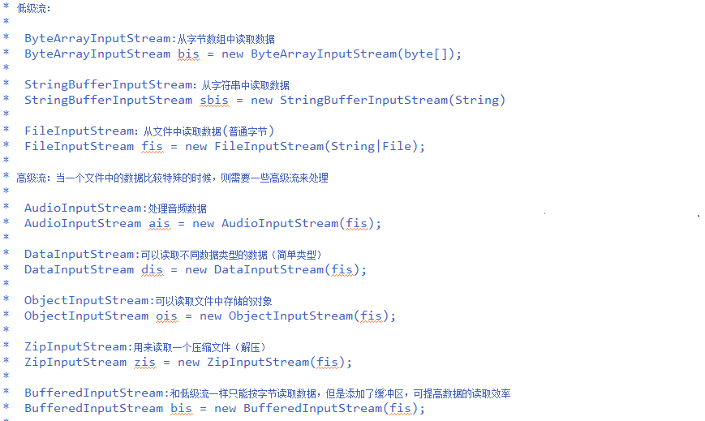

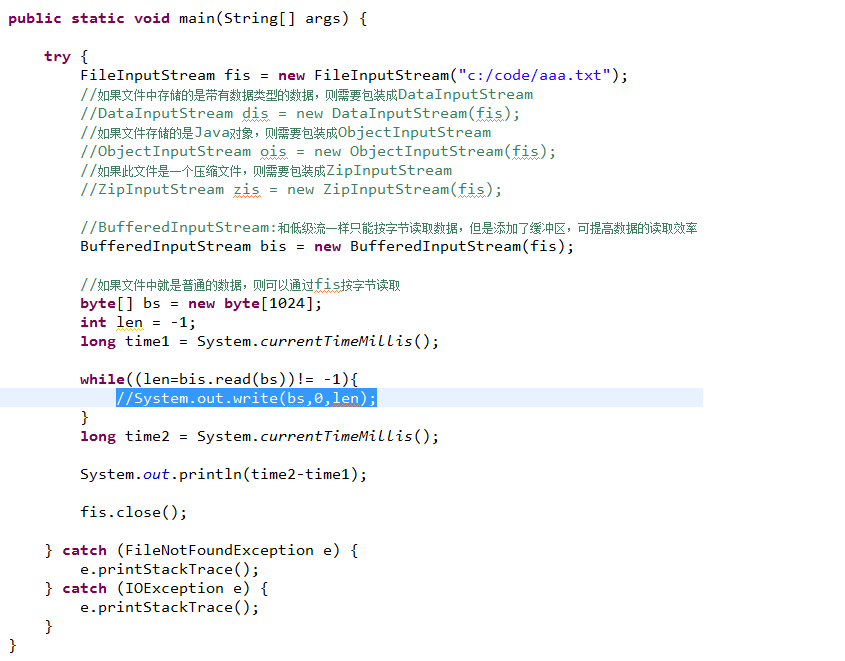

# OutputStream复习

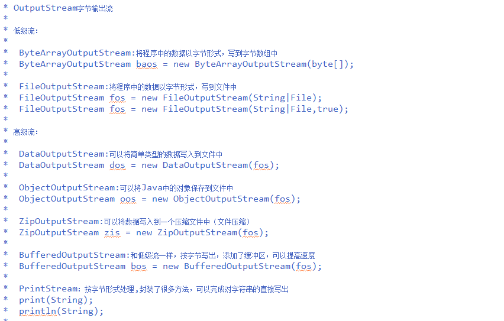

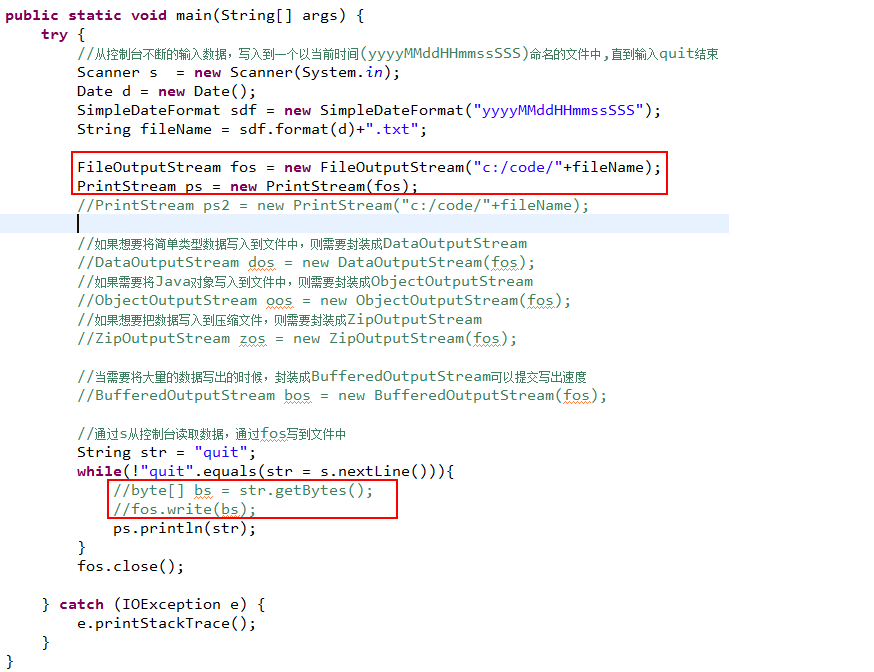

# 字符输入流（Reader）

Reader类是所有字符输入流的父类。

- CharArrayReader:从字符数组中读取数据
- StringReader:从字符串中读取数据
- InputStreamReader:转换流：是字节流转换成字符流的桥梁

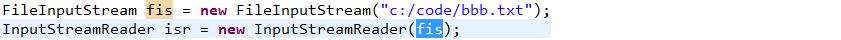

FileReader：从文件中读取数据

- BufferedReader:带有缓冲区的高级字符输入流

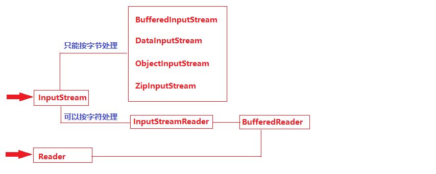

---

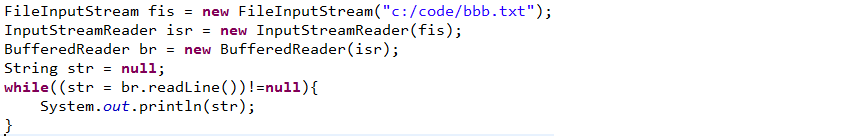

---

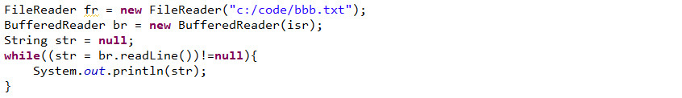

---

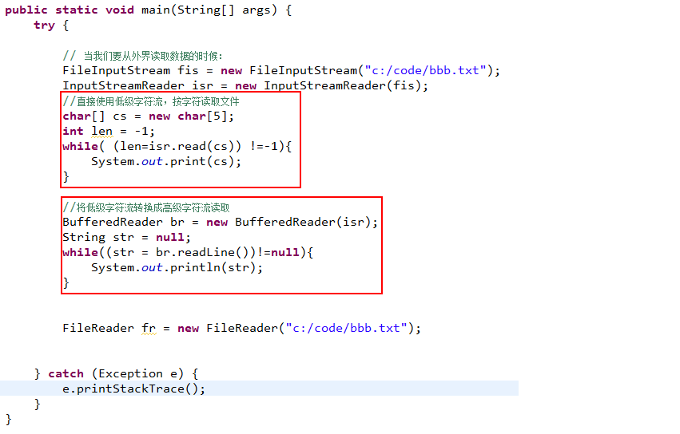

# 字符输出流（Writer）

Writer类是所有字符输出流的父类，可以将程序中的数据以字符的形式写出。

- CharArrayWriter:将数据以字符形式写到字符数组中

- StringWriter:将数据以字符形式写到字符串中

- OutputStreamWriter:

  转换流：将字节输出流转换成字符输出流

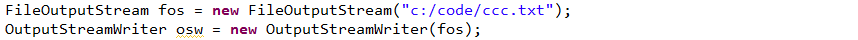

​		FileWriter: 将数据以字符形式写到文件中

- BufferedWriter:带有缓冲区的高级字符输出流

- PrintWriter:

  1.将低级流转换成高级流 PrintWriter pw = new PrintWriter(OutputStream);

  2.可以直接封装一个文件的输出流: PrintWriter pw = new PrintWriter(File);

  3.可以封装一个低级的字符流

  4.提供了各种用户不同数据写出的方法

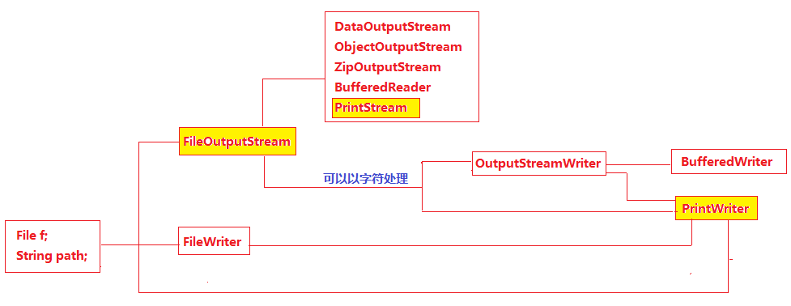

练习：

​          FileInputStream和FileOutputStream完成文件拷贝

​          FileReader和FileWriter完成文本文件拷贝

 # 文件压缩与解压

## ZipOutputStream流用来完成文件的压缩

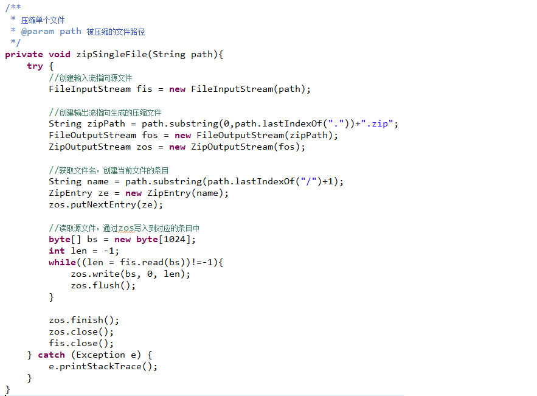

---

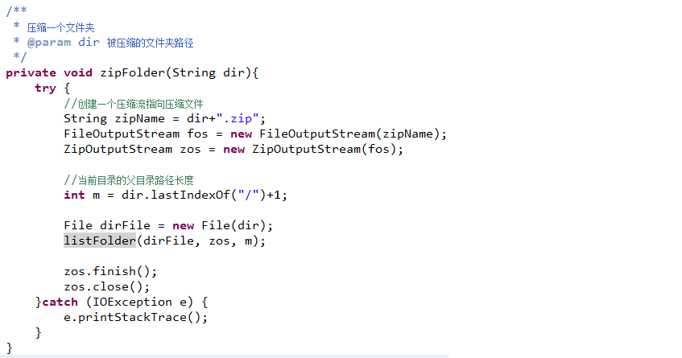

---

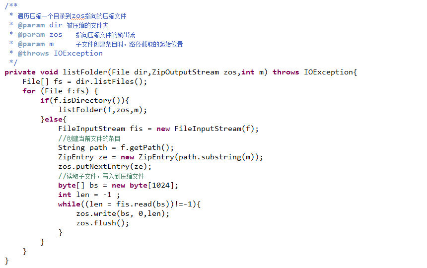

# ZipInputStream:用来解压文件

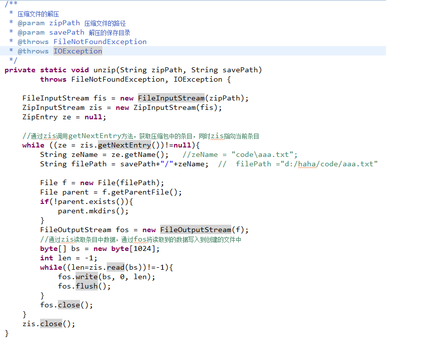