# 两种网络数据传输协议

TCP：基于连接的点对点安全传输协议

UDP：基于广播形式一对多非安全传输协议

# URL类

**URL(Uniform Resource Locator)----统一资源定位器，表示Internet上某一资源的地址**

- 类的作用:一个URL对象就表示一个网络中的资源文件
- 构造方法:

```java
URL( String)
URL(String,String,int,String)
```

- 创建对象:

```java
URL u1 = new URL("http://128.0.43.197:8080/sims/bbb/aaa.jpg");
URL u2 = new URL("http","128.0.43.197",8080,"sims/bbb/aaa.jpg");
```

- 常用方法:

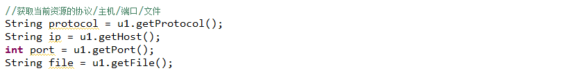

---


- 文件下载

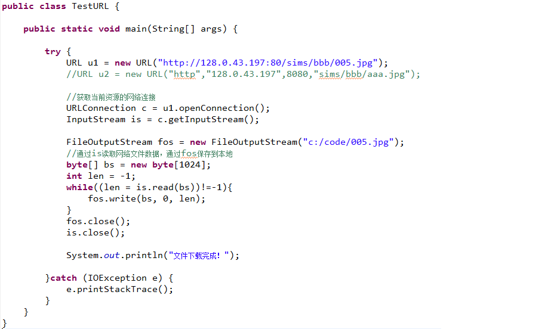

# UDP通信

## DatagramSocket：用于发送和接收UDP数据，和Socket没有关系

- 类的作用:一个DatagramSocket对象，既可以用来发送数据报，也可以接收数据报

- 构造方法:

  DatagramSocket()：发送数据报创建的对象通常使用无参构造器

  DatagramSocket (int port)：接收数据通常使用有参构造器

- 创建对象:

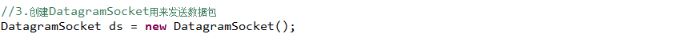

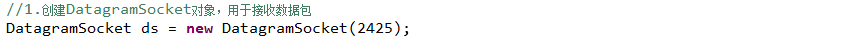

- 常用方法:

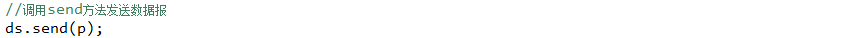


## DatagramPacket类：此类表示数据报包	

- 类的作用:一个DatagramPacket对象表示一个数据包，可以用来封装UDP传输的数据

- 构造方法:

  DatagramPacket(byte[] bs, int length)

  DatagramPacket(byte[] bs, int length,InetAddress addr, int port)

- 创建对象:


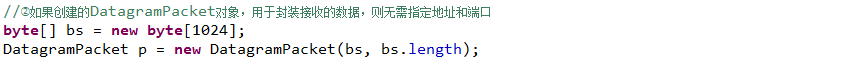

- 常用方法:

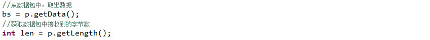

## DatagramSocket完成UDP通信

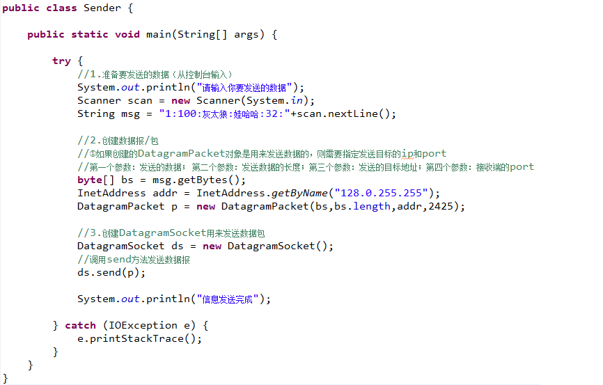

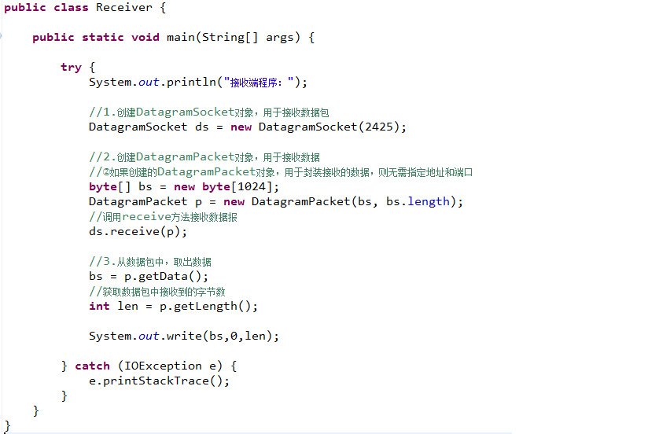

## MulticastSocket完成UDP多播传输：

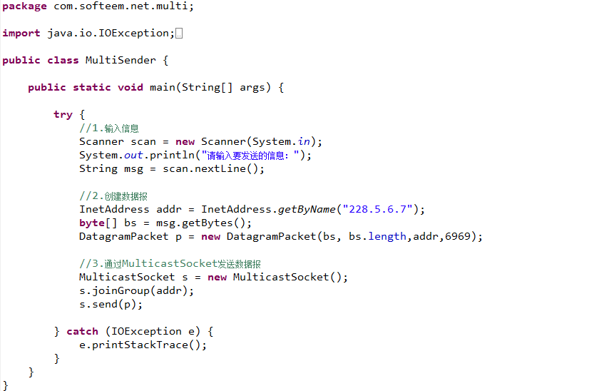

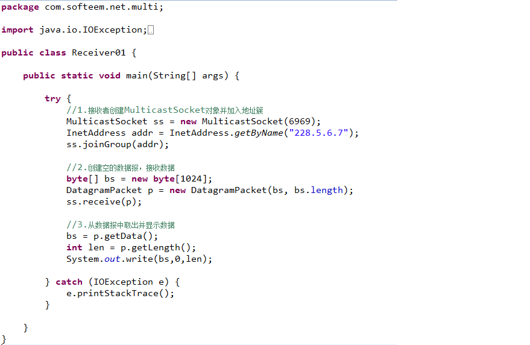