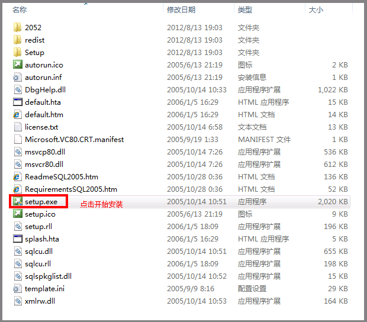

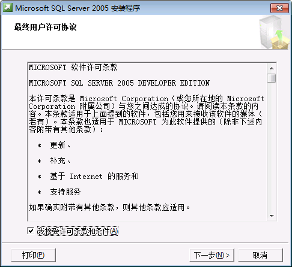

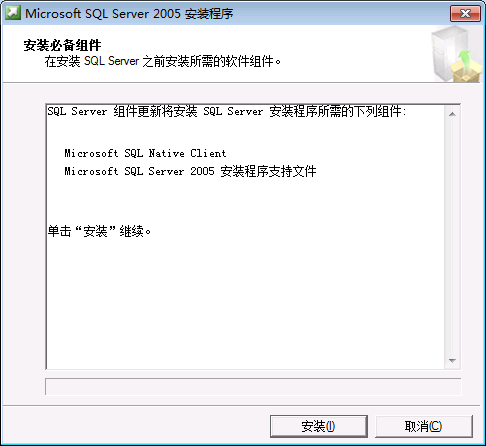

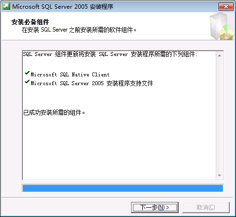

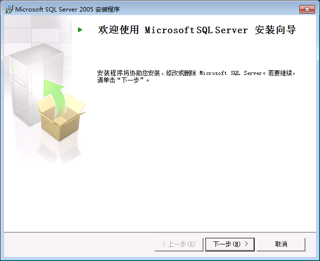

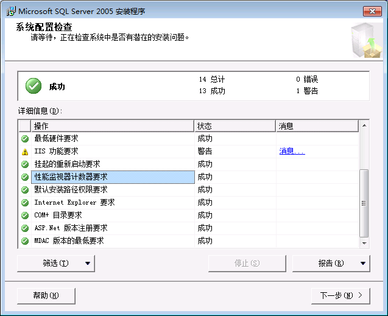

如果出现**性能监视器计数器要求**错误

​     win+R   regedit

HKEY_LOCAL_MACHINE\SOFTWARE\Microsoft\Windows NT\CurrentVersion\Perflib

将**Perflib**中的Last Counter和Last Help中的最后一个数字改成和004中的一致(十进制)

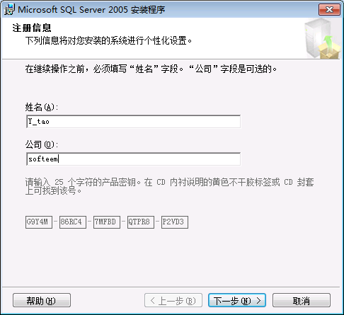

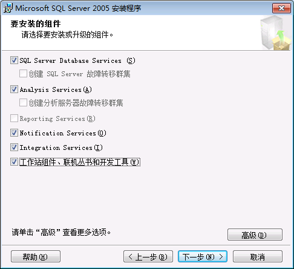

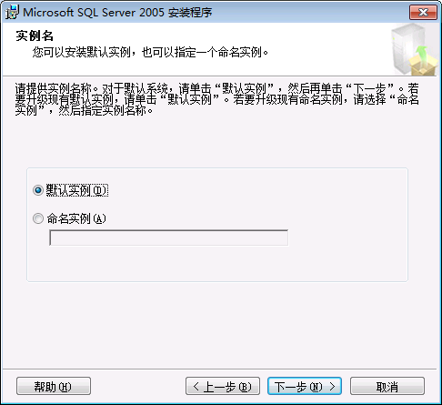

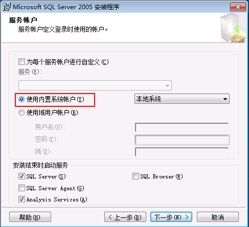

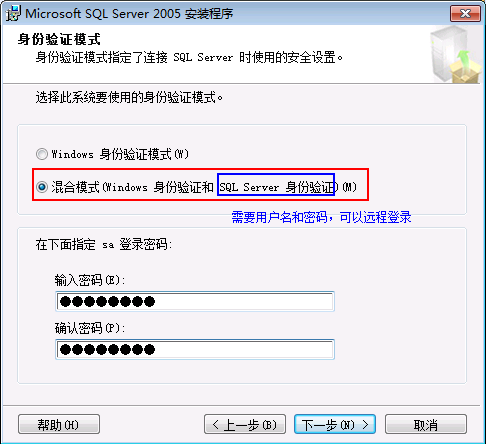

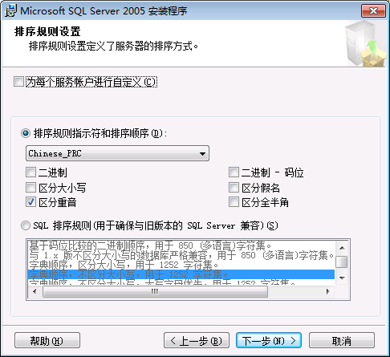

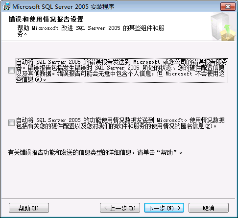

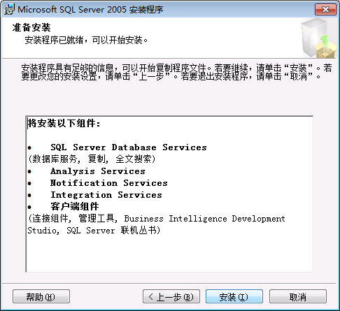

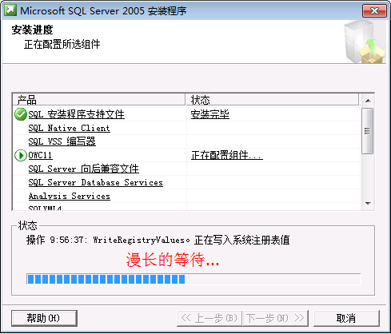