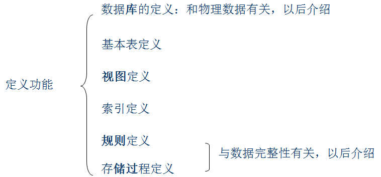
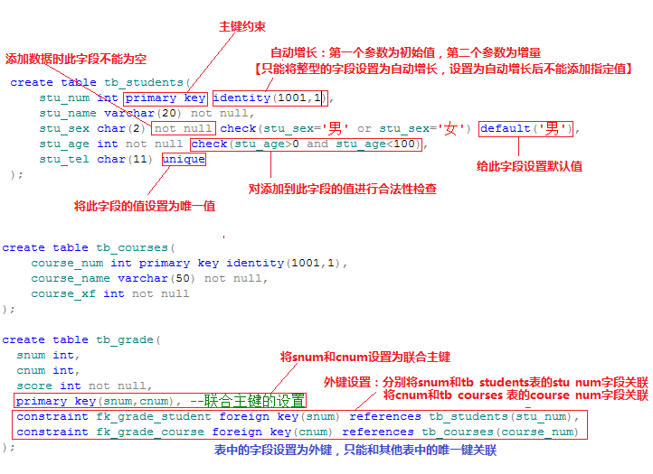
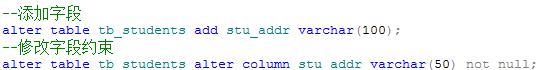
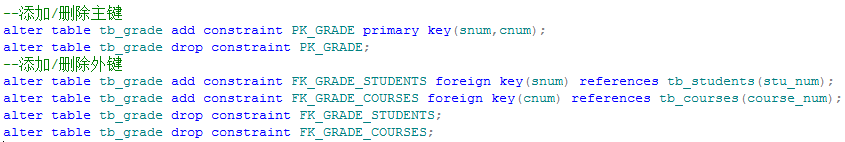

# SQL语言

SQL(**Structured Query Language**)：可以通过SQL语言完成关系数据库的更新和查询操作。

SQL特点：

- 一体化：一个SQL指令可以完成一个单独的操作

  - DML

    > 数据操纵语言：完成对数据库中存储的数据的CRUD操作
    >
    > - 查询操作
    >
    > - 更新操作

  - DDL

  数据定义语言：完成数据库对象（数据库、数据表、存储过程、触发器…）的定义/创建

  

  - DCL

  数据控制语言：对数据库中事务、权限等的管理

- 高度非过程化：只关注“作什么”，不关注“怎么做”

- 面向集合的操作方式：在数据库中数据的操作是以“元组”为单位

- 在不同的使用方式（宿主式、自含式）中，语法相同

  -  宿主式：将SQL嵌入到高级语言中使用
  -  自含式：将SQL作为操作命令独立使用

- 语言简洁

# DDL指令

数据库中的对象：数据库中的逻辑单元(数据库、数据表、视图、索引、存储过程等)

数据表中的数据：用户存储的数据

SQLServer数据库是一个文件系统的数据库，也就是说，我们将数据存储在数据库中实际上是存在数据库的某个文件中

一个SQLServer数据库包含一个数据文件，和一个日志文件

- 数据文件(mdf):存储数据库中的数据

- 日志文件(ldf):存储数据库的操作日志

# 1、数据库相关操作

- 创建数据库

```sql
create database db_test
on(
	name='db_test',                       --指定数据文件逻辑名称
	filename='c:\db_files\test.mdf',   --指定数据文件的物理路径
	size=10,						  --指定数据文件初始大小
	maxsize=100,                           --指定数据文件最大容量
	filegrowth=5					  --指定数据文件增量
)log on(
	name='db_test_log',
	filename='c:\db_files\testlog.ldf',
	size=2,
	maxsize=10,
	filegrowth=1
);

```

- 删除数据库

```sql
--drop:删除数据库中的对象
--delete:删除数据表中的数据
drop database db_test;
```

- 进入数据库

```sql
--进入/使用指定数据库
use db_test;
```

- 数据库的备份恢复

```sql
1.数据的分离与附加（数据库的移植）
2.指令完成备份与恢复（数据的存档）
--备份
backup database db_test to disk='c:\code\aaa.dat' with format,name='test';
--查看备份文件内部信息
restore filelistonly from disk='c:\code\aaa.dat';
--恢复
restore database db_test from disk='c:\code\aaa.dat'
with move 'db_test' to 'c:\db_files\test.mdf',
move 'db_test_log' to 'c:\db_files\testlog.ldf';
```

# 	2、数据表的相关操作

创建数据表:需要指定数据表名、字段个数、字段名称及字段约束

- 字段的约束

   

- 删除数据表


​        

- 修改数据表

  - 1.添加/修改表字段

    

  - 2.修改表约束

  

  

