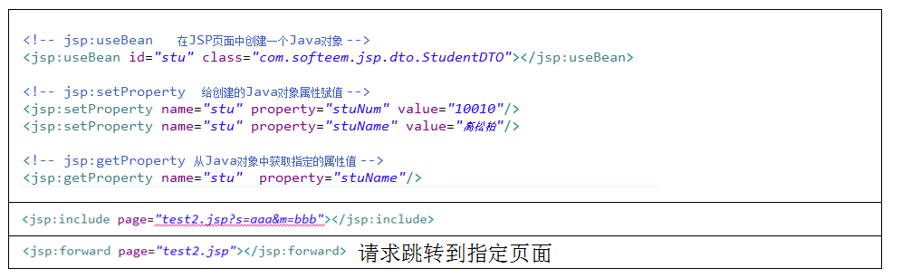
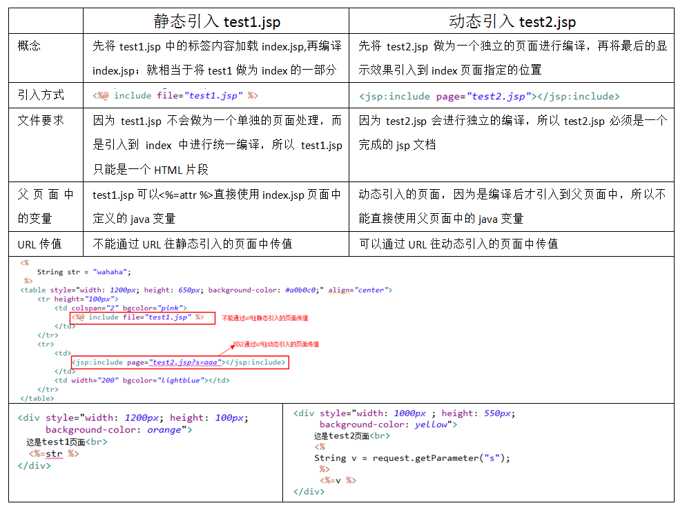
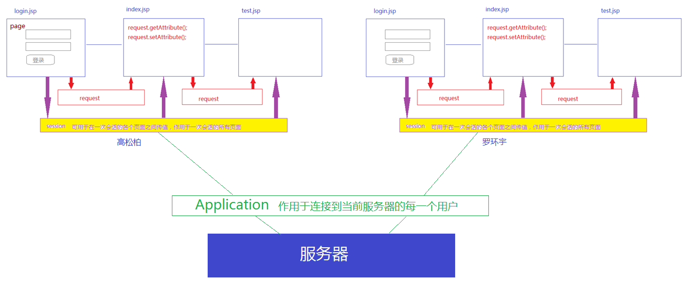
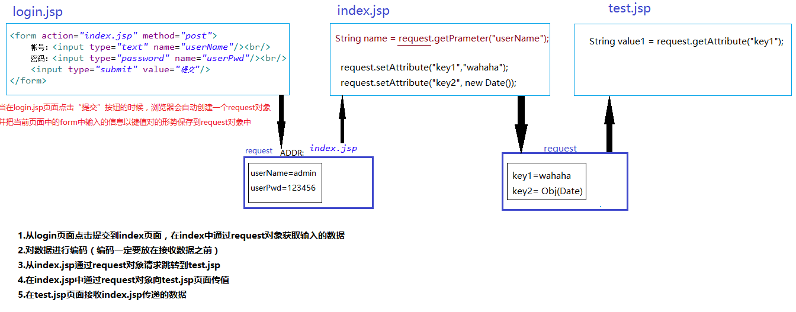
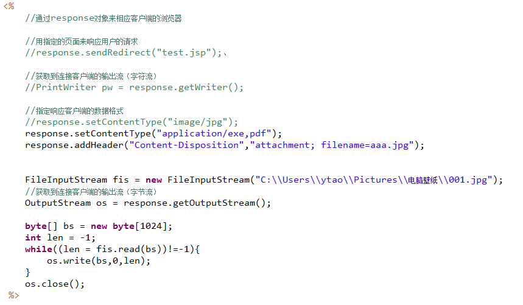
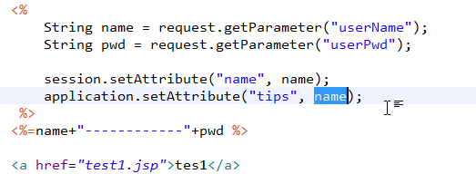

# JSP编译指令

编译指令：页面加载编译之前就会执行

- <%@page %>：用来声明当前JSP页面的属性

- <%@taglib %>：在当前页面引入第三方标签库（JSTL,Struts2,自定义标签）

- <%@include %>：在当前页面中静态进入其他的页面

# JSP动作指令

动作指定：页面加载编译之后执行的指令



静态引入和动态引入的区别（在index.jsp页面中静态引入test1.jsp,动态引入test2.jsp）：



# JSP的内置对象

## 1.什么是内置对象？

​     在JSP页面中已经声明好可以直接使用的Java对象。在JSP中有九大内置对象，每个内置对象都有其类型及作用。

## 2.内置对象：

| 内置对象名称    | 所属类              | 作用                                                         |
| --------------- | ------------------- | ------------------------------------------------------------ |
| page            | 当前JSP页面转换的类 | page对象指代的就是当前页面，只在当前页面内有效               |
| **request**     | HttpServletRequest  | 该对象代表了客户端的请求信息，主要用于接受通过HTTP协议传送到服务器的数据，request对象的作用域为一次请求 |
| **session**     | HttpSession         | 作用于一个用户请求的所有页面                                 |
| **application** | ServletContext      | 作用于连接当前服务器的所有用户                               |
| **response**    | HttpServletResponse | 代表的是服务器对客户端的响应，主要是将JSP容器处理过的数据传回到客户端 |
| out             | JspWriter           | out表示的是指向当前JSP页面的输出流，可以通过out对象将指定的内容写出到JSP文件的指定位置 |
| pageContext     | PageContext         | pageContext 对象的作用是取得任何范围的参数，通过它可以获取 JSP页面的out、request、reponse、session、application 等对象。 |
| config          | ServletConfig       | 可以通过config对象获取当前jsp页面所在的服务器信息            |
| exception       |                     | 该实例代表其他页面中的异常和错误                             |



### request对象

​     request 对象是 javax.servlet.HttpServletRequest类型的对象。 **该对象代表了客户端的请求信息，主要用于接受通过HTTP协议传送到服务器的数据**。（包括头信息、系统信息、请求方式以及请求参数等）。request对象的作用域为一次请求。



#### request对象提供的方法：
- request.getParameterMap():获取到request对象中存放值得map集合
- request.getParameter(String key):从request对象中的map集合中获取指定key的value，此方法也常用来获取从上一个输入传到到当前页面的值
- request.setCharacterEncoding("UTF-8"):对request中传递的数据进行编码。
- String[] arr = request.getParameterValues("hobby")：当页面中有多个name相同的输入框时使用此方法来获取多个值
- request.getRequestDispatcher("test.jsp") forward(request,response);从当前页面请求跳转到下一个页面。
- request.setAttribute(String key,Object value);将键值对设置到request中传递到下页面
- Object obj = request.getAttribute("key");接收上个页面通过setAttribute传递的参数
- HttpSession session = request.getSession();从request对象中获取到session对象

### session对象

当客户端浏览器和服务器第一次建立连接的时候就会产生一个session对象，直到这个客户端浏览器断开服务器连接才会销毁此对象。
在一个用户持续连接的过程中，创建的session对象会一直存在。当一个用户在第一个页面往session中存放了一个值，在第N个页面能不能取到这个值？
#### session对象提供的方法：
​	session.setAttribute(String key,Object value);
​	Object value = session.getAttribute(key);

### response对象

在服务器端用来响应客户端的请求。



### application对象

服务器中存储数据的容器，可以再多个客户端之间共享



# 九大内置对象

## request

request 对象是 javax.servlet.HttpServletRequest类型的对象。 该对象代表了客户端的请求信息，主要用于接受通过HTTP协议传送到服务器的数据。（包括头信息、系统信息、请求方式以及请求参数等）。request对象的作用域为一次请求。

## **response** 

response **代表的是服务器对客户端的响应，主要是将JSP容器处理过的数据传回到客户端。**response对象也具有作用域，它只在JSP页面内有效。

```java
//获取到响应客户端默认的编码方式
response.getCharacterEncoding();
response.getContentType();
    	
//设置响应数据的编码方式
response.setCharacterEncoding("GBK");
//设置响应数据的类型
response.setContentType("text/html");
//设置响应数据的长度
response.setContentLength(100);
```

## session

1.什么是session：**从一个客户打开浏览器并连接到服务器开始，到客户关闭浏览器离开这个服务器结束，被称为一个会话**。当一个客户访问一个服务器时，可能会在这个服务器的几个页面之间反复连接，反复刷新一个页面，服务器应当通过某种办法知道这是同一个客户，这就需要session对象。

2．session对象的ID：当一个客户首次访问服务器上的一个JSP页面时，JSP引擎产生一个session对象，同时分配一个String类型的ID号，JSP引擎同时将这个ID号发送到客户端，存放在Cookie中，这样session对象和客户之间就建立了一一对应的关系。当客户再访问连接该服务器的其他页面时，不再分配给客户新的session对象，直到客户关闭浏览器后，服务器端该客户的session对象才取消，并且和客户的会话对应关系消失。当客户重新打开浏览器再连接到该服务器时，服务器为该客户再创建一个新的session对象。

3.session对象存在一定时间过期问题，所以存在session中的名值对会在一定时间后失去，可以通过更改session有效时间来避免这种情况。同时编程时尽量避免将大量有效信息存储在session中，request是一个不错的替代对象。

## application

1．什么是application:

**服务器启动后就产生了这个application对象，当客户在所访问的网站的各个页面之间浏览时，这个application对象都是同一个，直到服务器关闭。**但是与session不同的是，所有客户的application对象都是同一个，即所有客户共享这个内置的application对象。

2．application对象常用方法:

- public void setAttribute(String key,Object obj): 将参数Object指定的对象obj添加到application对象中，并为添加的对象指定一个索引关键字。

- public Object getAttribute(String key): 获取application对象中含有关键字的对象。

## out

**out表示的是指向当前JSP页面的输出流，可以通过out对象将指定的内容写出到JSP文件的指定位置**

out 对象用于在Web浏览器内输出信息，并且管理应用服务器上的输出缓冲区。在使用 out 对象输出数据时，可以对数据缓冲区进行操作，及时清除缓冲区中的残余数据，为其他的输出让出缓冲空间。待数据输出完毕后，要及时关闭输出流

## **page**

**page** **对象代表JSP本身，只有在JSP页面内才是合法的**。 page隐含对象本质上包含当前 Servlet接口引用的变量，类似于Java编程中的 this 指针。

## **config**

**config** **对象的主要作用是取得当前页面在服务器的配置信息**。通过 pageConext对象的 getServletConfig() 方法可以获取一个config对象。当一个Servlet 初始化时，容器把某些信息通过 config对象传递给这个 Servlet。 开发者可以在web.xml 文件中为应用程序环境中的Servlet程序和JSP页面提供初始化参数。

## **exception**

java.lang.Throwable 的实例，**该实例代表其他页面中的异常和错误**。只有当页面是“错误处理页面”，即编译指令page 的isErrorPage 属性为true 时，该对象才可以使用。常用的方法有getMessage()和printStackTrace()等。

## pageContext

**pageContext** **对象的作用是取得任何范围的参数，通过它可以获取 JSP页面的out、request、reponse、session、application 等对象**。pageContext对象的创建和初始化都是由Tomcat容器来完成的，在JSP页面中可以直接使用 pageContext对象。

