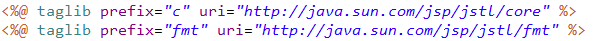
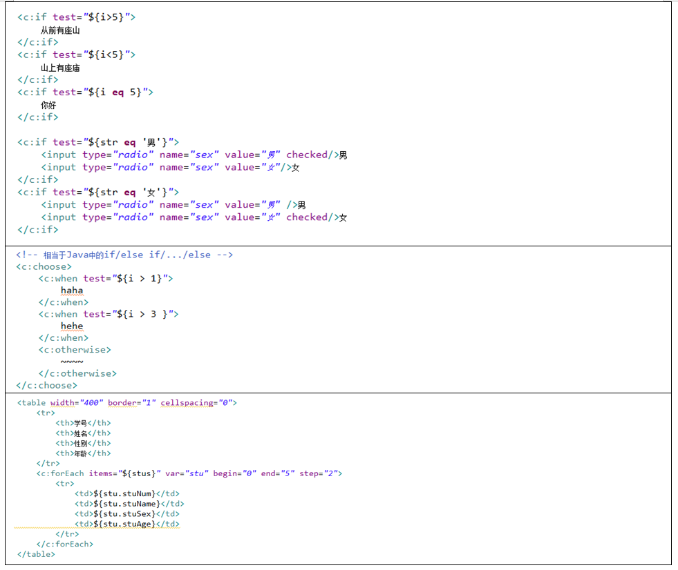
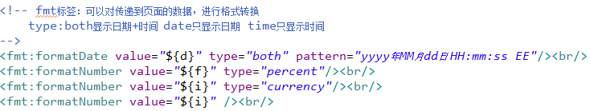
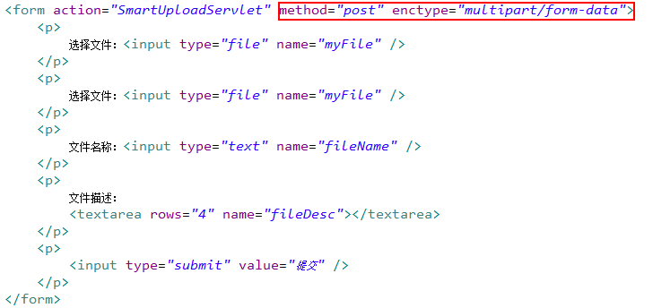
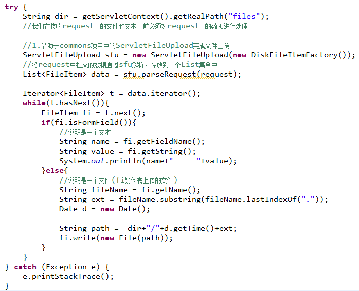
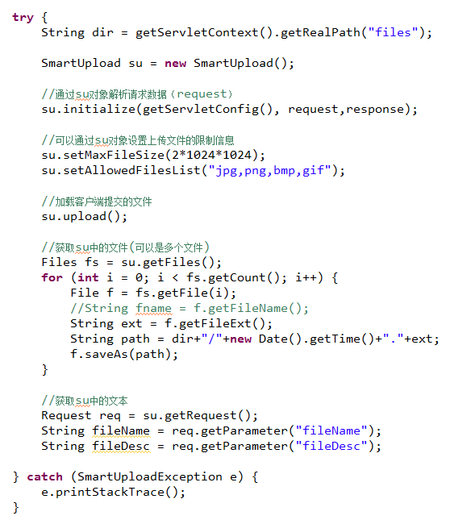
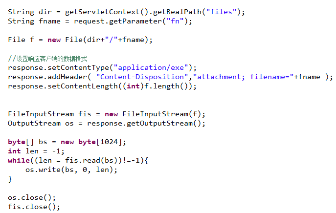
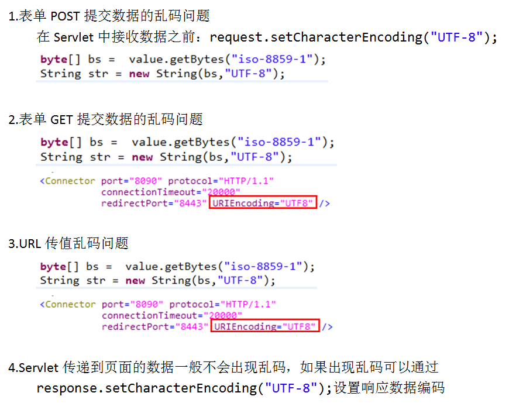

# JSTL+EL

EL表达式：通过”${key}”形式在JSP页面中,接收Servlet中传递到页面的数据。

JSTL标签库：提供了可以进行流程控制、类型转换等的一类标签。

​     ·是一个可以在JSP页面中使用的第三方标签库

​     ·可以完成流程控制、可以类型转换（Date,Number）

​     ·如果需要在JSP页面中使用JSTL标签，必须先通过编译指令taglib引入标签库

第三方标签库的使用：

​     1.将标签库的jar包导入到项目中（JSTL的jar包在javaee5/6中已经自动导入）

​     2.在JSP页面引入标签

- c标签库：

- fmt标签库：

# EL表达式作用域

- EL表达式在JSP页面可以接收page、request、session和application中的值；

- 如果在四个传值范围内有相同的key，则优先取出较小范围中的值

- 如果想要取出较大范围的值，则需要在key前指定其范围：
  - ${pageScope.key}
  - ${requestScope.key}
  - ${sessionScope.key}
  - ${applicationScope.key}

# 文件上传

​     文件上传：当页面表单提交的数据包含file时，在Servlet中需要接收文件信息。

如果页面表单中包含文件：

- form的method属性必须为post

- from的enctype属性必须为multipart/form-data

在Servlet类中接收文件：

- ServletFileUpload

- SmartUpload

# 文件下载：

# 乱码问题

