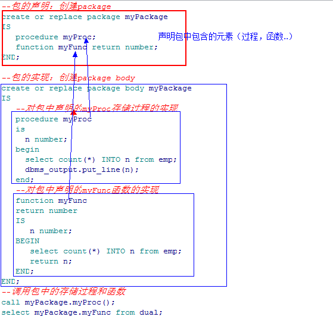
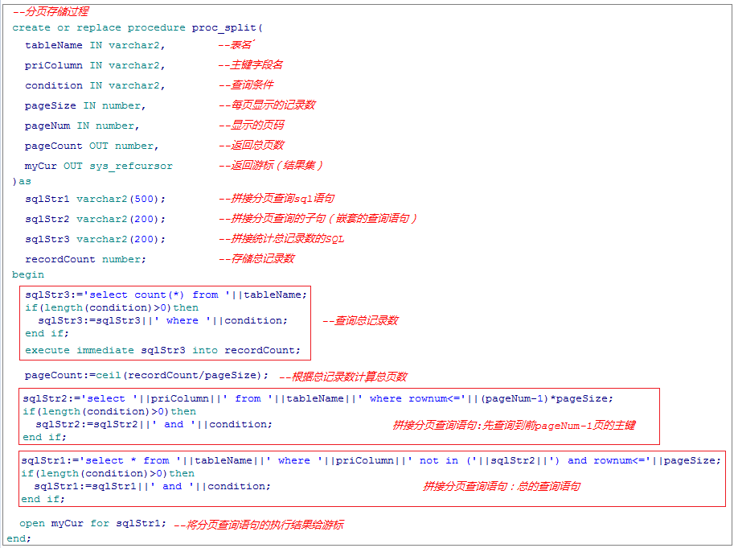
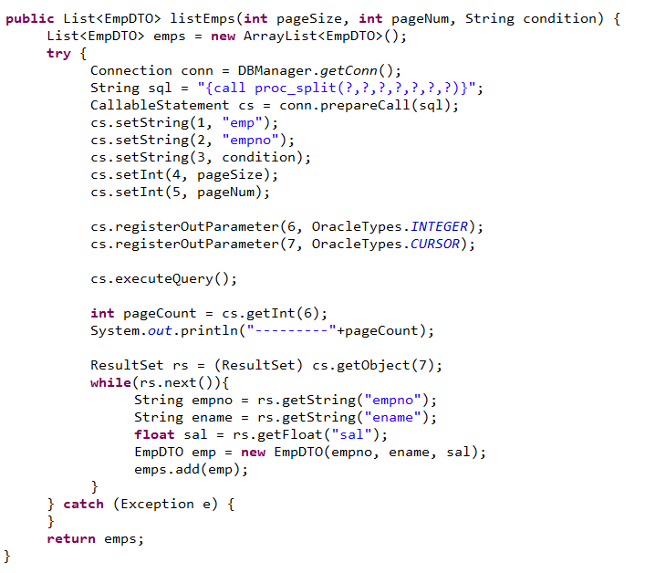
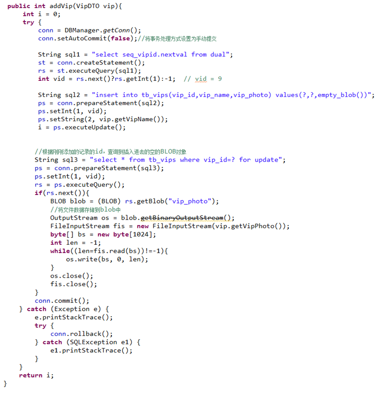
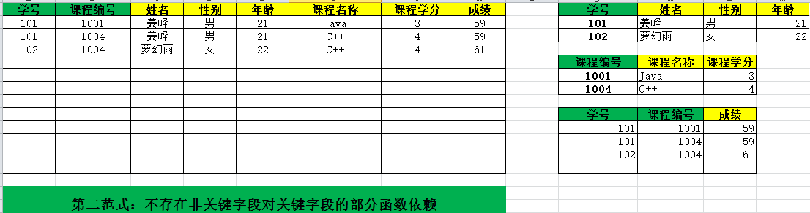

# 程序包

相当于Java的package



# 分页存储过程



---

```sql
--游标的使用：分页存储过程
--pageNum:显示的页数
--pageSize:每页显示的条数
--tableName:查询表的名字
--priColumn:主键字段
--pageCount：总页数(输出参数)
--recordCount：总记录数（输出）
--resultCur：装有结果集的游标
create or replace procedure proc_split(
   pageNum IN number,--页码
   pageSize IN number,--每页的记录数
   tableName IN varchar2,--表
   priColumn IN varchar2,--主键 
   condition IN varchar2,--分页条件
   pageCount OUT number,--总页数
   recordCount OUT number,--总记录数
   resultCur OUT sys_refcursor--游标：用来存放查询到的分页数据
)  
as
   vsql varchar2(200);  --分页sql语句
   vsql2 varchar2(100); 
   vsql3 varchar2(100);--统计总记录数
   pNum number;
begin
   pNum:=pageNum;
   --统计总记录数
   vsql3:='select count(*) from '||tableName||' where 1=1 '||condition;
   execute immediate vsql3 into recordCount;
   --计算总页数
   pageCount:=ceil(recordCount/pageSize);
   --判断pageNum是否是一个合法的页码
   if pageNum<0 then
      pNum:=1;
   elsif pageNum>pageCount then
      pNum:=pageCount;
   end if;
   --拼接分页sql语句
   vsql2:='select '||priColumn||' from '||tableName ||' where rownum<='||pageSize*(pNum-1)||' '||condition;
   vsql:='select * from '||tableName||' where '||priColumn||' not in('||vsql2||') and rownum<='||pageSize||' '||condition;
   --将vsql执行结果赋值给游标
   OPEN resultCur FOR vsql;
end;


--调用分页存储过程
declare
   pc number;
   rc number;
   rcur my_package.ref_cur;
   e emp%ROWTYPE;
begin
   proc_split(3,3,'emp','empno','and sal>1500',pc,rc,rcur);
   dbms_output.put_line('总记录数：'||rc);
   dbms_output.put_line('总页数：'||pc);
   LOOP
      FETCH rcur INTO e;
      EXIT WHEN rcur%NOTFOUND;
      dbms_output.put_line(e.empno||'----'||e.ename||'----'||e.sal);
   END LOOP;
end;
```

---

> ```sql
> create or replace package page is 
> 	type type_cur is ref cursor;   
> 	procedure p_pagintion   
> 	(   
>        psql in varchar2,       --条件SQL语句  
>        pfrist in number,       --第几页  
>        psize in number,        --一页显示多少条  
>        pcount out number,      --共几页  
>        pnotecount out number,  --总记录  
>        pnote out type_cur      --显示页的记录  
> 	);   
> END;   
> 
> create or replace package body page is    
> 	procedure p_pagintion   
> 	(   
>        psql in varchar2,       --条件SQL语句  
>        pfrist in number,       --第几页  
>        psize in number,        --一页显示多少条  
>        pcount out number,      --共几页  
>        pnotecount out number,  --总记录  
>        pnote out type_cur      --显示页的记录  
> 	)    
> 	AS   
> 		v_pfrist number;   
> 		v_sql varchar2(100);   
> 		v_sql1 varchar2(100);   
> 		v_sql2 varchar2(100);   
> 		v_sql3 varchar2(1000);   
> 		v_notecount number;   
> 		v_min number;   
> 		v_max number;   
> 	BEGIN   
>             v_sql:='select count(*) from (' || psql || ')';--查询总记录的SQL   
>             execute immediate v_sql into v_notecount;--执行SQL把总记录结果得到  
>             pnotecount:=v_notecount;   
>             pcount:=ceil(pnotecount/psize);--求出总页数  
>             v_pfrist:=pfrist;   
>             IF(v_pfrist > pcount)THEN   
>             v_pfrist:=pcount; -- 如果传进来的页数大于最后一页，默认返回最后一页数据  
>             end IF;   
>             v_max:=v_pfrist*psize;--显示页的最大记录排行值  
>             v_min:=v_max-psize+1;--显示页的最小记录排行值  
>             v_sql1:='select * from (select rownum rn,t.* from ';   
>             v_sql2:=' t ) where rn between '||v_min||' and '||v_max;   
>             v_sql3:=v_sql1||' ( '||psql||' ) '||v_sql2;--分页SQL   
>             open pnote for v_sql3;   
> 	END p_pagintion;   
> END page;
> ```
>
> ```java
> public void test1() throws SQLException {   
>         Connection conn = null;   
>         ResultSet rs = null;   
>         CallableStatement cstmt = null;   
>         try {   
>             Class.forName("oracle.jdbc.driver.OracleDriver");   
>             conn = DriverManager.getConnection(   
>                     "jdbc:oracle:thin:@localhost:1521:TEST", "test",   
>                     "test");   
>             cstmt = conn.prepareCall("{call page.p_pagintion(?,?,?,?,?,?)}");   
>             cstmt.setString(1, "select t.* from t_user t");   
>             cstmt.setInt(2, 3);   
>             cstmt.setInt(3, 1);   
>             cstmt.registerOutParameter(4, OracleTypes.NUMBER);   
>             cstmt.registerOutParameter(5, OracleTypes.NUMBER);   
>             cstmt.registerOutParameter(6, OracleTypes.CURSOR);   
>             cstmt.executeQuery();   
>             System.out.println("共" + cstmt.getObject(4) + "页");   
>             System.out.println("共" + cstmt.getObject(5) + "条");   
>             rs = (ResultSet) cstmt.getObject(6);   
>             while (rs.next()) {   
>                 System.out.println(rs.getString("id") + " -- "  
>                         + rs.getString("name") + " -- " + rs.getString("age"));   
>             }   
>         } catch (ClassNotFoundException e) {   
>             e.printStackTrace();   
>         } catch (SQLException e) {   
>             e.printStackTrace();   
>         } finally {   
>             rs.close();   
>             cstmt.close();   
>             conn.close();   
>         }   
> }  
> ```

# JDBC调用分页存储过程



# JDBC操作大字段



# 数据库设计规范

1.提取出需要进行数据库操作的数据实体

2.确定实体的数据项

3.绘制E-R图

4.根据E-R图创建数据表

5.对创建好的数据表进行规范性检查（检查创建的数据表是否满足数据库设计三范式）

## **第一范式：**

要求数据表中的字段不可再分（傻瓜都不能创建不满足第一范式的表）


## 第二范式：

不存在非关键字段对关键字段的部分函数依赖

【表中的主键字段也称之为关键字，非主键字段也称之为非关键字段】



## 第三范式：

不存在非关键字段之间的传递依赖

