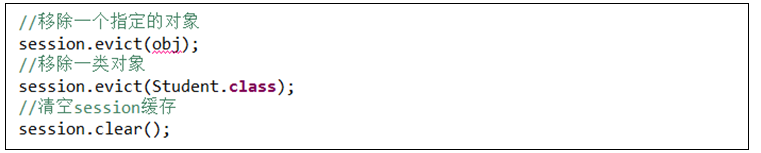

# 一、持久化对象的生命周期

瞬态：不在于数据库中

持久态：存在于数据库中，同时被session管理

游离态：存在于数据库中，但是脱离了session的管理

备注：在事务提交之前，对持久化对象的修改会直接影响到数据库。

# 二、延迟加载

延迟加载：在执行查询操作的时候，不查询数据库，当第一次使用查询出来的这个对象的时候，才进行数据库查询。

# 三、映射文件

- POJO类创建完成以后，需要在映射文件中进行映射关系配置。

- 映射文件的创建（略）

# 四、映射关系配置

## 1.多对一关联映射：学生---班级  

## 2.一对多关联映射： 班级---学生  

## 3.一对多和多对一双向关联

## 4.一对一主键关联（单向）

## 5.一对一主键关联（双向）

##          6.一对一唯一外键关联(单向)  

##          7.一对一唯一外键关联(双向)  

##          8.多对多关联映射（单向）  

##          9.多对多关联映射（双向）  

# 五、缓存机制

Hibernate为了提交CRUD操作效率，会将之前操作的POJO存放到特定的内存中，当再次使用这个POJO对象时可以直接从内存中获取而无需访问数据库。这个内存我们称之为缓存。

Hiberante缓存分为两种：一级缓存和二级缓存

一级缓存也称之为session级缓存，同一session的多次操作中可共享，不同的session则不能共享。

二级缓存也称之为SessionFactory级缓存，只要是从同一个SessionFactory对象获取的session都可以共享这个缓存。

二级缓存需要配置：

# 六、锁机制

悲观锁

乐观锁

