# Spring对Struts2框架的支持

通过Spring特性可以为Struts2的工作做些什么？

1.Struts2是如何工作的？

Struts2可以完成页面和代码的数据交互，在MVC中起到了控制层的作用。

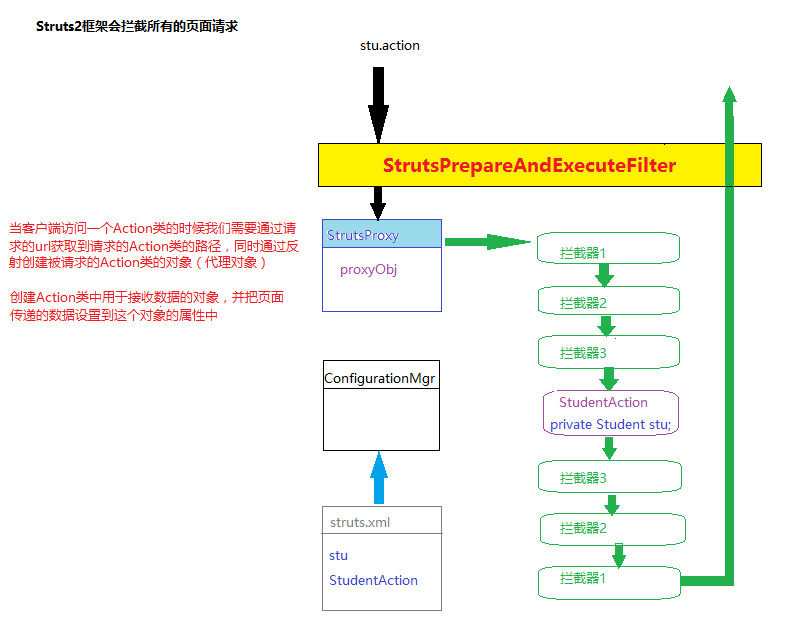

2.Spring对Struts2支持实现

a.创建一个web项目

b.添加Struts2框架支持

c.添加Spring框架支持（去除重复的jar包）

d.添加struts2对spring的支持

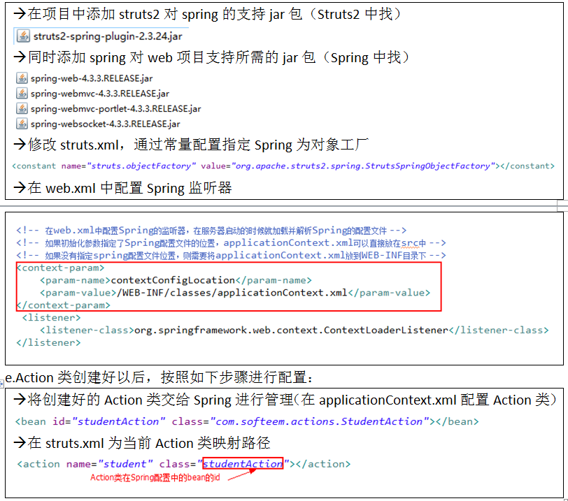

**Spring** **整合 Struts2** **原理解析** **：**

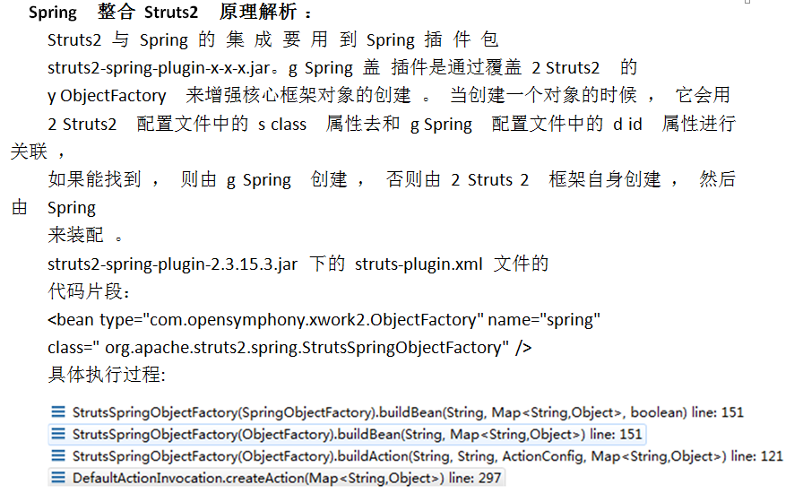

# Spring对Hibernate框架的支持

1.Hiberate的ORM？

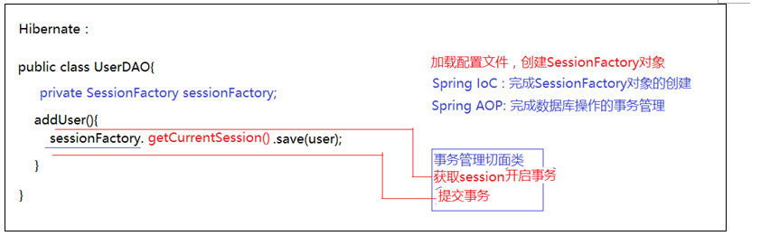

2.Spring对 Hibernate的IoC支持的实现

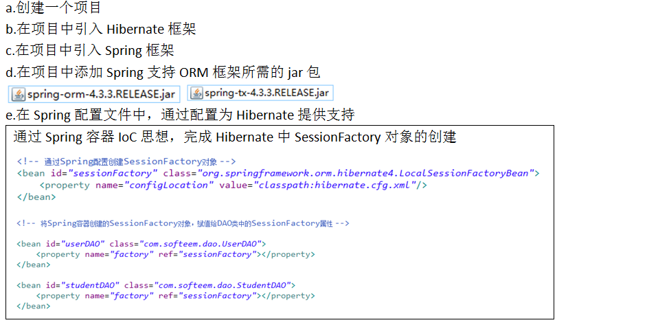

3.Spring对 Hibernate的AOP支持的实现（事务管理）

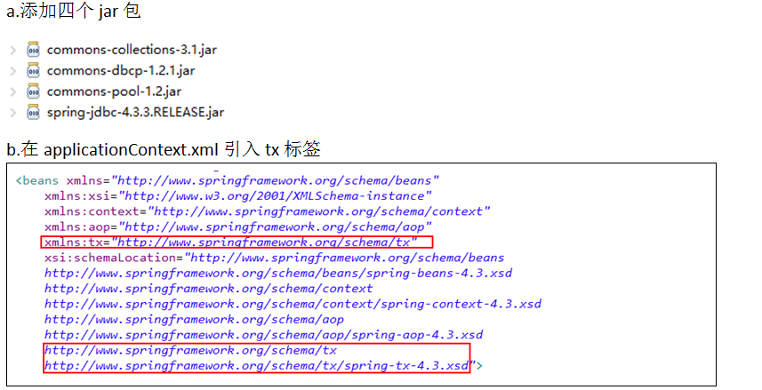

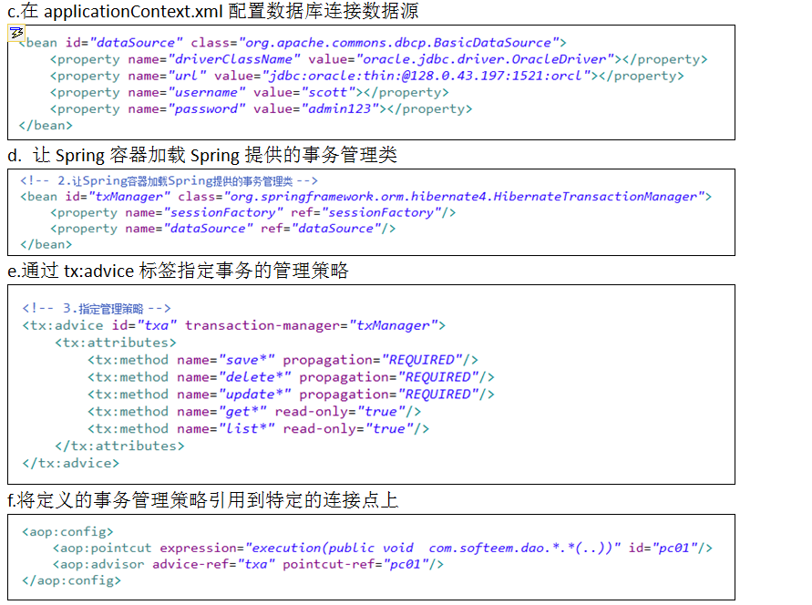

# 三大框架jar包整理

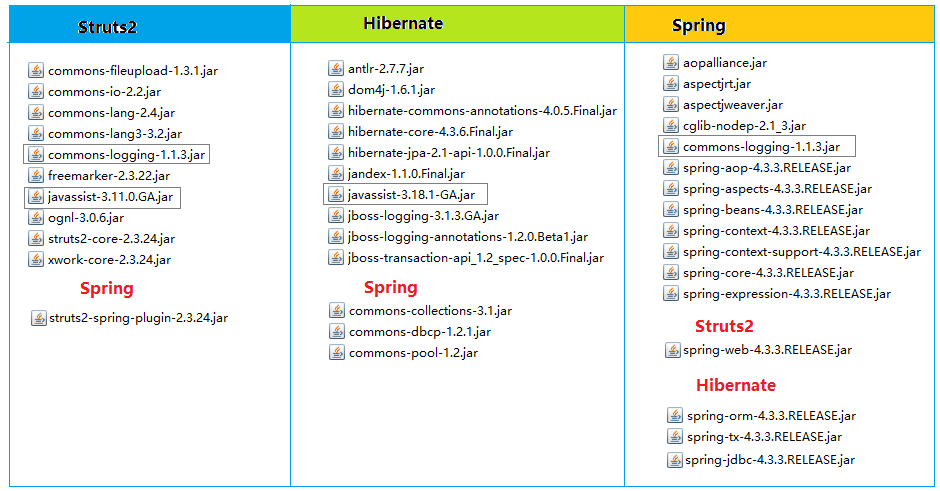

# 三大框架整合的步骤

1.创建web项目

2.在web项目中引入Struts2框架

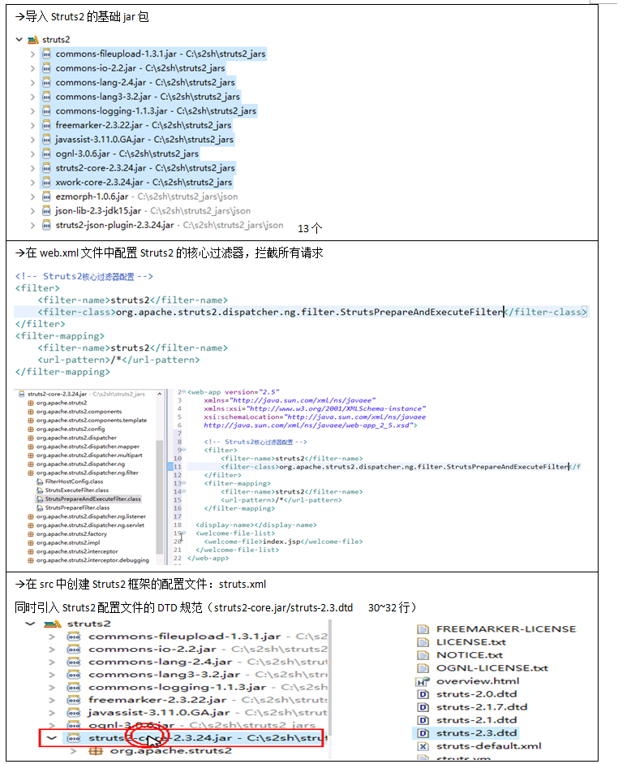

3.在项目中引入Hibernate框架  

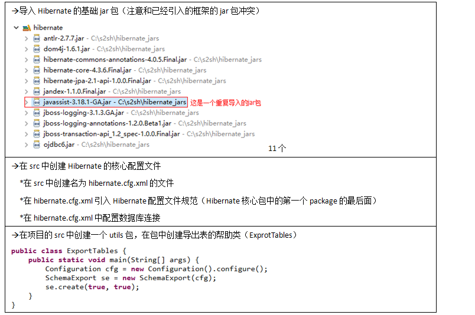

4.在项目中引入Spring框架

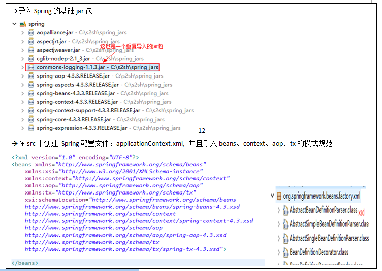

5.Struts2和Spring的整合配置：  

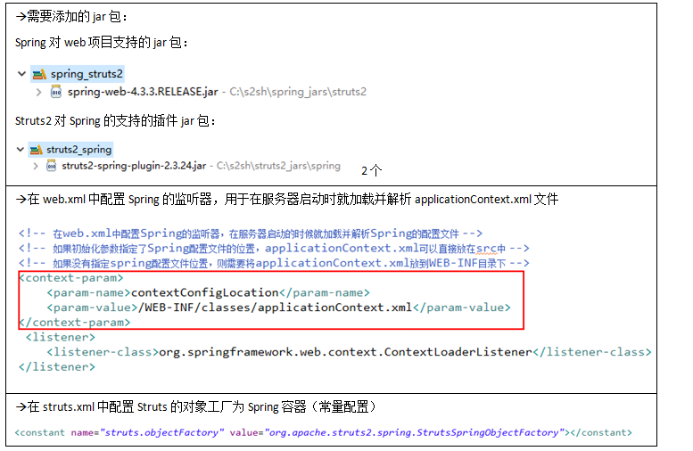

6.Spring和Hibernate框架的整合  

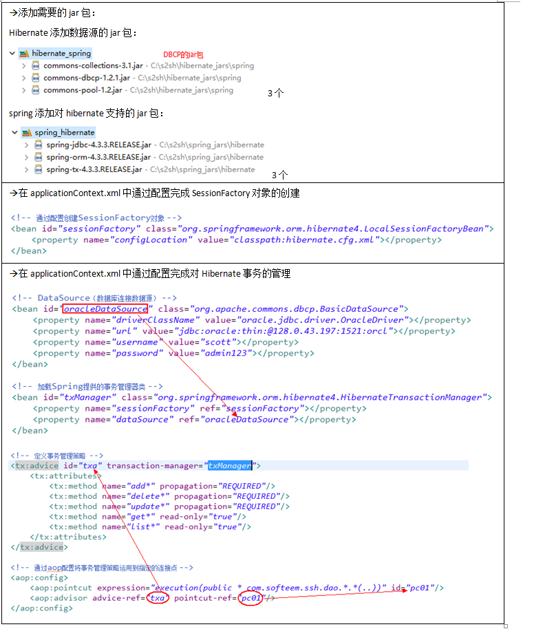

# SSH使用

1.创建POJO类

2.创建并配置POJO类的映射文件

3.创建POJO对应的DAO类

​		a.DAO类中定义SessionFactory对象，提供set方法

​		b.所有的方法名必须按照Spring配置的事务管理策略命名

​		c.对于CRUD方法中的操作，直接通过SessionFactory对象调用getCurrentSession()方法获取session对象

​		d.对于增删改操作无需手动进行事务管理

4.在applicationContext.xml文件中配置，DAO类被Spring管理，并通过Sping给DAO中的SessionFactory对象赋

值

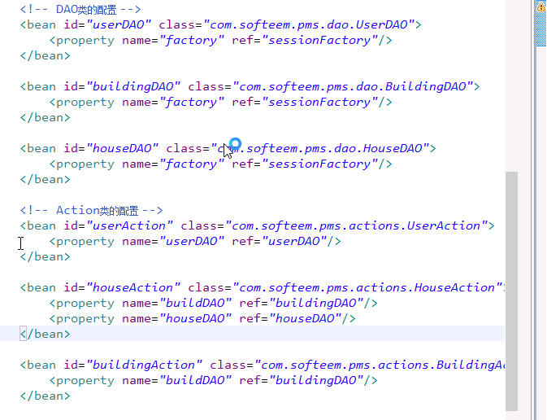

5.创建JSP页面

6.创建Action类：在Action类中定义对应DAO对象，并提供set方法

7.在applicationContext.xml文件中配置Action类，并通过Spring容器给Action类中定义的DAO对象赋值

8.在struts.xml为当前Action配置URL（actions标签的class属性引用Spring中的id的值）