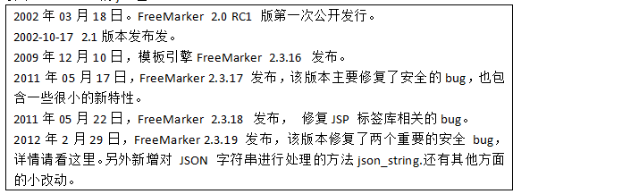
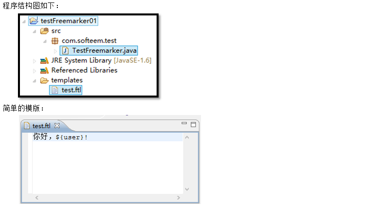
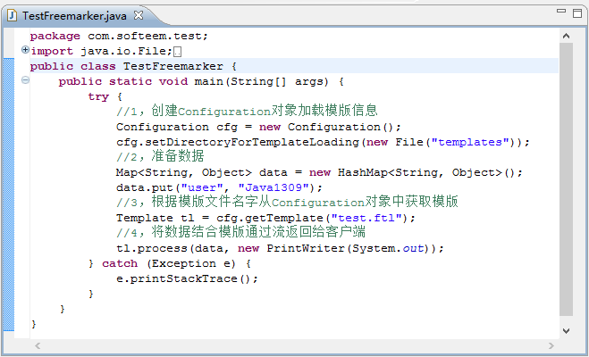
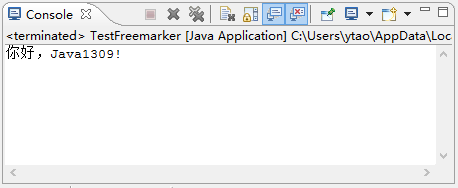
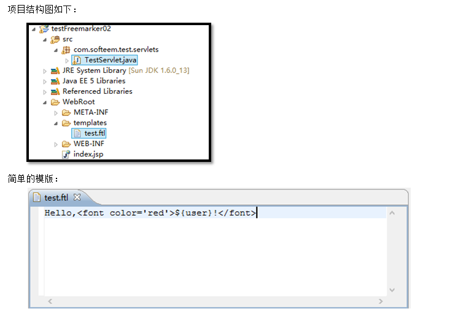
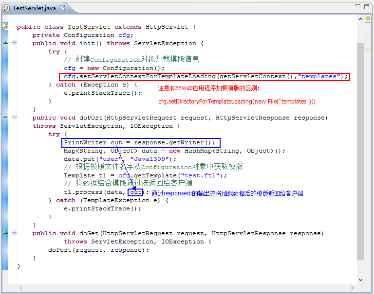
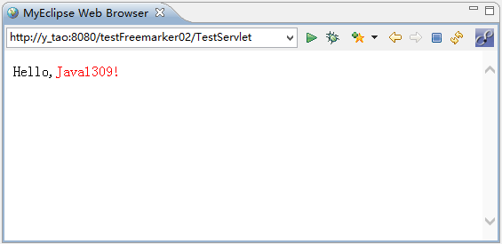
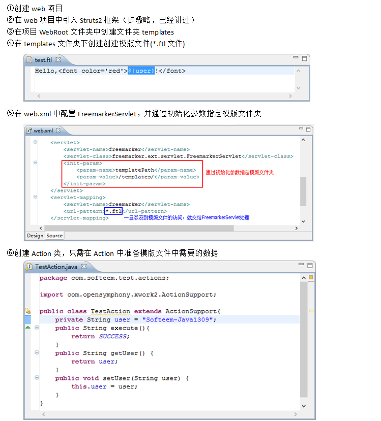
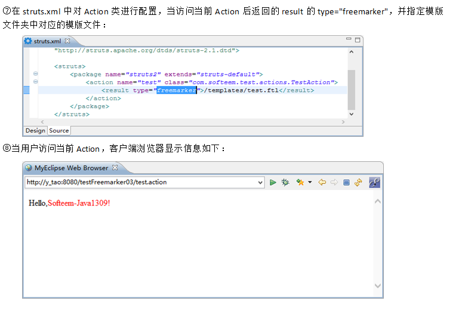

​		FreeMarker允许[Java servlet](http://baike.baidu.com/view/3618433.htm)保持[图形设计](http://baike.baidu.com/view/1834880.htm)同[应用程序](http://baike.baidu.com/view/330120.htm)逻辑的分离，这是通过在模板中密封[HTML](http://baike.baidu.com/view/692.htm)完成的。[模板](http://baike.baidu.com/view/160044.htm)用[servlet](http://baike.baidu.com/view/25169.htm)提供的数据动态地生成 HTML。模板语言是强大的直观的，[编译器](http://baike.baidu.com/view/487018.htm)速度快，输出接近[静态](http://baike.baidu.com/view/612026.htm)HTML页面的速度。虽然FreeMarker具有一些[编程](http://baike.baidu.com/view/3281.htm)的能力，但通常由Java程序准备要显示的数据，由FreeMarker生成页面，通过模板显示准备的数据。 

​     FreeMarker与容器无关，因为它并不知道[HTTP](http://baike.baidu.com/view/9472.htm)或[Servlet](http://baike.baidu.com/view/25169.htm)；FreeMarker同样可以应用于非Web[应用程序](http://baike.baidu.com/view/330120.htm)环境，FreeMarker更适合作为Model2框架（如[Struts](http://baike.baidu.com/view/25603.htm)）的视图[组件](http://baike.baidu.com/view/379950.htm)，可以在模板中使用[JSP](http://baike.baidu.com/view/3387.htm)标记库，FreeMarker是免费的。

#  一、简单Freemarker实例（非web应用环境）：

- ①创建Java Project

- ②导入Freemarker的jar包： 

 

- ③在项目中创建文件夹templates

- ④在templates文件夹下创建创建模版文件(*.ftl文件)

- ⑤在Src中创建Java类，在类中实现对模版的加载

 Java类中对模版的加载和使用：  

运行Java类，控制台输出结果为：

# 二、Freemarker在Servlet中的应用：

- ①创建一个web工程

- ②导入Freemarker的jar包

- ③在项目WebRoot文件夹中创建文件夹templates

- ④在templates文件夹下创建创建模版文件(*.ftl文件)

- ⑤创建一个Servlet，在Servlet中加载模版，并通过response中的输出流返回数据

​     Servlet类中对模版的加载：

当客户端请求TestServlet，则在客户端的浏览器中显示如下：

# 三、Freemarker在Struts2中的应用：

