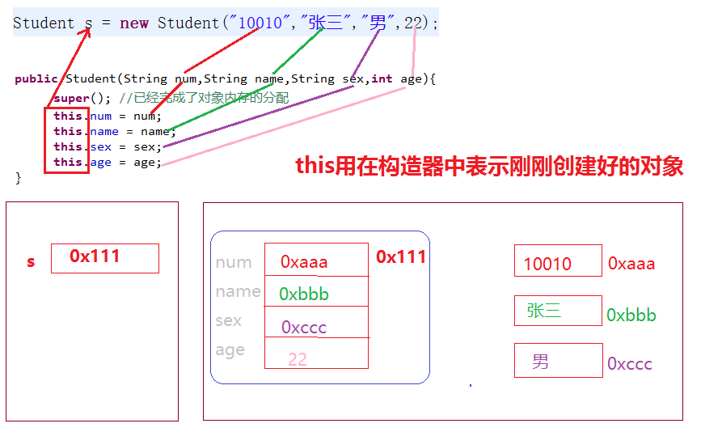
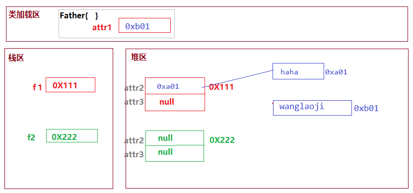
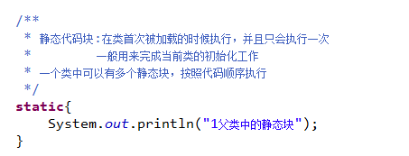
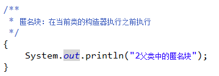
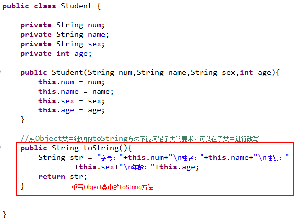
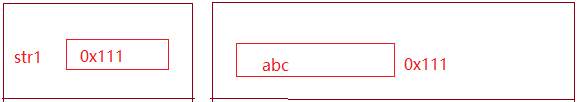
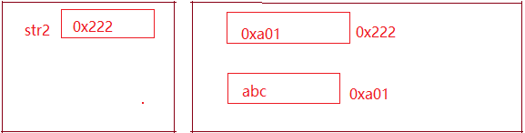

# super关键字

super关键字用在子类中代表其父类

- super关键字用在子类的构造器中，通过”super([args])”调用父类的构造器；一个类的构造器必须**在其最前面（第一行）**调用一个父类构造器，如果没有手动调用，则默认调用父类中的无参构造器。

- super关键字用在子类的构造器中，通过“super.method([args])”调用父类中的方法

- super关键字用在子类的方法中，通过“super.method([args])”调用父类中的方法

# this关键字

- this关键字用在构造器中，表示刚刚创建好的对象；可以用来将传递的参数赋值给当前对象的属性，也可以用来调用当前类中的方法。

- this关键字用在方法中，表示调用此方法的对象。

- this关键字原则上是可以省略的，但是如果出现参数和属性名相同的时候，this不能省略



# static关键字

static可以用来修饰属性、代码块、方法和内部类；被static修饰的属性、代码块、方法、内部类称之为静态属性、静态代码块、静态方法、静态内部类；静态属性、静态代码块、静态方法、静态内部类**与类相关**，非静态的属性**与对象相关**。

​     静态变量/静态方法特征：

​     ①与类相关，不会为每个对象都分类一个空间

​     ②可以通过“类名.属性/方法”调用，也可以通过“对象.属性/方法”调用



## 静态块：



## 匿名块：



# final关键字

final可以用来修饰类、属性和方法：

​     final修饰的属性表示常量，其值不能被改变；

​     final修饰的方法表示最终方法，不能被其子类重写/覆盖；

​	 final修饰的类表示最终类，不能被其他类继承；

# toString方法

​	 Object类是所有类的超父类，Object类中定义的方法，可以被所有对象调用。

​     当我们直接打印一个对象的时候，或默认调用方法，而类中的的作用是打印当前对象的，如果不想打印此信息，我们可以在类中重写方法。



# equals方法

## ==和equals的区别：

- ==如果用来比较两个简单类型，就是比较两个变量的值是否相等；如果用来比较引用类型，则表示两个引用变量中的内存地址是否相同。

- 在Object类定义了equals方法，用来比较两个对象的内存地址是否相等，和==作用相同

- 在String类中对equals方法进行了改写，==用来比较两个字符串变量中的内存地址是否相同，equals则是比较两个字符串变量最终引用的字符序列是否相同。

- String str = “abc”；只创建了一个字符串对象；String str = new String(“abc”);则表示创建了两个字符串对象：

> String str = “abc”；
>
> 
>
> String str = new String(“abc”);
>
> 

# 冒泡排序

```java
/**
	 * 冒泡排序
	 * @param arr
	 */
public void bubble(int[] arr){
	for (int j = arr.length-1; j >0 ; j--) {
		for(int i = 0; i<j ; i++){
				if(arr[i] > arr[i+1]){
					int temp = arr[i+1];
					arr[i+1] = arr[i];
					arr[i] = temp;
				}
		}
	}
}
```

# 快速排序

```java
/** 快速排序
 * @param arr
 * @param start
 * @param end
*/
public void quick(int[] arr,int start,int end){
		int i = start;
		int j = end;
		int temp = arr[i];
		while( i<j ){
			//从后往前比较
			while(j>i){
				if(arr[j]<temp){
					arr[i] = arr[j];
					i++;
					break;
				}else{
					j--;
				}
			}
			//从前往后比较
			while(i<j){
				if(arr[i]>temp){
					arr[j] = arr[i];
					j--;
					break;
				}else{
					i++;
				}
			}
		}
		arr[i] = temp;
		//对前一半进行同样的比较
		if(start<i-1){
			quick(arr,start,i-1);
		}
		//对后一半进行同样的比较
		if(end>i+1){
			quick(arr,i+1,end);
		}
}

```

