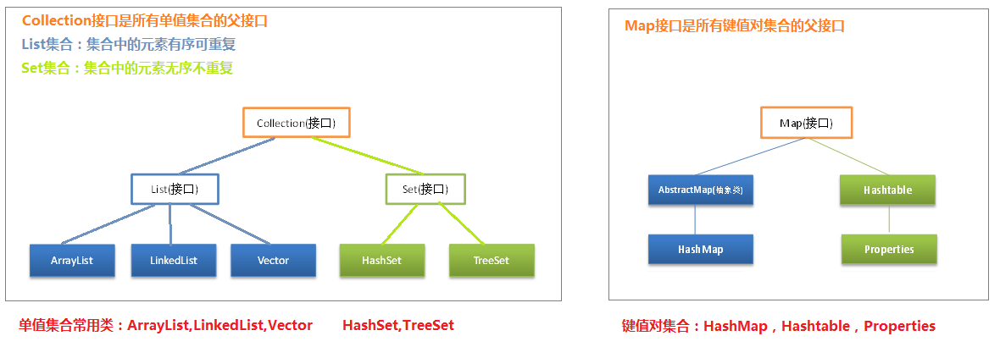
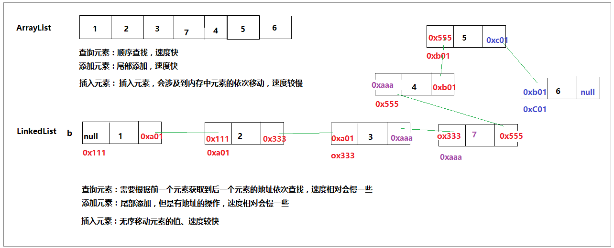
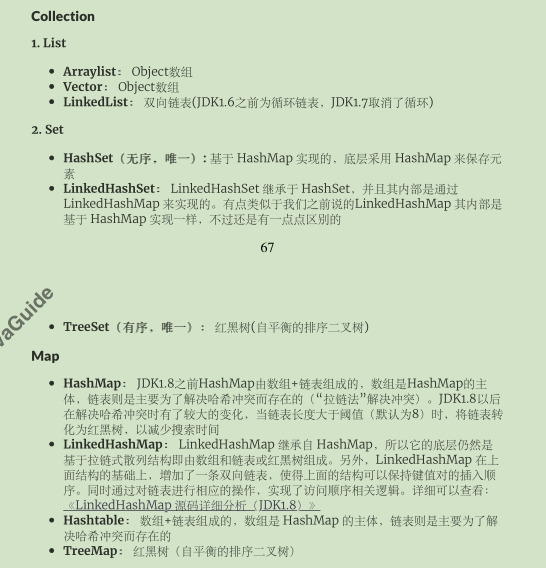
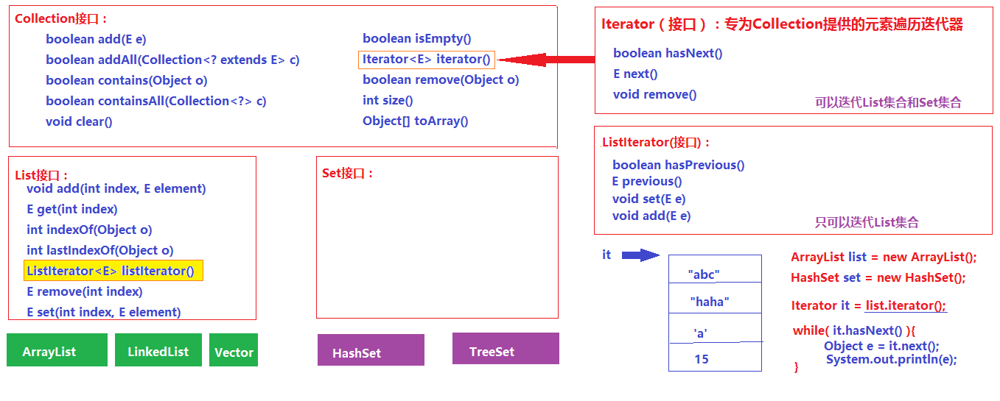
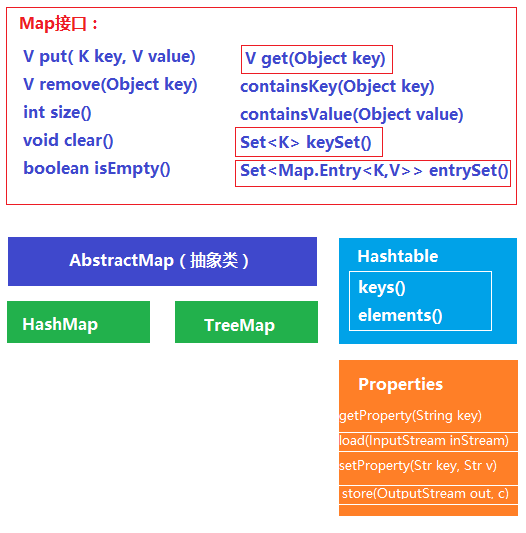

# 集合概述

数组就是可以存放一组相同类型数据的数据结构

数组的特点：数组一旦创建，其长度不能改变；一个数组中只能存放一种类型的数据。

 

集合：是一种可以存放多种类型数据的数据结构

集合的特点：①集合的长度是可变的；②对存放的数据的类型无限制

 

在Java中，使用一些类来描述集合，这样的类我们称之为**集合类**，集合类的对象就是一个集合。

int[] arr = new int[10]; 

集合类 obj = new 集合类();



# 集合中的各种区别：

①Collection和Collections的区别： 

​	 Collection是一个接口，是所有单值集合类的父接口；

​     Collections是一个帮助类，这个类中提供了很多有对集合的各种操作的静态方法

②List接口和Set接口的区别：

​	List接口和Set接口都是Collection接口的子接口；

​	List集合中元素有序可重复，Set集合中的元素无序不重复。

③ArrayList和LinkedList的区别：

​	ArrayList集合和LinkedList集合都是List接口的实现类，其元素都有序可重复；



ArrayList中元素的存储是基于数组的实现，元素查询、添加元素速度较快，但是插入元素速度较慢；LinkedList中

元素的存储是基于链表的实现，元素的插入速度较快。

④ArrayList和Vector的区别：

​	ArrayList和Vector都是基于数组的存储； Vector实现了同步是线程安全的（多线程中用Vector），而ArrayList

是线程非安全的，但是ArrayList存储效率较高。

⑤HashSet和TreeSet的区别：

​	两者都是Set接口的实现类，其元素都无序不可重复；区别在于其元素存储方式不同，HashSet是按照hash码散

列存储，TreeSet树形存储。

⑥HashMap和Hashtable的区别：

​	两者都是Map接口的实现类，都表示键值对集合。

​	HashMap中允许一个null键和多个null值，但是Hashtable中不允许使用null做为key或者value；HashMap未实

现同步，是线程非安全的，而Hashtable实现了同步是线程安全的。



# Collection接口中的常用方法：

```java
ArrayList a = new ArrayList();
//boolean add(E e):将指定的元素添加到集合中
a.add("abc");
a.add("wahaha");
a.add(3);
a.add(true);
//boolean addAll(Collection c):将参数指定的集合中的所有元素全部添加到当前集合中
ArrayList c = new ArrayList();
c.addAll(a);
//void clear():清空当前集合中的所有元素
a.clear();
//boolean contains(Object o)：检查当前集合中是否包含参数指定的元素
boolean flag = a.contains("wahaha");
//boolean containsAll(Collection c)：检查当前集合中是否包含参数指定的这个集合中的所有元素
boolean flag2 = a.containsAll(c);
//boolean isEmpty()：判断当前集合是否为空
boolean flag3 = a.isEmpty();
//boolean remove(Object o)：从当前集合中移除指定的元素
//如果list集合中存在多个参数指定的元素，则移除第一个
boolean flag4 = a.remove("abc");
//boolean removeAll(Collection<?> c)：从a集合中移除c集合中包含的所有元素
boolean flag5 = a.removeAll(c);
System.out.println(flag5);
//Object[] toArray():将当前集合中的所有元素都取出来，存放到一个Object数组中
Object[] arr = a.toArray();
for (Object obj : arr) {
	System.out.println(obj);
}
//int size()：获取当前集合中存放的元素的个数
int len = a.size();
System.out.println(len);
```



# Map中的常用方法



```java
//1.创建键值对集合
HashMap map = new HashMap();
Hashtable table = new Hashtable();
		
//Properties中的元素的key和value只能是String类型
Properties p = new Properties();
		
//2.向键值对集合中添加元素
map.put("a", 123);
map.put(1, "abc");
map.put(null, null);
map.put("hehe", null);
		
//3.获取集合中键值对的个数
int len = map.size();
System.out.println(len);
		
//4.根据key移除一个键值对
map.remove("hehe");
//map.clear();
		
//5.修改键值对：调用put方法，如果对应的key存在，则可以通过key修改value
map.put(1, "wahaha");
		
//6.检查当前集合中是否存在key等于指定参数的键值对
boolean b1 = map.containsKey("hehe");
//7.检查当前集合中是否存在value等于指定参数的键值对
boolean b2 = map.containsValue("abc");
```

# 集合总结

|                      | **ArrayList**                              | **HashSet**                              | **HashMap**                            | **Hashtable**                              |
| -------------------- | ------------------------------------------ | ---------------------------------------- | -------------------------------------- | ------------------------------------------ |
| **创建对象**         | **ArrayList list = new ArrayList();**      | **HashSet set = new HashSet();**         | **HashMap map = new HashMap();**       | **Hashtable table = new Hashtable();**     |
| **添加元素**         | **list.add(“aaa”);**                       | **set.add(“123”);**                      | **map.put(key, value);**               | **table.put(key, value);**                 |
| **插入元素**         | **list.set(0, 456);**                      | **×**                                    | **×**                                  | **×**                                      |
| **移除元素**         | **list.remove(“aaa”);**  **list.clear();** | **set.remove(“123”);**  **set.clear();** | **map.remove(key);**  **map.clear();** | **table.remove(key);**  **table.clear();** |
| **获取元素（单个）** | **list.get(0);**                           | ***\**\**\**\**\**\****                  | **map.get(key);**                      | **map.get(key);**                          |

# 集合遍历

- ArrayList

```java
//toArray遍历
Object[] arrr = list.toArray(); 
for(Obiect obj : arr){ 
	System.out.println(obj);
}
//数组下标遍历
for(int i = 0;i<list.size();i++){	
	Object obj = list.get(i);
	System.out.println(obj);
}
//Iterator遍历
Iterator it = list.iterator();
While(it.hasNext()){
	Object obj = it.next();
	System.out.println(obj);
}
//ListIterator遍历
ListIteratorit = list.listIterator ();
While(it.hasNext()){
	Object obj = it.next();
	System.out.println(obj);
}
```

- HashSet

```java
//toArray遍历
Object[] arrr = set.toArray(); 
for(Obiect obj : arr){ 
	System.out.println(obj);
}
//Iterator遍历
Iterator it = set.iterator();
While(it.hasNext()){
	Object obj = list.next();
	System.out.println(obj);
}
```

- HashMap

```java
//keySet遍历
Set set = map.keySet();
Iterator it = set.iterator();
While(it.hasNext()){
	Object key= it.next();
	Object val = map.get(key);
	System.out.println(obj+":"+val);
}
//entrySet遍历
Set set = map.entrySet();
Iterator it = set.iterator();
While(it.hasNext()){
 Map.Entry e = (Map.Entry)it.next();
	Object key = e.getKey();
	Object val = e.getValue();
	System.out.println(obj+":"+val);
}
```

- HashTable

```
//keySet遍历
Set set = table.keySet();
Iterator it = set.iterator();
While(it.hasNext()){
	Object key= it.next();
	Object val = table.get(key);
	System.out.println(obj+":"+val);
}
//Enumeration遍历
Enumeration ea = table.keys();
while(es.hasMoreElements()){
 Object key= ea.nextElement();
	Object val = table.get(key);
	System.out.println(obj+":"+val);
}
//entrySet遍历
Set set = map.entrySet();
Iterator it = set.iterator();
While(it.hasNext()){
 Map.Entry e = (Map.Entry)it.next();
	Object key = e.getKey();
	Object val = e.getValue();
	System.out.println(obj+":"+val);
}
```

