# Java常用类

String

封装类（Byte,Short,Integer,Long,Float,Double,Character,Boolean）

Math

File

集合类

​     Collection

​	List:ArrayList,LinkedList,Vector 

​	Set:HashSet,TreeSet

​     Map

​     HashMap,Hashtable(Properties)

日期类

​     Date

​     DateFormat

​     Calendar

 # Date类

**java.util.Date类**：一个Date类的对象，就表示一个时间点（可以将一个时刻以年月日/时分秒的形式直观的表现出来）

​     **格林尼治时间（标准时间）**：1970年1月1日 0时0分0秒 0毫秒

​     计算机时间：通常用与标准时间的时间差来记录某一时刻（long）

**Date类的构造器：**

​     Date()：无参构造器，通过无参构造器创建的Date对象代表是计算机当前时刻

​     Date d = new Date();

Date类中方法：

​     setTime()

​     getTime()

java.sql包中的时间(Date,Time,Timestamp):

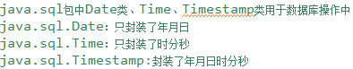

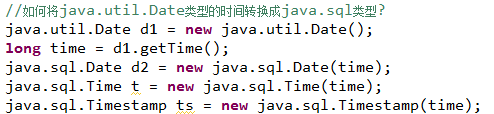

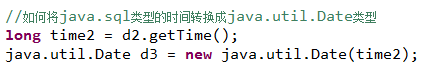

# DateFormat类：

java.text.DateFormat是一个日期帮助类，可以对日期的格式进行转换

在DateFormat类中提供了一个“String format(Date date)”方法，可以对日期的格式进行转换。

**创建一个类的对象：**

​          1、通过new关键字调用构造器

​          2、调用类中的静态方法获取对象

​          3、通过反射创建对象

java.text.SimpleDateFormat：支持自定义日期格式转换

- 将java.util.Date转换成自定义的String类型

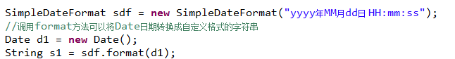

- 将满足格式的String类型日期字符串，解析成java.util.Date

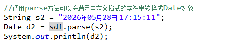

# Calendar类:

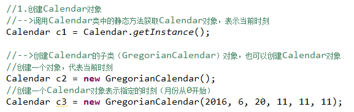

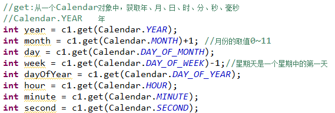

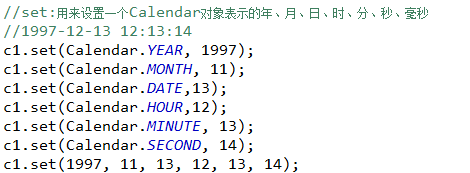

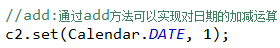

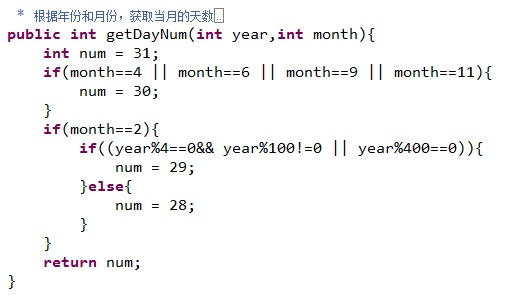

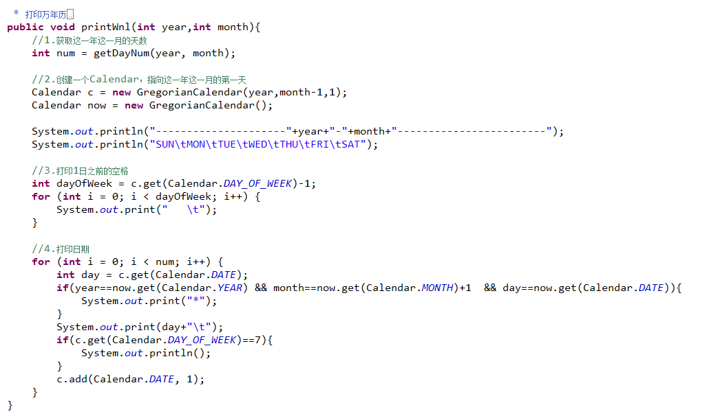

# StringBuilder与StringBuffer类

StringBuilder是线程非安全的可变字符序列；StringBuffer是线程安全的可变字符序列。

​     这两个类都是对字符串进行拼接操作而存在。

​     当一个String类型的字符串需要进行频繁的拼接操作时：

# 正则表达式

正则表达式，我们将检验数据的规则定义成一个表达式/字符串，然后验证目标字符串是否满足这个规则。

**正则表达式的规则**

​     String reg = “邮箱规则”;

​     String str = “”;

​     boolean b = Pattern.matcher(reg,str);

| **.**                 | 匹配任意一个字符                                             |
| --------------------- | ------------------------------------------------------------ |
| **^**                 | 用在表达式的开头，无实际意义  用在[]中表示取到集合的补集     |
| **$**                 | 用在表达式结尾，无实际意义                                   |
| **\|**                | 或者                                                         |
| **[]**                | 表示定义一个集合                                             |
| **-**                 | 用在数字或者字母中，表示一个区间                             |
| *****                 | 允许前面的字符出现**0~n**次                                  |
| **+**                 | 允许前面的字符出现**1~n**次                                  |
| **？**                | 允许前面的字符出现**0~1**次                                  |
| **{}**                | 允许前面的字符出现**自定义**次数  {num}à允许前面的字符出现**num**次数  {m,n}à允许前面的字符最少出现**m**次数，最多出现**n**次数 |
| 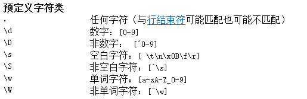 | 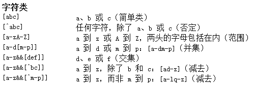                                        |

 