# IO流概述

Input/Output：输入输入

IO流（输入输出流）：就是程序和外界进行数据交互的管道

IO流的作用：用于程序与外界之间进行数据交互

# IO流的分类

**根据数据传输的方向，可以将流分为：**

​     输入流：将外界的数据输入到程序中

​     输出流：将程序中的数据输出到外界

**根据处理数据的类型，可以将流分为：**

​     字节流：以字节为单位进行数据的输入/输出

​     字符流：以字符为单位进行数据的输入/输出

**根据数据的处理能力，可以将流分为：**

​    节点流：低级流

​     处理流：高级流

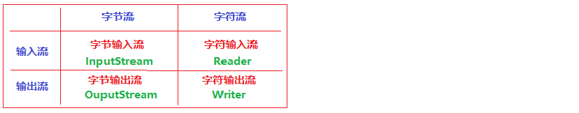

# 字节输入流（InputStream）

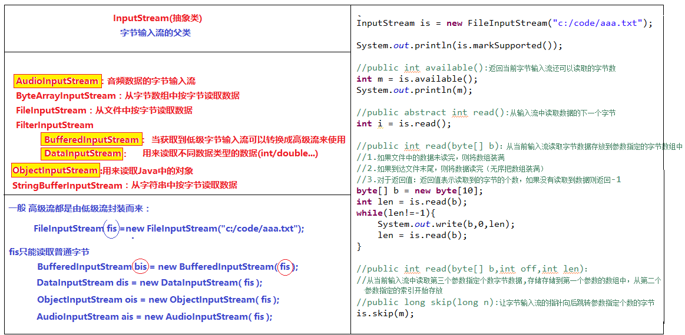

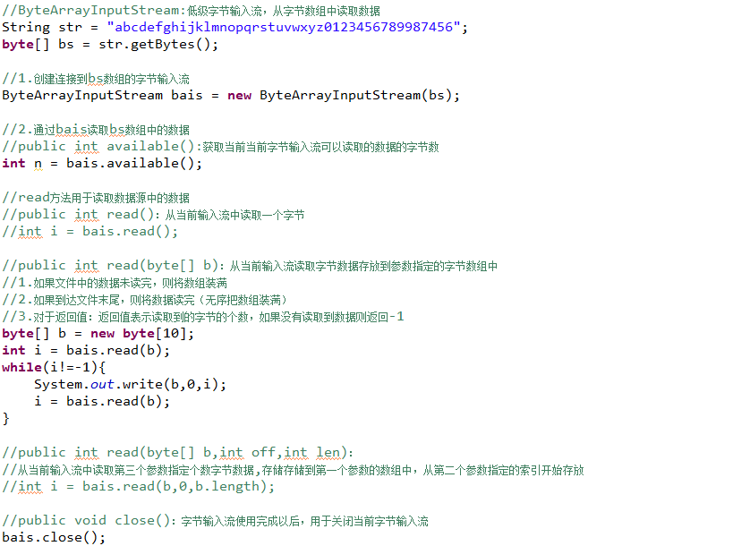

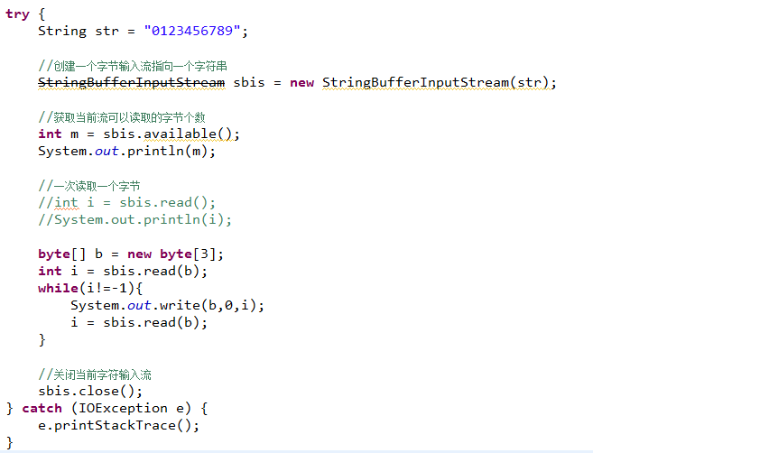

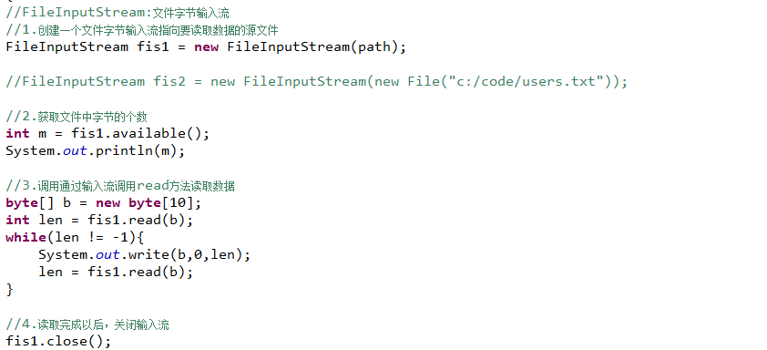

# 字节输出流（OutputStream）

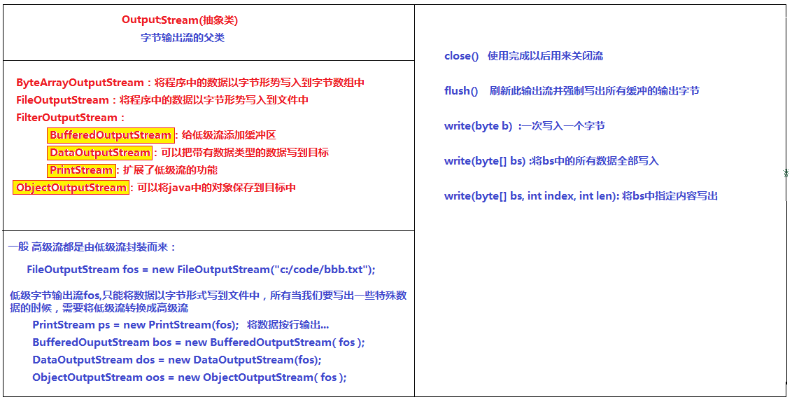

# 文件字节流

## FileInputStream/FileOutputStream 

①文件拷贝：

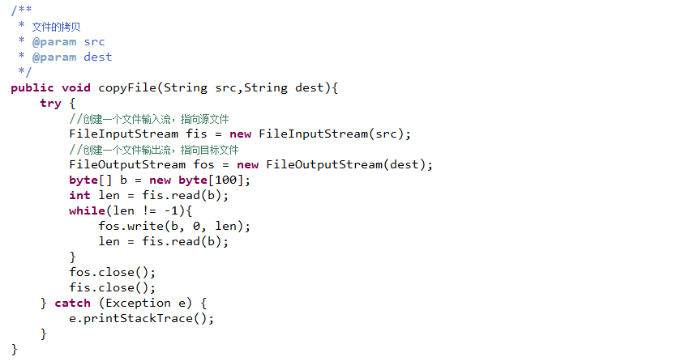

②文件合并：

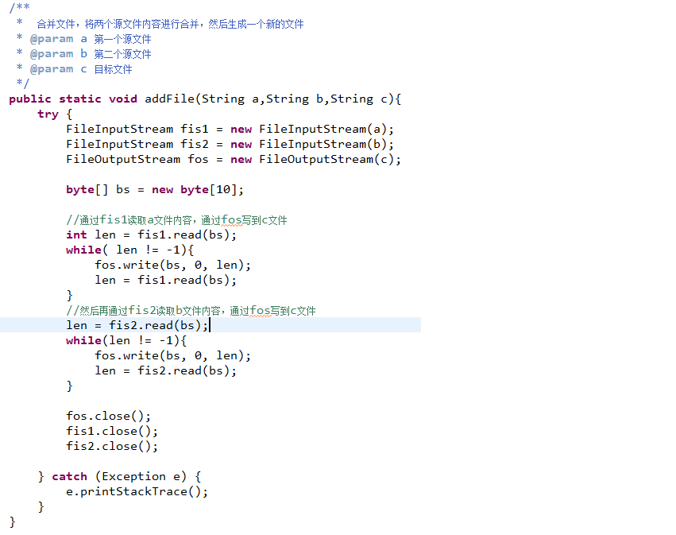

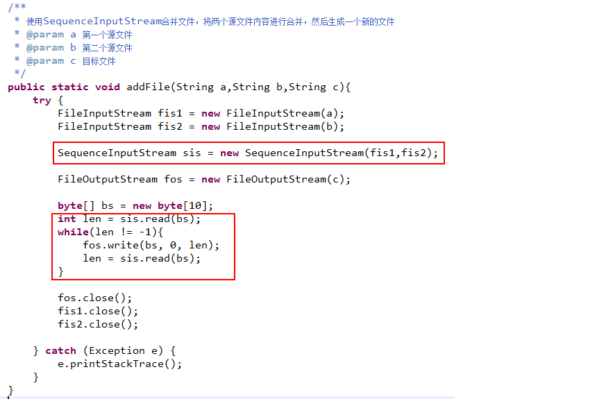

## RandomAccessFile

既可以用来读文件，也可以用来写文件

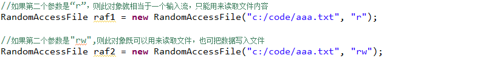

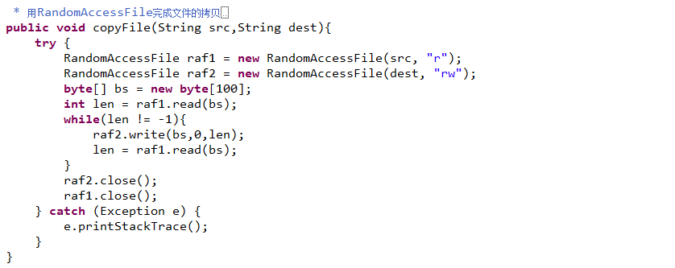

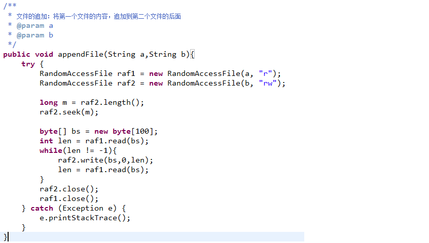

# 数据流（DataOuputStream/ DataInputStream）

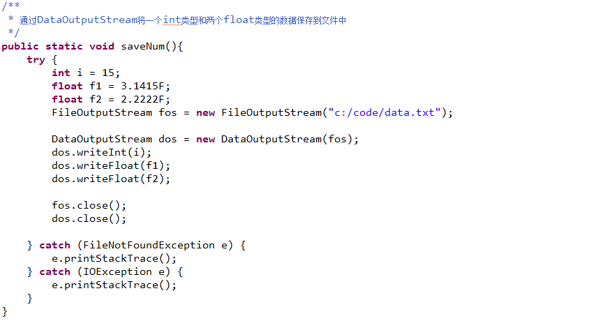

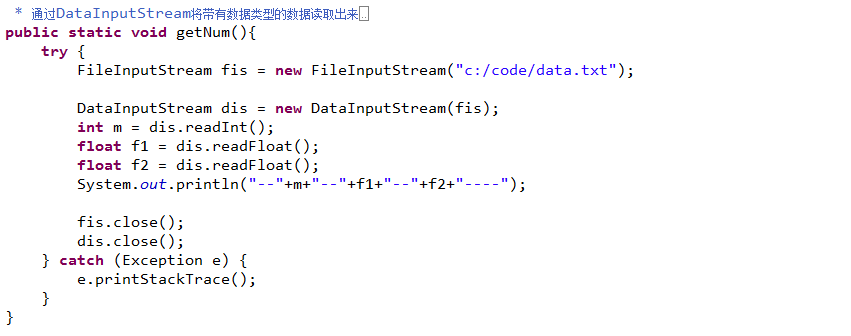

# 对象序列化（ObjectOutputStream/ ObjectInputStream）

ObjectOutputStream：可以将程序中的对象输出到外界(文件、网络)

ObjectInputStream：可以将外界中存储的对象读取到程序中

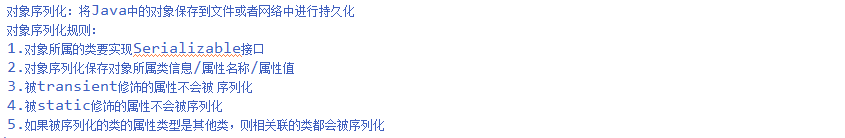

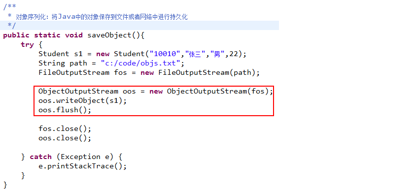

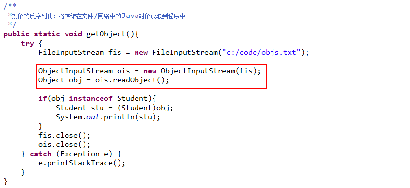

# Java.util.Scanner

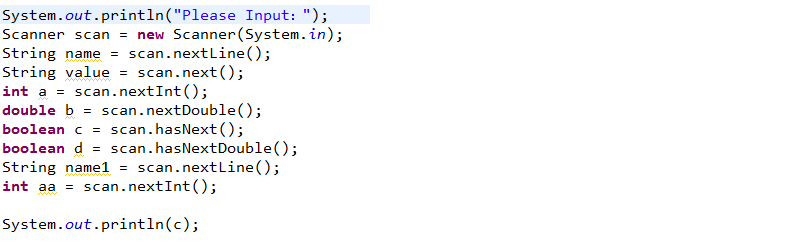

