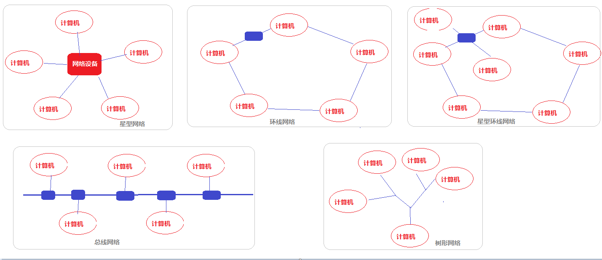
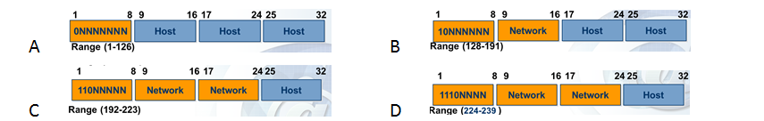
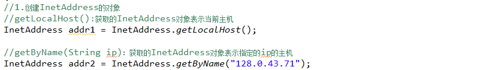
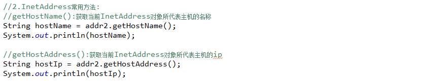
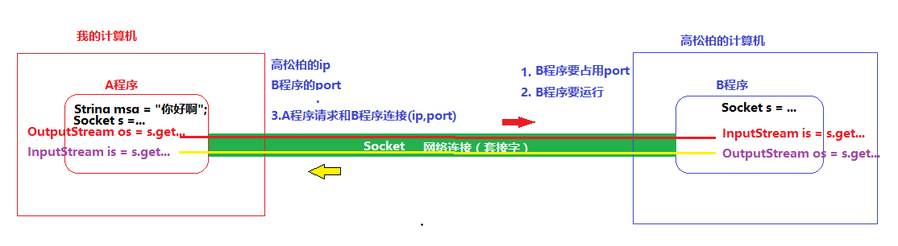
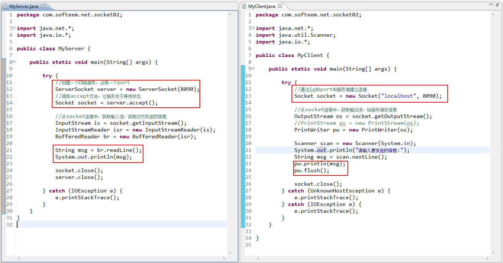
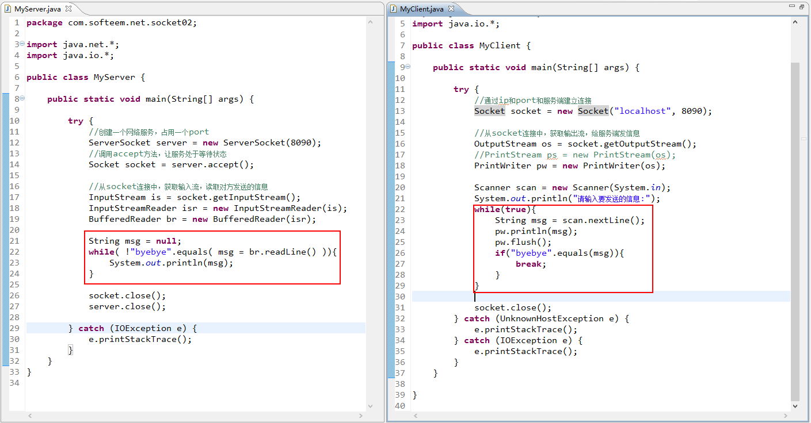
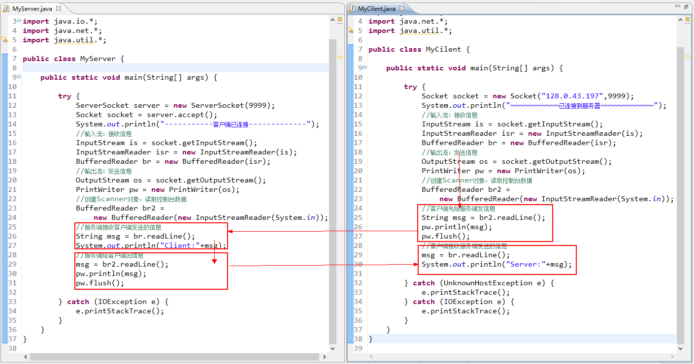
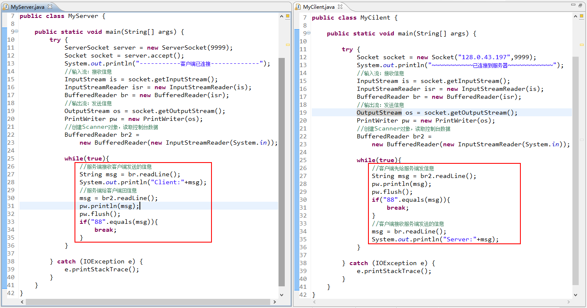
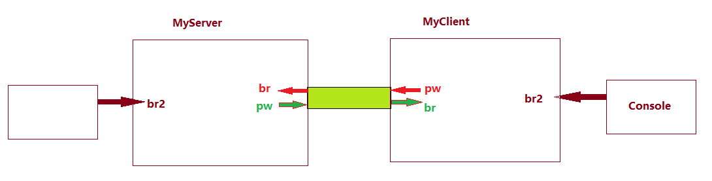

#          网络相关概念  

网络：将计算机通过网络设备及通信线路连接在一起

**网络的分类：**

​     范围：局域网（校园网），城域网（都市网），广域网（互联网）

​     拓扑结构：

传输介质：双绞线，同轴电缆，光导纤维

网络中传输的数据，必须通过协议层处理，然后在物理链路层传输。

**IP(Internet Protocol)**：互联网协议，每台计算机都以一个唯一的地址，IPv4地址由4部分组成组成，每部分的取值在00~ff（0~255）之间。

**Port(端口)：可以进行网络通信的软件，数据进出的通道（0~65535，8000~20000）**

- 如果一个软件想要进行网络通信，就必须占用一个端口号

- 同一台计算机上两个程序的port不能相同

| **端口** | **对应服务** | **端口** | **对应服务** |
| -------- | ------------ | -------- | ------------ |
| 7        | Echo服务器   | 53       | DNS          |
| 21       | ftp          | 79       | Finger       |
| 23       | telnet       | 80       | HTTP         |
| 25       | SMTP         | 110      | POP3         |

**端口号可以从0到65535，通常将它分为三类：**

- 公认端口（Well Known Ports）：从0到1023，它们紧密绑定（Binding）一些服务

- 注册端口（Registered Ports）：从1024到49151。它们松散地绑定一些服务

- 动态和/或私有端口（Dynamic and/or Private Ports）：从49152到65535。理论上，不应为服务分配这些端口

- 网络编程：就是实现两台计算机之间的网络通信

# InetAddress类

​     InetAddress类用来描述网络中的计算机地址，一个InetAddress类的对象就代表一个网络地址。

​     有关网络编程的所有类都位于“java.net”包。

- 类的作用:一个InetAddress类的对象就代表一个网络地址
- 构造方法:没有对外提供构造器
- 创建对象:

- 常用方法:

# Socket类

Socket(套接)：代表一个IP和port组合，也就是两个程序的的连接。

Socket的作用：获取输入输出流

| **类的作用** | 用于向服务端发送请求，通过ip和port请求建立连接               |
| ------------ | ------------------------------------------------------------ |
| **构造方法** | 通过IP和port请求与B程序建立连接   Socket ss = **new** Socket("127.0.0.1",7890);   InetAddress addr = InetAddress.*getByName*("128.0.43.197");   Socket ss = **new** Socket(addr,7890); |
| **常用方法** | InputStream is =  ss.getInputStream();   OutputStream os = ss.getOutputStream();  ss.close(); |

# ServerSocket类

ServerSocket用来描述网络服务

| **类的作用** | 创建一个网络服务，等待客户端连接                             |
| ------------ | ------------------------------------------------------------ |
| **构造方法** | //创建一个服务，并占用一个端口号   ServerSocket server = **new** ServerSocket(7890); |
| **常用方法** | //通过ServerSocket对象，调用accept方法，让服务处于等待状态：   Socket s = server.**accept**();   //网络通信结束以后关闭服务   server.close(); |

示例代码：

##   实现单向通信（一次）

## 实现单向通信（多次）

## 实现双向通信（一个回合）

## 实现双向通信（双向多回合）

