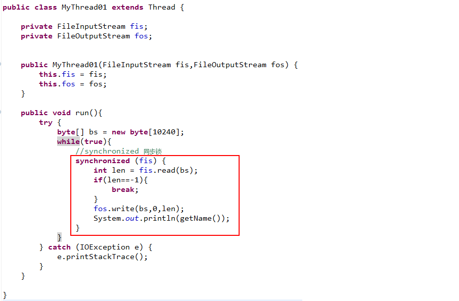
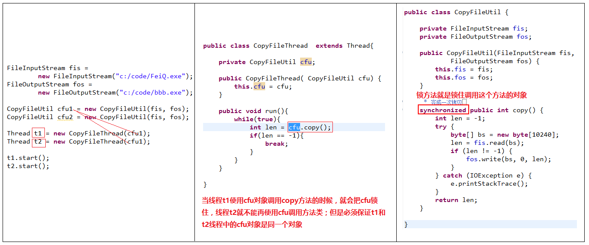
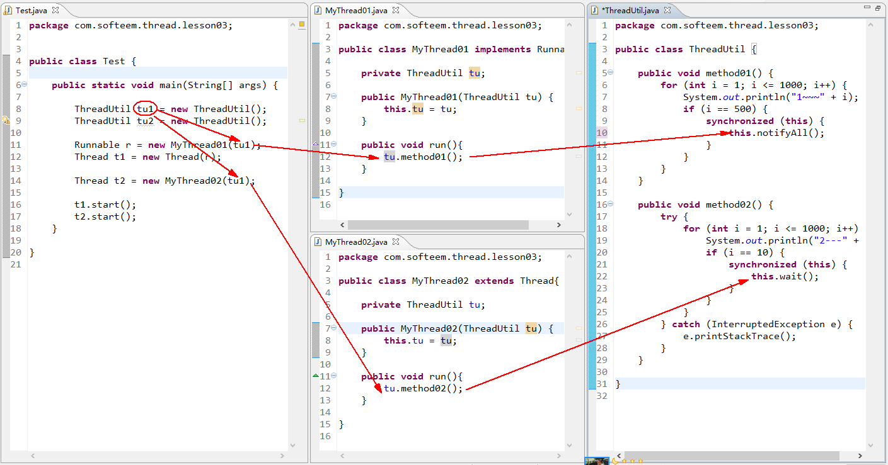
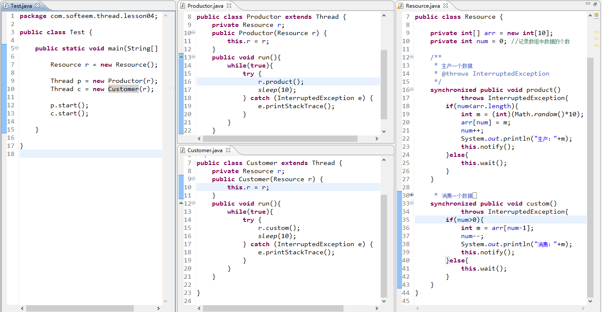

# 多线程编程中的资源竞争问题

多线程共享相同的数据和资源可能会导致数据错误，为了避免这一错误，我们引入“同步锁”机制。

锁对象：在线程体中，如果由于使用的资源被其他线程访问会导致数据错误，那么我们在只用这个资源之前，可以通过**synchronized**关键字将这个共享对象锁住，使用完成之后进行释放。

锁方法：使用**synchronized**关键字修饰一个方法，表示对这个方法实现同步，即不允许多个线程同时调用这个方法。实际上方法被同步指的是调用当前方法的对象被锁住。

如果使用**synchronized**锁方法，那么调用这些方法的对象必须是同一个对象。

# wait和notify方法

​     wait/notify/notifyAll这三个方法是Object类定义的

​     this.wait():让当前线程进入休眠状态，直到被其他线程调用notify/notifyAll唤醒

​     this.notify()/notifyAll():唤醒由当前对象调用wait进入休眠状态的线程; notify()随机唤醒一个，notifyAll()唤醒所有。

# 生产者和消费者

有一个长度为3的int类型数组，创建2个线程：

- 生产者：只要数组没满，就产生一个0~9的随机数存放到数组中；如果数组满了，就暂停生产，等待消费者消费；一旦消费者消费一个，则恢复生产。

- 消费者：只要数组中有数据，就取出并打印数据；如果数组空了，就暂停消费，等待生产者生产数据；一旦生产者生产一个数据，则恢复消费。

