- **SQL的书写顺序：select—>from—>where—>group by—>having—>order  by—>limit**  

- **SQL的执行顺序：from—>where—>group by—>having—>select—>order by—>limit**  

# DML语句（增删改）

- 增

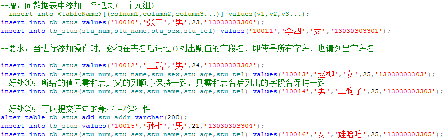

- 删

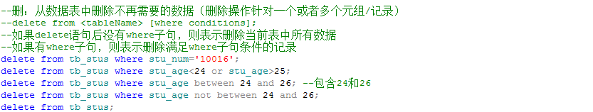

- 改

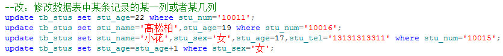

# 查询语句

- 基本查询

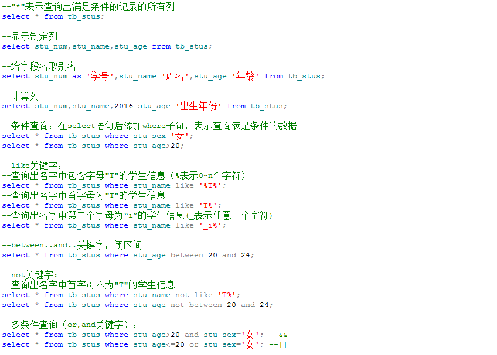

- 分组查询

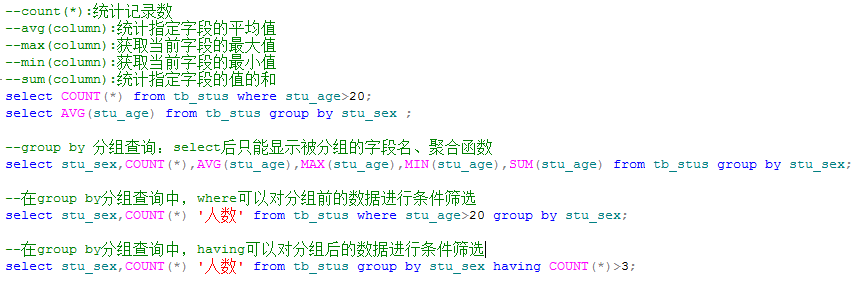

- 排序

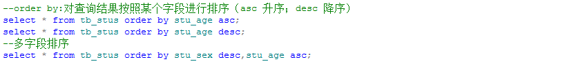

- 嵌套分页

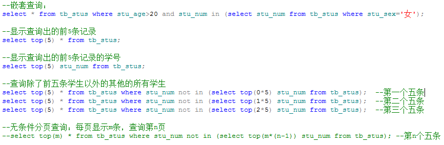

# 多表联合查询

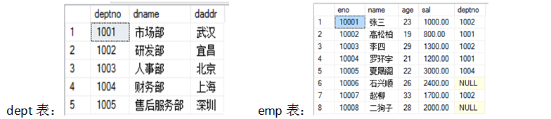

- 等值连接

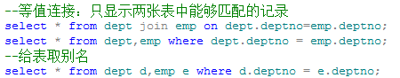

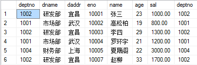

- 左连接

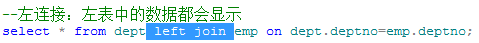

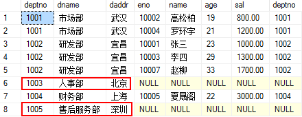

- 右连接

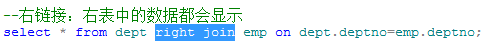

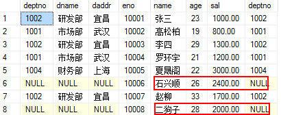

- 全连接

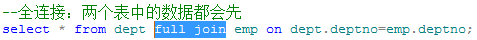

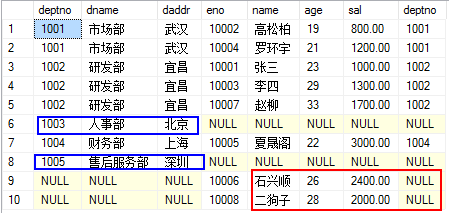

- 排列组合

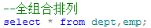

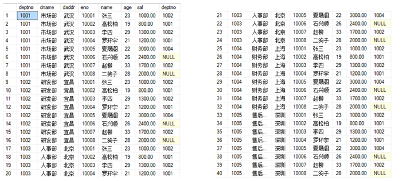

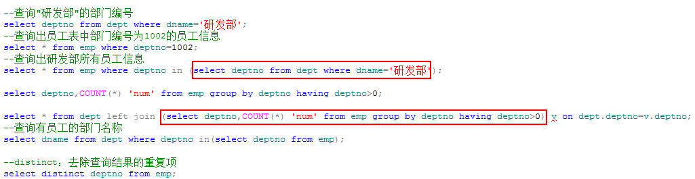

- 多表联合查询练习：

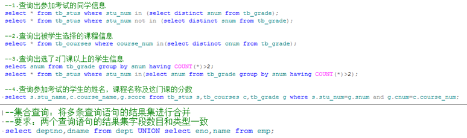

# 视图

```sql
--视图：可以将查询的结果单独创建成一张“表”--视图
--create view <viewName> as select...;
--对视图的更新(删除/添加/修改)都会影响到原数据表
--创建视图
create view stu_nv as (select * from tb_stus where stu_sex='女');
--查询视图
select * from stu_nv;
--删除视图中的数据(会从原表中删除)
delete from stu_nv where stu_num='10015';
--向视图中添加数据（会添加到原表）
insert into stu_nv values('10015','Lucy','女',22,'13031323334');
--删除视图（删除数据表，会连同数据表中的数据一同删除；但是删除视图不会影响数据）
drop view stu_nv;
```

# 索引

## **什么是索引？**

索引相当于一本书的目录，可以很大程度上提高我们的查询效率。

## 如何创建索引？

- 如果将数据表的某一个字段设置为主键，则会自动在此字段上建立索引

- 如果将数据表的某一个字段设置为唯一键，也会自动在此字段上建立索引

- 如果我们频繁的根据某一字段进行查询操作，则需手动在此字段上建立索引

## **创建索引：**

```sql
create [UNIQUE] index stus_name on tb_stus(stu_name);
select * from tb_stus where stu_name=’’ and stu_age>20;
```

## **删除索引：**

```sql
drop index  stus_name on tb_stus;
```

